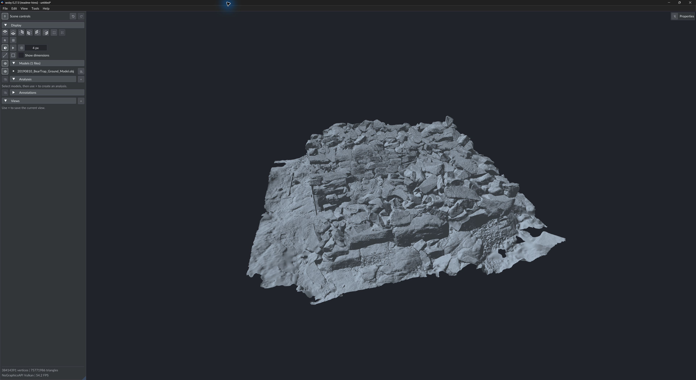
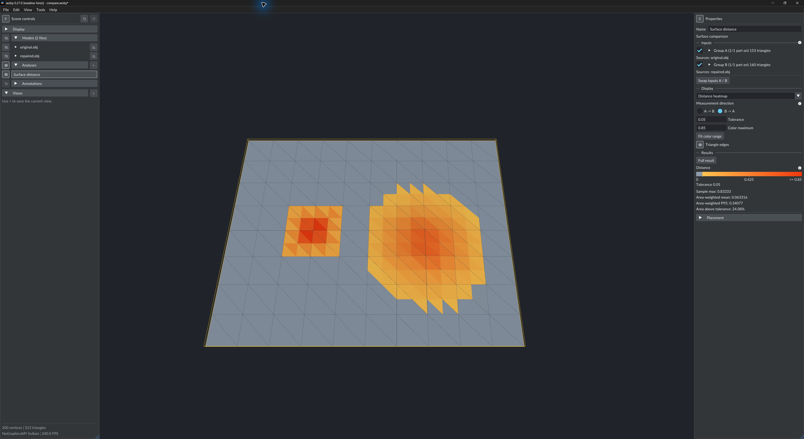
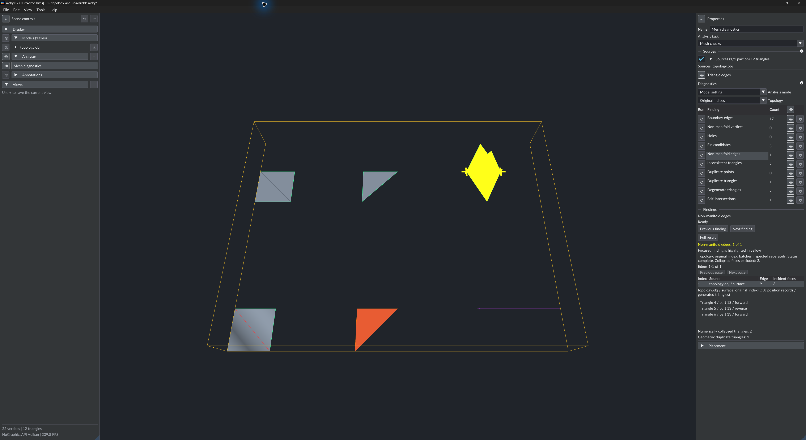
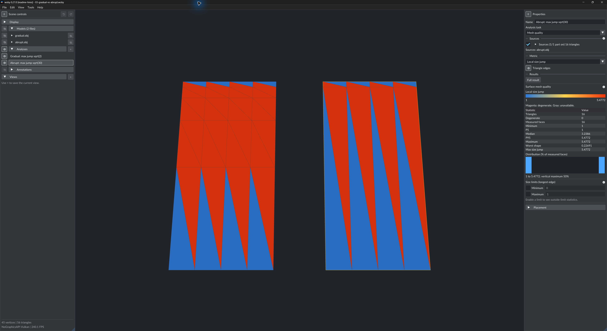
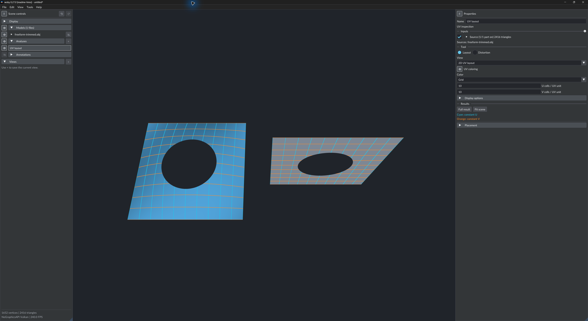
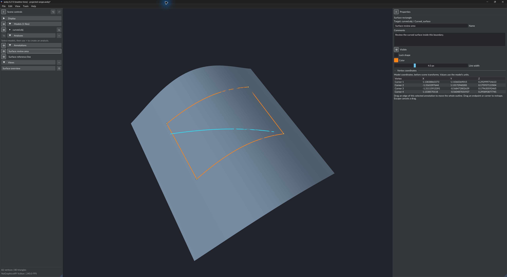

# woby

woby is a desktop application for viewing and analyzing 3D geometry.

## Features

- **Supports obj file format:** Triangular meshes, polygon meshes, point clouds and OBJ freeform geometry including Bézier and B-spline/NURBS curves and surfaces, with trim boundaries and holes.
- **Importers:** Write your [importers](doc/importers.md) to support any file format.
- **AI support:** Tell your AI where to find woby executable, it will figure out the rest. CLI based http server that can do anything and everything in one or more woby instances.
- **Surface comparison:** Create named analyses with A/B inputs, overlays, and distance heatmaps. Set tolerances and color ranges. Results include maximum, mean, P95, and area statistics. Distances are approximate and unsigned. Measurements use the model coordinate units.
- **Mesh diagnostics:** Find boundary edges, winding edges, non-manifold edges and vertices, duplicates, degenerate triangles, holes, fin candidates, and self-intersections. Select findings to show them in the viewport.
- **Surface mesh quality:** Examine triangle size, shape quality, and local size changes. Results include histograms, percentiles, and comparisons with specified size limits.
- **UV inspection:** Examine an existing 2D UV layout or a 3D surface grid. Measure distortion, stretch, orientation, and overlaps. Select linked points in the source and analysis. Woby does not create UV coordinates.
- **Surface annotations:** Draw lines and rectangles on surfaces. Change their shape or add comments. Save annotations with the scene.
- **Saved states:** Save named Views and `.woby` scenes. Use Undo/Redo for scene changes, object additions and removals, and analysis settings.
- **Export and automation:** Export PNG images at a specified resolution. Include analysis legends and labels if necessary. Export diagnostic results as JSON. Use the [CLI and local API](doc/ctl-commands.md) to control an active viewer.

## Requirements

| GPU and system | Driver version | Source information |
| --- | --- | --- |
| NVIDIA on Windows | Vulkan developer beta **595.92** | This release added device-address commands. Earlier releases added descriptor heaps and untyped pointers. Refer to the [NVIDIA release history](https://developer.nvidia.com/vulkan-driver). |
| NVIDIA on Linux | Vulkan developer beta **595.44.03** | This release added the same feature on Linux. Refer to the [NVIDIA release history](https://developer.nvidia.com/vulkan-driver). |
| AMD on Windows | Adrenalin **26.6.1**, with applicable RDNA 3 or later hardware | This is the first listed regular release with descriptor heaps and device-address commands. Preview **25.30.17.02** added descriptor heaps only. Refer to the [AMD Vulkan release history](https://www.amd.com/en/resources/support-articles/release-notes/rn-rad-win-vulkan.html). |
| AMD on Linux | **Mesa RADV 26.2.0** or later | This release enables descriptor heaps by default. Refer to the [Mesa 26.2 release notes](https://docs.mesa3d.org/relnotes/26.2.0.html). |

The Mac hardware minimum is Apple M1 or newer.

| GPU and system | Minimum feature generation | Examples |
| --- | --- | --- |
| NVIDIA on Windows or Linux | Turing | GeForce GTX 1630, GTX 1650, GTX 1660, and RTX 2060. Later RTX generations also have the necessary architecture. GTX 10-series/Pascal does not have the necessary features. |
| AMD on Windows | RDNA 3 | Radeon RX 7600. Renderer reports also include Radeon 700M integrated graphics. |
| AMD on Linux with RADV | RDNA 2 | The AMD GPU in the Steam Deck. Radeon RX 6400 and RX 6600 are desktop candidates from this generation. |

## Screenshots

**Large models**

The Bear Trap ground model contains **75,771,986 triangles** and **38,414,391 vertices** in a 7.11 GB OBJ file. The lower-left status area shows the geometry counts and live FPS.

This capture shows **54.2 FPS** with solid rendering at **3840 × 2071** and 4× MSAA. It uses woby 0.27.0, a Release build, on Windows with an NVIDIA GeForce RTX 3070 Laptop GPU and an AMD Ryzen 7 5800H.

**Surface comparison**

Compare an original surface with a repaired surface. The distance heatmap shows the changed areas. The Properties pane shows the tolerance, color range, and distance statistics.

**Mesh diagnostics**

Find topology errors and select a finding to highlight the affected geometry. This sample shows a selected non-manifold edge, detector counts, and controls to move between findings.

**Surface mesh quality**

Compare gradual and abrupt changes in triangle size. The selected result shows local size-jump statistics and a distribution histogram. Each result uses its own color range.

**Freeform geometry and UV inspection**

Inspect a trimmed Bézier surface with a circular hole beside its 2D UV layout. Cyan lines show constant U values; orange lines show constant V values.

**Surface annotations and saved views**

Add lines, review areas, and comments to a surface. Select an annotation to edit its shape and appearance. Save a named view to return to the same scene settings and camera position.

