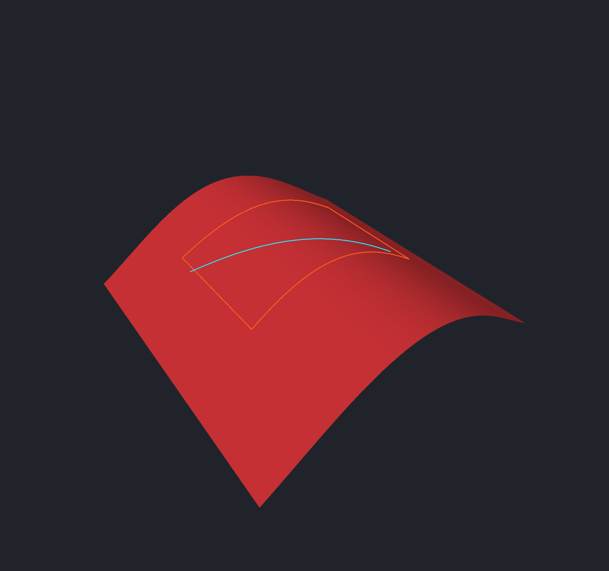

# Surface annotations sample

Open `projected-ranges.woby` to inspect a line and rectangular range attached to a
curved model. Orbit the camera: the cyan line and orange boundary bend with the
surface and remain fixed to the same model locations.

Select an annotation in Objects to edit its appearance, name, or comments. Drag a
visible endpoint or corner handle on the model to reshape it. Each completed drag
supports Undo/Redo. Drag an edge of the selected annotation to move the whole
outline across its source surface. The line and rectangle icons beside Show dimensions create
additional outlines. Escape or clicking the active tool cancels drawing.

This sample uses an 80-triangle generated curved sheet. The rectangle is defined
in its original drawing projection, not as four straight edges in 3D. Neither
annotation modifies the source mesh or represents a surface-area measurement.

