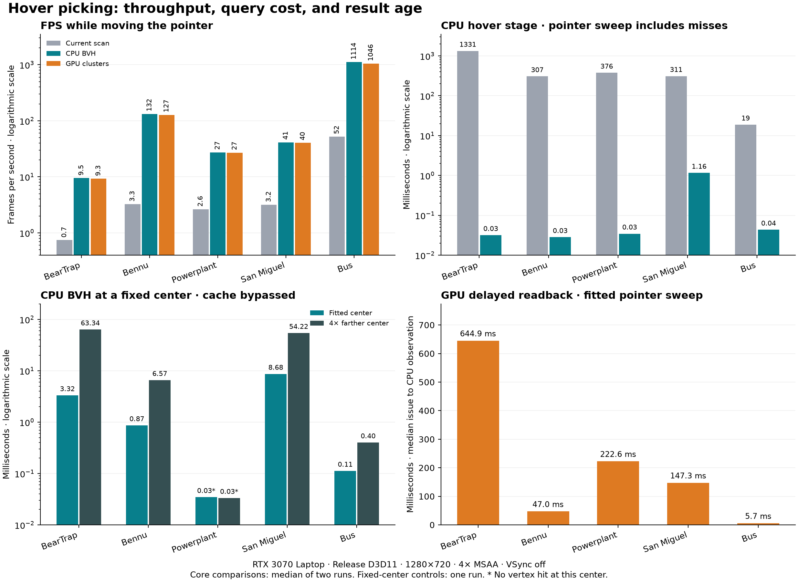

# Accelerated hover-picking experiment

Measured on 27 September 2026, source commit `51933cf87d59257bc5f822f8e68cb95712b1434f`.
Research prototypes are in `D:/.worktree/woby-hover-picking`; production source in
the main checkout is unchanged.

**Spatial culling removes the original hover stalls. The simple CPU BVH still has
expensive dense zoom-out queries; GPU compute preserves FPS there, but CPU
readback makes its result much older.** A production choice must account for all
three: frame rate, query completion time, and result age.

For an FPS-first design on modern GPUs, the next experiment should consume the
GPU result directly for highlighting. Your proposed visible-marker-only policy
also makes an ID attachment to the actual marker pass worth comparing. That ID
attachment has **not** been benchmarked here. CPU coordinate text would still
need readback, or a different update policy such as updating after the pointer
settles. For synchronous coordinate hover, the CPU BVH is a useful starting
point, but its dense-query tail needs additional pruning or work off the UI
thread before treating it as a complete solution.

## Fitted view with a moving pointer

FPS below is the median of two independent process-run rates. All modes issue a
query each eligible frame; static-cache reuse is deliberately bypassed. Four-pixel
markers are drawn by the production renderer, with a three-pixel minimum hover
radius. GPU columns use spatial cluster culling and delayed readback.

| Model | Current scan FPS | No picking FPS | CPU BVH FPS | GPU clusters FPS |
|---|---|---|---|---|
| BearTrap | 0.74 | 9.45 | 9.48 | 9.31 |
| Bennu | 3.26 | 131.28 | 132.12 | 127.13 |
| Powerplant | 2.65 | 27.28 | 27.32 | 26.98 |
| San Miguel | 3.19 | 41.19 | 41.26 | 40.29 |
| Bus | 52.12 | 1093.67 | 1113.93 | 1046.17 |

Small differences around the no-picking control are noise, not evidence that
picking accelerates drawing. BearTrap remains near 9.5 FPS because marker rendering
itself takes about 106 ms. Removing hover work cannot remove that rendering limit.

The very low CPU medians include fast misses. These are useful improvements, but
they are not representative of every successful hover:

| Model | Current scan CPU ms | BVH CPU median ms | BVH query P95 ms | BVH queries returning a vertex |
|---|---|---|---|---|
| BearTrap | 1331.12 | 0.032 | 7.17 | 26/60 (43%) |
| Bennu | 306.55 | 0.028 | 1.82 | 362/794 (46%) |
| Powerplant | 376.33 | 0.035 | 3.29 | 31/165 (19%) |
| San Miguel | 311.02 | 1.158 | 6.23 | 63/248 (25%) |
| Bus | 18.81 | 0.043 | 0.14 | 3004/6684 (45%) |

CPU stage medians include adapter/group setup and overlay-result construction.
Query P95 values come from the adapter's per-query timer, which ends just before
the main hover stage ends. Per-run medians and P95s are combined with equal weight;
the two independent runs are not pooled by frame count.

## Dense queries and zoom

The fixed-center controls force an uncached query every frame. In normal operation,
a truly stationary camera and pointer can reuse the existing result. These controls
measure the work required after an input change; they do not claim that an idle
production viewer repeatedly performs this work. These focused controls have one
run per model, so treat small FPS differences as exploratory.

| Model | Fitted CPU ms | 4× farther CPU ms | Far candidate points tested | Far FPS: none | Far FPS: CPU | Far FPS: GPU |
|---|---|---|---|---|---|---|
| BearTrap | 3.321 | 63.337 | 1,015,980 | 6.6 | 6.7 | 6.5 |
| Bennu | 0.865 | 6.566 | 78,800 | 108.6 | 110.1 | 103.6 |
| Powerplant (miss) | 0.035 | 0.033 | 0 | 8.5 | 8.6 | 8.5 |
| San Miguel | 8.675 | 54.216 | 864,919 | 27.0 | 17.8 | 26.6 |
| Bus | 0.112 | 0.401 | 5,483 | 693.8 | 695.7 | 659.7 |

Powerplant's center controls returned **no vertex**, so its low values here are
not evidence of cheap dense picking. Its moving-pointer and pan scenarios did
exercise successful queries; their timings are retained in the data.

BearTrap tests about 1.02 million candidate points at the far center, versus
48,645 at the fitted center. Its 63 ms query is largely hidden behind the roughly
150 ms GPU frame. San Miguel tests about 865,000 points and spends 54 ms in the
CPU query; this exceeds its roughly 37 ms rendering time and drops FPS from 27 to
18. GPU picking costs about 0.49 ms of GPU work in this same San Miguel control
and retains 26.6 FPS, but its delayed result reaches the CPU about 224 ms later.
BearTrap's corresponding GPU result age is about 920 ms.

This CPU prototype traverses all intersecting leaves. It has no front-to-back
depth pruning or screen-distance bounds for rejecting leaves that cannot beat
the current winner. Those are meaningful next CPU optimizations. The GPU
prototype also has room to improve: it launches a group for every spatial leaf,
then rejects that leaf. A compact candidate queue or GPU hierarchy traversal
could reduce this overhead. Neither improvement was measured here.

## Camera movement

Picking stays enabled during these tests, including orbit and pan, which normally
suppress production hover queries. Values are median / P95 CPU query costs in ms;
median uses the full hover stage, while P95 uses the per-query timer.

| Model | Zoom | Orbit | Pan |
|---|---|---|---|
| BearTrap | 4.19 / 9.95 | 2.97 / 6.11 | 4.05 / 25.14 |
| Bennu | 0.87 / 1.88 | 0.75 / 0.97 | 0.80 / 1.05 |
| Powerplant | 0.03 / 0.05 | 0.03 / 0.06 | 0.05 / 5.28 |
| San Miguel | 8.16 / 15.94 | 5.08 / 8.64 | 1.37 / 8.37 |
| Bus | 0.10 / 0.13 | 0.09 / 0.23 | 0.10 / 0.16 |

Powerplant's centered zoom/orbit paths were misses; its pan path included hits.
The index is unchanged during these camera motions. Only query matrices and the
cursor frustum are updated. BearTrap's pan P95 reaches about 25 ms, and San Miguel's
zoom P95 reaches about 16 ms, reinforcing that median sweep timings alone are not
a sufficient production budget.

## GPU execution versus readback

The compute shaders use the existing GPU position and point-ID buffers, a spatially
reordered rank list, cluster boxes, and per-group transforms. One lane rejects a
cluster before the workgroup tests its points. Shared-memory reductions produce
one winner per cluster; two further passes reduce those winners to a single ID.
No global per-point atomic competition, ray tracing, or Shader Model 6 feature is
required. This experiment uses the existing D3D11/Shader Model 5 toolchain.

| Model | Full scan GPU ms | Clustered GPU ms | Immediate readback ms | Delayed readback ms |
|---|---|---|---|---|
| BearTrap | 4.863 | 1.503 | 322.1 | 644.9 |
| Bennu | 1.342 | 0.389 | 25.0 | 47.0 |
| Powerplant | 1.372 | 0.439 | 112.1 | 222.6 |
| San Miguel | 1.121 | 0.363 | 74.5 | 147.3 |
| Bus | 0.093 | 0.040 | 4.0 | 5.7 |

Cluster culling reduces compute time by approximately 2.3–3.4×. The unculled
control uses the same spatially reordered point list, so this comparison isolates
culling within this implementation rather than comparing every possible scan layout.

The pinned bgfx D3D11 backend calls `Map(..., D3D11_MAP_READ, 0, ...)` in
`renderer_d3d11.cpp:1847`. The application gets a future frame number, but the
render thread can wait for the copy. D3D11's explicit non-waiting flag is what
allows a busy resource to return without waiting. [Microsoft Map flag documentation](https://learn.microsoft.com/en-us/windows/win32/api/d3d11/ne-d3d11-d3d11_map_flag)

The delayed variant queues the map after three application-frame advances,
giving the older copy time to finish. Observed result delivery was six frames
after issue, versus three for immediate readback. This is a throughput/age
tradeoff, not a guarantee that the driver can never block. On Bus, immediate
readback averaged 711 FPS across runs (669–752), delayed readback 1,046 FPS,
and compute without any readback 1,043 FPS. CPU BVH picking averaged 1,114 FPS.

GPU result age is measured from issuing a request to observing its data on the
CPU. It is **not** physical mouse-to-display latency. GPU prototype results are
logged and are not displayed as stale coordinate overlays. CPU results use the
ordinary coordinate overlay. A GPU-drawn hover highlight is proposed, not implemented
in this experiment.

## Preparation cost

Build times below are medians of three timed-run processes per model. CPU memory
is index-array capacity; GPU memory is added buffer/texture payload. Neither is
peak process memory or a driver-allocation measurement. The existing mesh buffers
are additional. All variants retain the same prepared resources for fair controls.

| Model | Index build seconds | CPU index MiB | Extra GPU payload MiB |
|---|---|---|---|
| BearTrap | 17.96 | 179.7 | 162.6 |
| Bennu | 8.30 | 41.8 | 38.1 |
| Powerplant | 5.08 | 51.3 | 45.4 |
| San Miguel | 1.86 | 42.5 | 37.8 |
| Bus | 0.15 | 2.6 | 2.3 |

Construction is synchronous in the research adapter and excluded from timed
frames. A production version needs background construction or a cache, explicit
mesh lifetime/invalidation handling, and cancellation. Camera movement, zoom,
and affine group transforms can reuse the model-space index.

## Correctness and picking policy

Separate validation runs tested 90 camera/cursor queries per model. All 450 CPU
BVH queries agreed with both a linear reference and the production picker's
returned coordinates, depth, and screen distance. All 450 clustered GPU results
matched the corresponding unculled GPU result exactly. No readback-ring requests
were dropped in any validation or timed process.

| Model | Queries | GPU/CPU exact ID agreement | GPU/CPU hit-or-miss agreement |
|---|---|---|---|
| BearTrap | 90 | 67 | 90 |
| Bennu | 90 | 90 | 90 |
| Powerplant | 90 | 71 | 90 |
| San Miguel | 90 | 89 | 90 |
| Bus | 90 | 52 | 90 |

GPU and CPU floating-point projection are not bit-identical. Exact point IDs
agreed in 369/450 queries; hit-or-miss agreed in all 450. Compared winning depths
differed by at most about 1.2e-7 in normalized depth. This does not establish a
world-space error bound, and some point IDs can represent split render vertices.
An exact CPU-compatible result therefore cannot be assumed for the GPU path.

Both prototypes search eligible vertex centers within the hover radius, including
vertices behind solid surfaces. They do **not** implement visible-fragment picking.
If visible-marker picking is selected, an ID attachment should follow the actual
marker/surface depth policy. Transparency, minimum hover tolerance, and MSAA need
an explicit winner/resolve policy; IDs must not be averaged like colors. Integrating
ID output into the existing marker pass could avoid a second full geometry pass,
but its bandwidth and MSAA cost remain unmeasured. It could also remove the need
for this point index if it completely replaces geometric hover queries.

The next GPU prototype should compare that ID attachment with clustered compute,
use the result directly for a highlight, and separately decide how coordinate text
handles result age. The CPU alternative should add conservative best-candidate
pruning and a query budget/worker strategy, then repeat the dense zoom-out controls.
San Miguel also merits caching group preparation; both prototypes currently pay
around 1 ms to prepare its 2,203 groups.

## Other controls

Adding solid surfaces or using marker opacity 0.4 changes GPU drawing cost and
therefore readback age, while the geometric hover policy remains the same.
The `depth` control uses `max(original near plane, 0.01 × fitted distance)`:
Powerplant's no-picking marker rate rises from roughly 27 FPS to 45.7 FPS, and
clustered picking retains 44.7 FPS. This confirms the separate depth-precision
issue from the [rendering investigation](large-model-rendering-performance.md).
It is an experimental setting, not a general production near-plane policy.

## Measurement and verification

- 305 measured scenarios, 206,053 measured frame intervals, 15 Release processes.
  Core cases have two independent rounds; focused controls have one. Priming
  scenarios, validation runs, and earlier pilots are excluded from these totals.
- Ryzen 7 5800H (8 cores / 16 threads), 64 GiB RAM, RTX 3070 Laptop 8 GiB,
  NVIDIA 546.30, D3D11, hidden 1280×720 full-viewer window, 4× MSAA, VSync off.
  No other viewer, build, or test suite ran during timing. Clocks, thermals, and
  scheduling were not locked.
- Each scenario warms for at least 1.5 seconds and 20 frames, then measures at
  least 3 seconds and 30 frames. Camera paths repeat over two seconds; the pointer
  sweep uses ±15% of viewport width with a period of pi seconds. Real SDL mouse
  delivery, native input latency, and physical presentation latency are not measured.
- GPU view timestamps are deduplicated using each view's own source-frame ID,
  with eight-frame boundary margins. Readback latency excludes the last eight
  issued frames so a subsequent slow legacy case cannot contaminate it. CPU and
  GPU costs overlap and should not be summed.
- CPU/UI logging and profiling add some overhead. GPU variants omit coordinate
  overlay display; CPU variants include it. Motion paths use wall time, so small
  cross-mode differences can reflect sampling phase as well as execution cost.
- Debug and Release builds were warning-free. All 638 CTest tests, including
  graphics tests and four new point-index tests, passed; the new index tests
  exercise 1,558 assertions. Three new analysis-contract tests and four reused
  rendering-analysis tests also passed.

The prototypes support one static model per process and its imported groups.
Production integration must address scene edits, replacement, repeated instances,
and traversal-order tie keys for reordered scene nodes. The report's correctness
claims concern the tested scenes and inputs.

## Artifacts and reproduction

- [Per-run scenario results](hover-picking-results.json)
- [Flat result table](hover-picking-results.csv)
- [Separate correctness results](hover-picking-validation.json)
- [Hardware/source provenance](hover-picking-provenance.json)
- [Harness and commands](../tests/hover_experiment/README.md)
- Raw captures: `build/hover-core`, `build/hover-extra`, and `build/hover-qa`.
  The earlier `hover-release-pilot` and `hover-debug-qa` directories are excluded.

The [CPU index](../tests/hover_experiment/point_index.h),
[GPU candidate shader](../tests/hover_experiment/candidates.sc),
[reduction shader](../tests/hover_experiment/reduce.sc), and
[runtime adapter](../tests/hover_experiment/adapter.h) are preserved with the harness.
