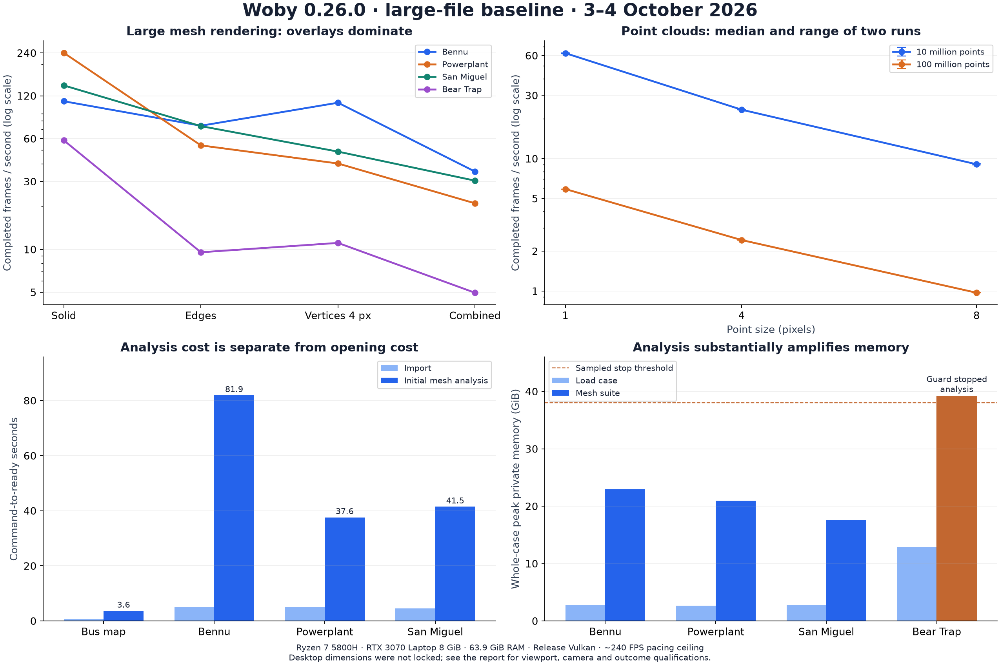

# Woby large file performance baseline

Measured on 3–4 October 2026 against Woby 0.26.0, commit `7f23b97560877266ca75fbc00c38a03e9576a656`. This report establishes a baseline for later performance work; application code and the original model corpus were not changed. The [path catalog](large-file-stress-paths.md) describes the complete test surface. Reproduction scripts are in [tests/stress](../tests/stress).

The first import pass attempted every one of the 22 supplied OBJ files. Eleven loaded, eight returned ordinary load failures, two terminated with Windows heap-corruption code `0xC0000374`, and one was stopped by the measurement harness's memory guard. Successful loading does not imply acceptable interaction speed: the 100-million-point cloud rendered around 2.4 FPS, while BearTrap fell from about 58 FPS in solid view to 5 FPS with solids, edges and vertices together.



The figures use the cases identified below; rendering values are desktop observations with the resolution and pacing qualifications in the next section. The [JSON baseline](benchmarks/large-file-stress-20261003.json) and [frame CSV](benchmarks/large-file-stress-20261003.csv) retain the numerical measurements. The [follow-up report](large-file-stress-follow-ups.md) prioritizes investigations.

## Measurement conditions

| Item | Baseline |
| --- | --- |
| CPU | AMD Ryzen 7 5800H, 8 cores / 16 logical processors |
| RAM | 68,564,348,928 bytes, about 63.9 GiB |
| GPU | NVIDIA GeForce RTX 3070 Laptop GPU, 8 GiB VRAM |
| Driver / backend | NVIDIA 616.92; NoGraphicsAPI Vulkan |
| OS | Windows 11 Home, build 26300 |
| Storage / power | Corpus and results on D:; NVMe host storage; Legion Balance Mode |
| Build | Visual Studio 2026, `vs2026-vcpkg`, Release for measurements |
| Rendering | Production desktop loop; application requests 1280 × 720; actual window dimensions were not locked or logged in the early scripted runs; default pane initially visible; isometric fitted view |
| Capture | Separate 1920 × 1800 PNG export, outside steady FPS sampling |
| Isolation | One measured viewer or CPU benchmark at a time; builds and test suites complete before timing workloads |
| Guards | 600-second import deadline unless a run manifest says otherwise; 180/240-second operation deadlines, extended to 600 s for comparison follow-ups; stop above 38 GiB private bytes or below 6 GiB available system memory |

Private memory is sampled every 200 ms. The 38 GiB threshold is a **sampled stop condition, not a hard allocation limit**: the full Semantic3D run jumped from 37.6 to 47.2 GiB between samples before termination. Reported peaks include this overshoot. RSS, Windows peak working set, available system memory, CPU time and thread count are retained separately. Device-wide GPU memory, utilization, temperature, power and clocks are sampled once per second; those values include other applications.

The app's production mailbox pacing is approximately 240 FPS on this display. Results near that ceiling cannot rank spare rendering capacity. FPS is calculated from completed frame-counter deltas over query-midpoint elapsed time. CPU/GPU timings are sparse samples of the last completed frame, not a complete frame-time distribution; no frame P95/P99 claims are made. GPU timestamps are asynchronous, and GPU time overlaps CPU work. The graphics-frame CPU stage includes waiting and presentation pacing.

Scripted process launches requested Windows `SW_HIDE`; SDL ran the normal desktop renderer rather than headless mode. These measure completed rendered frames and GPU work, not end-to-end physical display/input latency. The later native UI follow-up observed a 1524 × 1664 outer-window screenshot, despite the application requesting 1280 × 720 at creation. Earlier runs did not retain actual drawable dimensions, so they are **not a certified fixed-resolution benchmark**. Treat them as a baseline on this desktop, and explicitly lock/log drawable dimensions for future cross-build rendering comparisons. Pane changes also alter the usable viewport.

The RPC pane toggle controls the **left scene pane**, not the right Properties pane. It changes both UI work and available viewport area, so its FPS difference cannot be attributed solely to UI construction. Camera movement in the scripted suites uses RPC commands; physical input latency is not inferred from those timings. Headless mode is used only for explicitly labeled loading/reproduction checks, never as a visualization FPS proxy.

No OS cache flush, fixed CPU/GPU frequency, CPU affinity, or thermal lock was applied. Fresh processes are not cold-cache runs. Raw manifests record model sizes/timestamps, executable SHA-256, exact selections, limits and measurement durations. Small differences require repeated controlled runs before being treated as regressions.

## Original corpus loading

Times below are the first full-sweep `model.add` acknowledgement, including background CPU loading and GPU finalization. They do not timestamp the first physical display pixel. Annotation preparation is tracked separately after the acknowledgement. Screenshots confirm the subsequently rendered scene.

| Successful input | File GB | Triangles or points | Groups | Load seconds | Peak private GiB |
| --- | ---: | ---: | ---: | ---: | ---: |
| SA_Row3 | 0.000044 | 2,995 triangles | 7 | 1.16 | 0.71 |
| BeTSSi original | 0.000099 | 161,756 triangles | 70 | 1.03 | 0.71 |
| Tubes original | 0.000140 | 250,400 triangles plus 44 points and curves | 78 | 1.37 | 0.88 |
| Camera original | 0.000300 | 231,073 triangles plus curves | 52 | 3.78 | 0.72 |
| BusGameMap | 0.0756 | 1,054,542 triangles | 65 | 0.67 | 0.82 |
| Semantic3D 10M | 0.312 | 10,000,000 points | 1 | 2.03 | 2.13 |
| Bennu | 0.816 | 17,866,836 triangles | 1 | 4.97 | 2.80 |
| Powerplant | 0.818 | 12,759,246 triangles | 21 | 5.13 | 2.65 |
| San Miguel | 1.143 | 9,980,699 triangles | 2,203 | 4.53 | 2.80 |
| Semantic3D 100M | 3.225 | 100,000,000 points | 1 | 19.17 | 15.57 |
| BearTrap | 7.109 | 75,771,986 triangles | 1 | 25.11 | 12.81 |

Peak private memory covers the whole case, including capture, and is not purely retained mesh payload. File sizes use decimal GB; memory uses binary GiB. The source names and exact paths are preserved in the machine-readable evidence.

BearTrap's CPU-load log reports 19.71 seconds inside `loadModel` and 22.85 seconds for the broader CPU-loading stage. GPU finalization then produced a 2.24-second frame dominated by `pending_io`. Large import therefore still contains a visible main-thread stall even though parsing runs in the background.

| Input that did not load | Seconds until outcome | First-sweep outcome |
| --- | ---: | --- |
| testpoints | 2.26 | Material not found, line 14 |
| SCARED-C original | 0.43 | Non-finite source coordinate |
| BeTSSi ×100 | 1.58 | Process exited `0xC0000374` |
| SA_Row3 ×1,000 | 244.69 | Freeform tessellation exceeds the vertex limit |
| BeTSSi ×1,000 | 21.51 | Freeform tessellation exceeds the vertex limit |
| Tubes ×1,000 | 0.76 | Process exited `0xC0000374` |
| Camera ×1,000 | 12.50 | Parameter-vertex table limit, source line 2,918,155 |
| SA_Row3 ×10,000 | 21.72 | Parameter-vertex table limit, source line 4,776,215 |
| BeTSSi ×10,000 | 24.61 | Parameter-vertex table limit, source line 7,882,499 |
| Semantic3D full 429,615,314 points | 18.94 | Harness memory guard; observed private peak 47.23 GiB |
| Orchard 268,979,477 points | 58.92 | CPU loading completed; GPU buffer exceeds supported 32-bit size; private peak 37.79 GiB |

The source has a two-million-element freeform control/parameter/tessellation limit. The 244.69-second keycap rejection shows that some unsupported inputs consume substantial CPU time before rejection. The renderer separately uses 32-bit byte sizes for individual buffers: at 32 bytes per vertex, a single vertex buffer permits at most 134,217,727 vertices. Both full Semantic3D and orchard exceed that limit regardless of their successful source parsing or available system RAM.

The heap-corruption failure is intermittent. BeTSSi ×100 reproduced it once in three additional headless process runs; the other two returned the normal tessellation-limit error. Tubes ×1,000 returned normal limit errors in three headless reruns. One CPU-only load attempt per model also returned normal limit errors. These results reproduce an application failure but do not identify its root cause; no crash stack was captured. Retain both the crash and ordinary-rejection paths when investigating loader cleanup.

SCARED-C contains 283,454 non-finite vertex rows among 1,310,720 vertices. A separately labeled derivative removes those rows and retains 1,027,266 finite vertices. The original remains unchanged. A separate 500-copy native keycap derivative preserves the provided corpus generator's native geometry and index remapping, providing a case below the known freeform tessellation limit. Derived results must not be reported as successful loads of the original rejected files.

## First rendering sweep

These are four-second steady measurement windows after 1.5 seconds of warm-up, in fresh Release viewers. Helpers are hidden; solid/edge/vertex comparisons use the pane-hidden viewport. Display buffers remain allocated after first use, matching normal editing. Camera fitting and screenshots occur outside the timed windows.

| Mesh | Solid FPS | Edges FPS | Vertices at 4 px FPS | Combined FPS | Vertices at 1 px FPS | Vertices at 8 px FPS |
| --- | ---: | ---: | ---: | ---: | ---: | ---: |
| Bennu | 109.84 | 73.91 | 107.30 | 35.20 | 115.19 | 70.21 |
| Powerplant | 240.39 | 53.78 | 40.12 | 21.05 | 77.15 | 18.30 |
| San Miguel | 141.92 | 73.46 | 48.63 | 30.39 | 86.62 | 27.12 |
| BearTrap | 58.34 | 9.54 | 11.10 | 4.95 | 24.78 | 4.36 |

The small native models and bus map generally reach the display pacing ceiling. BearTrap's sampled GPU time rises from 16.46 ms in solid mode to 108.88 ms for edges and 202.30 ms for the combined view. Its 8-pixel vertex view reaches about 224.17 ms of GPU time. This is strong evidence of a rendering bottleneck in these cases, not merely an expensive UI table.

The 10M cloud's first sweep recorded about 23.42 FPS at the default point size, 60.67 FPS at one pixel, and 8.91 FPS at eight pixels. The corresponding sampled GPU medians were 41.81, 15.63 and 110.83 ms. The generic mesh-mode harness initially disabled all standalone points in its edge-only and transparent cases; those empty-view observations are explicitly excluded from point-rendering conclusions. Corrected cloud repetitions retain standalone points and use explicit point scenario names.

Two corrected runs per cloud used six-second windows after 1.5 seconds of warm-up, with alternating model order. Ranges below contain the two observed FPS values, not confidence intervals.

| Cloud | Default 4 px FPS | 1 px FPS | 8 px FPS | Transparent 4 px, 35% opacity FPS |
| --- | ---: | ---: | ---: | ---: |
| Semantic3D 10M | 23.38–23.40 | 62.15–62.84 | 8.98–9.13 | 10.71–10.80 |
| Semantic3D 100M | 2.43–2.43 | 5.88–5.89 | 0.97–0.97 | 0.96–0.96 |

The finite-only SCARED derivative loaded 1,027,266 points in 0.564 s, peaked at 1.12 GiB private memory, and reached the pacing ceiling with opaque points; transparency reached 223.88 FPS. The 500-copy native keycap derivative loaded 1,497,500 triangles, 1,117,000 vertices and 3,500 groups in **131.53 s**, despite a file size of only 22.7 MB. Its solid/edge/vertex/combined views reached 97.84/93.50/83.66/30.95 FPS, with a 1.25 GiB whole-case private peak. These derivatives provide usable workloads alongside the rejected original ladders.

Launching with `--file` also completed: launch-to-instance-ready was 0.953 s for BusGameMap, 18.878 s for the 100M cloud, and 29.005 s for BearTrap. This is a different boundary from `model.add` in an already running process; annotation preparation, subsequent frame sampling and capture follow that timestamp.

## Mesh diagnostics, quality, and export

Each initial measurement includes the nine default detectors and surface-quality preparation. Self-intersections are a separate explicit run. Results cover boundary edges, non-manifold edges and vertices, inconsistent winding, duplicate points and triangles, degenerate triangles, holes, and fins. All four surface-quality metrics were exercised: longest edge, equivalent size, shape, and size jump. Times are command-to-ready latencies, not isolated algorithm CPU times.

| Input | Initial ready s | Cached query s | Exact-position topology s | Original-index topology s | Source transform → ready s | Whole-case peak private GiB |
| --- | ---: | ---: | ---: | ---: | ---: | ---: |
| BusGameMap | 3.65 | 0.248 | 1.58 | 1.07 | 3.82 | 2.11 |
| BeTSSi original | 0.83 | 0.327 | 0.38 | 0.55 | 0.85 | 0.99 |
| Tubes original | 1.07 | 0.234 | 0.92 | 0.46 | 1.09 | 1.29 |
| Camera original | 1.12 | 0.248 | 0.68 | 0.61 | 1.12 | 1.10 |
| Bennu | 81.88 | 0.041 | 26.58 | 21.38 | 85.99 | 22.95 |
| Powerplant | 37.61 | 0.104 | 15.03 | 11.65 | 41.01 | 20.99 |
| San Miguel | 41.46 | 0.423 | 14.98 | 12.83 | 43.96 | 17.56 |
| BearTrap | Stopped after 12.27 s | — | — | — | — | 39.10 |

BearTrap loaded successfully before the analysis exceeded the sampled 38 GiB guard. Its analysis result is unavailable; the guard does not prove the machine or application could never finish with a different budget. For completed cases, cached result retrieval is much cheaper than geometric invalidation. Display offset edits also reused results. Changing hole, fin, and degenerate thresholds, findings pagination, and JSON export were exercised separately.

Bennu's quality-metric changes produced roughly three-second `view_setup` stalls, even though steady quality rendering was about 123 FPS. The main loop updates comparison runtime/display buffers in that stage. This identifies a first-use or regeneration cost worth profiling separately from worker computation and steady drawing; it does not establish the exact hot function.

San Miguel's default diagnostic view rendered at 12.35 FPS. Sparse CPU medians included 46.32 ms in ImGui construction, 15.45 ms in scene submission, and 14.20 ms in helper submission, versus a 23.79 ms GPU median. Quality views with the default diagnostic overlays still enabled reached about 17–18 FPS. These measurements include the pane and overlays, and should not be interpreted as isolated heatmap cost.

A separate controlled run measured 12.42 FPS with the left pane shown and 12.58 with it hidden. Turning all diagnostic Show flags off still gave 12.13/12.40 FPS. Quality mode without overlays reached 18.14/18.23 FPS. ImGui construction remained about 46 ms in diagnostics and 18 ms in quality. **The right analysis Properties pane remained visible**, so this experiment does not exclude that pane as a CPU cost. Scene/helper submission also remained substantial with overlays hidden. BusGameMap stayed near the pacing ceiling across these controls. Export cancellation reached `state=canceled`, including on San Miguel after 6,774 entries, and a later findings page plus boundary focus succeeded.

| Full diagnostic export | Output bytes | Entries written | Start → observed completion |
| --- | ---: | ---: | ---: |
| BusGameMap | 18,292,125 | 219,537 | About 1.6 s |
| Powerplant | 1,334,973,752 | 13,745,439 | 93.77 s |
| San Miguel | 1,549,523,564 | 17,792,847 | 115.68 s |

Export latencies include polling delay. Each export reached `state=complete` with all retained results written. `detectionComplete=false` remains expected because the manually run self-intersection detector was not checked in these mesh-only cases. Export completion is therefore distinct from completeness of every diagnostic category.

### Visible Properties pane follow-up

A separate visible and foregrounded San Miguel viewer used six-second windows after two seconds of warm-up. The observed outer window was 1524 × 1664 pixels. Source geometry stayed hidden while its mesh analysis remained visible. Actual Windows UI captures accompany the renderer's scene-only captures.

| UI state, in order | FPS | Sampled ImGui construction ms | Scene submission ms | Helper submission ms |
| --- | ---: | ---: | ---: | ---: |
| Analysis Properties visible | 12.32 | 46.75 | 15.45 | 14.15 |
| Properties hidden | 29.01 | 0.16 | 15.65 | 14.18 |
| Analysis Properties restored | 12.39 | 46.45 | 15.50 | 14.13 |
| Source file selected, source Properties visible | 27.35 | 2.21 | 15.64 | 14.14 |

The visible → hidden → visible sequence reproduces a **roughly 46 ms per-frame analysis Properties cost**. Hiding it raises sustained FPS about 2.35×, but roughly 30 ms of scene/helper submission remains. Pane toggling changes viewport width, and selecting the source also changes the selection bounds overlay; the isolated ImGui stage is stronger evidence than FPS alone. The raw scenario named `native_properties_visible_repeat` is mislabeled: clicking the Properties text did not open the pane, so that 29.10 FPS window was still hidden. The aggregate marks this explicitly; `native_properties_restored` is the valid visible repeat.

With the pointer already over the canvas, native wheel input changed camera distance from 102.124 to 90.576; the resulting source-Properties view ran at 27.34 FPS. The first wheel action immediately after leaving the pane did not change camera distance. A viewport click subsequently selected the analysis and restored its Properties panel, returning to 12.34 FPS. These establish functioning native input paths, not input-latency percentiles.

The same viewer began importing the 500-copy native keycap derivative. Clicking the observed Cancel button during triangulation returned `canceled=true`, `addedCount=0`, `failedCount=0`; the existing one-file, one-analysis San Miguel scene remained intact and rendered afterward. The import command was pending for 25.89 s before cancellation. That is elapsed work before the manual cancellation, not cancellation response time. Window captures show both the progress dialog and recovered scene.

## UV inspection and quality

BusGameMap and San Miguel exercised 3D surface, edges, overlapping layout, separated layout, U/V gradients and grid density; all six quality metrics; normalization, thresholds, range highlighting, overlap scope, and triangle pages. The original native keycap exercised missing-UV behavior: all 2,995 triangles were unavailable for UV metrics. Its empty UV layout is excluded from valid UV rendering conclusions.

| Operation | BusGameMap s | San Miguel s |
| --- | ---: | ---: |
| Initial UV inspection | 0.232 | 3.220 |
| Initial UV quality | 1.336 | 14.289 |
| Quality layout switch | 1.373 | 15.464 |
| Quality separation | 1.356 | 15.431 |
| Area metric | 1.357 | 15.447 |
| Orientation metric | 1.060 | 11.988 |
| Anisotropy metric | 1.379 | 15.800 |
| Minimum stretch metric | 1.365 | 15.417 |
| Per-patch overlap metric | 2.339 | 15.354 |
| Absolute normalization | 2.319 | 15.530 |
| Threshold change | 2.333 | 15.681 |
| Range change | 2.342 | 15.359 |
| Cross-patch overlap | 1.580 | 16.420 |

The original angle metric was already selected; setting it again returned in 0.034 s on BusGameMap and 0.128 s on San Miguel. In contrast, the other changes repeatedly incurred substantial ready latency. This makes UV invalidation and display regeneration a strong follow-up target. No claim is made that all 15 seconds ran on the UI thread.

BusGameMap has 958,674 valid UV triangles and 95,868 missing-UV triangles. San Miguel reports 9,583,544 valid, 389,006 collapsed-UV, and 17,386 degenerate-surface triangles; these classifications need not be mutually exclusive. Both models returned **truncated overlap results**. BusGameMap's per-patch run reached 2,000,000 candidates; its cross-patch run retained 10,000 cross-patch pairs. San Miguel also truncated, at 1,222,894 candidates per patch and 73,368 for selected patches. These bounded runs are not exhaustive overlap certificates.

BusGameMap's UV views reached the approximately 240 FPS pacing ceiling. San Miguel ranged from 27.93 FPS for the overlapping quality layout with edges to 47.62 FPS for separated plain UV inspection with edges. Its quality surface view was 43.46 FPS and separated quality layout with edges 44.42 FPS. The initial suite leaves edges enabled after the surface-with-edges step. Camera/layout occupancy and pane cost differ between modes.

BearTrap completed plain UV construction in 18.67 s and rendered the UV surface at 59.44 FPS, dropping to 7.23 FPS with edges and about 8.3 FPS in layout views. Initial UV quality took 106.72 s; layout and separation each took about 115 s; area, anisotropy and minimum-stretch changes took 114–115 s, and orientation took 80.83 s. The result classified 75,770,512 triangles as valid UV geometry.

However, **BearTrap's UV-quality display failed**: capture reported `Analysis display exceeds the supported 32-bit GPU buffer size`. Its apparent 240 FPS quality frames are empty-display observations and are excluded. CPU metric completion does not imply successful heatmap display. The expanded three-vertices-per-triangle quality buffer exceeds the 32-bit byte-size limit at this scale. Subsequent UV overlap analysis triggered the memory guard after 72.04 s, with a whole-case private peak of 38.57 GiB. Normalization, threshold, range and cross-patch overlap steps after that termination were not reached on BearTrap.

The separated-layout captures show small patches at the common full-layout fit, especially on San Miguel. Source inspection confirms that layout vertices lie in world XZ and Z-up/front is the perpendicular camera; the sparse appearance is not an edge-on view. Whole-layout FPS is therefore kept distinct from a closer camera experiment.

In the follow-up without edges or helpers, San Miguel's overlapping/separated quality layouts measured 44.58/44.57 FPS at whole-layout fit and 44.81/45.21 FPS at 0.15 times that camera distance. BusGameMap stayed near 240 FPS. Later triangle pages produced valid linked probes on both meshes, with non-null surface, UV and display coordinates; this complements the bus's first-page missing-UV probe.

## Surface comparison and concurrent work

Identical-input comparisons returned near-zero distance statistics in both directions: BeTSSi used 647,024 samples per side (maximum about `9.1e-8` model units), and BusGameMap used 4,218,168 per side (maximum about `2.0e-9`). These are numerical sanity checks, not exact Hausdorff-distance proofs.

| Initial full comparison | Ready latency | Whole-case peak private GiB | Outcome |
| --- | --- | ---: | --- |
| BeTSSi original A = B | 3.20 s | 1.33 | Completed |
| BusGameMap A = B | 15.41 s | 3.96 | Completed |
| Bennu A = B | Connection reset at 113.79 s | 24.46 | Transport failure; harness cleanup; no completed result |
| Powerplant A = B | 95.22 s | 24.03 | Explicit distance-heatmap buffer-limit error |
| San Miguel A = B | 180 s budget | 25.59 | Command timed out while work remained running |
| BearTrap A = B | Guarded case, 49.4 s total | 38.68 | Memory guard before a result |

Bennu's comparison connection reset is distinct from the `0xC0000374` native-loader failures. Its raw case was initially misclassified from the Windows cleanup exit code; the aggregate corrects that classification and preserves the original record. The distance display's twelve-vertices-per-triangle representation limits a side to 11,184,810 triangles with the current 32-bit byte-size API. The error can arrive after expensive automatic diagnostics have already run.

San Miguel's retry with a 600-second command budget lost its connection after **285.75 s** and recorded Windows exception exit code **`0xC0000409`**, with 35.35 GiB peak private memory. The harness also attempted cleanup while the process was exiting, so the exact exit/cleanup ordering is uncertain. No crash stack was captured. Disabling the automatic diagnostic detectors produced another connection reset at **281.11 s**, the same exception code and a 35.35 GiB private peak. This repeats the failure below the memory guard; increasing the command deadline did not produce a usable result.

With automatic detectors disabled, the bus comparison completed in 15.31 s. Bennu and Powerplant returned the explicit distance-buffer error after 162.14 s and 73.91 s, at whole-case private peaks of 25.31 and 24.03 GiB. This follow-up still requests surface quality as part of full results; it is not an isolated distance-kernel benchmark. A workflow marked `completed` after recording that expected RPC error does not mean a usable distance analysis was produced.

BeTSSi's distance mode rendered at 189.27 FPS and BusGameMap's at 92.56 FPS. Their overlay, A-only, B-only and quality modes were faster, with most bus modes near 240 FPS. Changing the bus tolerance/range returned in 0.231 s. An independent bus copy translated by 0.001 times the source radius produced nonzero mean distances of about 5.73 model units in both directions, with maxima about 59.34. Initial ready time was 17.78 s, cached retrieval 0.598 s, disabling B 4.27 s, re-enabling it 17.77 s, and swapping the translated sides 17.42 s.

Three concurrent bus analyses—mesh, UV quality, and distance comparison—completed with source invalidation and subsequent deletion. The short camera-motion window while work was pending averaged 220.34 FPS; the ready scene drawing all analyses reached 85.27 FPS; deleting them restored about 240 FPS. These scenes have different draw content, so this is a workflow result rather than an isolated worker-throughput comparison. The corresponding San Miguel concurrent case hit the memory guard after 149 s; no full three-analysis result is claimed there.

A bus scene containing mesh, UV-quality and surface-comparison analyses saved in 0.013 s and reopened its model/state in 0.298 s. Restored result waits then took 4.279 s, 0.033 s and 11.601 s in query order. Background work overlaps those waits, so they are not independent per-analysis runtimes. All three restored analysis results and a capture were retained; whole-case private memory peaked at 5.10 GiB.

The first self-intersection pilot confirmed start/cancel/retry behavior, but its result queries still reported `running` after acknowledgement. Those acknowledgement latencies are excluded as completion measurements. The runner now waits for the manual detector's own terminal state and retains candidate counts, limits and truncation status.

The intermediate `intersections-polled` run exposed a harness error: `partial` is a terminal detector status, but the first polling implementation kept waiting. That run was interrupted, retained and labeled; the corrected `intersections-terminal` campaign supplies the timing results. `partial` means the configured search budget was reached, not a complete count or an all-clear.

| Bounded self-intersection retry | Retry → observed terminal s | Candidate tests | Known intersecting pairs | Whole-case peak private GiB |
| --- | ---: | ---: | ---: | ---: |
| BeTSSi original | 2.77 | 402,655 | 10,000 | 0.92 |
| BusGameMap | 4.88 | 538,195 | 10,000 | 1.99 |
| San Miguel | 26.40 | 136,171 | 10,000 | 16.22 |

All three reached `status=partial`, `detectionTruncated=true`, `truncationReason=pair_limit`; the complete count is null. The configured limits were 10,000 pairs and 2,000,000 candidate tests. Timing includes up to roughly two seconds of polling delay and result serialization. These are bounded-search timings, not exhaustive intersection times. Start, cancel, retry and findings pagination completed.

Group-scoped bus analysis also completed add, disable, isolate, clear, add-whole-file, remove-member and group-transform invalidation. One-group ready took 0.592 s, two groups 3.328 s, disabled-member ready 0.616 s, isolated-member ready 2.768 s, whole-file ready 3.593 s, and group-transform recomputation 3.419 s. The case peaked at 1.60 GiB. Group geometry differs in size, so these values establish usable paths rather than a uniform per-group cost.

## Scene lifetime and annotations

Visibility undo/redo, transforms/reset, saved-view create/apply, scene inventory/tree, save, populated reopen, empty reopen, and clear completed on the large inputs below. Scene files reference model geometry, so a fast save does not imply embedded geometry serialization. Reopening loads source geometry again.

| Input | Save s | Reopen populated s | Reopen empty s | Whole-case peak private GiB |
| --- | ---: | ---: | ---: | ---: |
| San Miguel | 0.127 | 4.423 | 4.280 | 3.84 |
| Semantic3D 100M | 0.480 | 18.126 | 16.774 | 27.27 |
| BearTrap | 0.041 | 25.118 | 24.540 | 19.53 |

Post-reopen stats and captures were retained. Peak memory shows the importance of testing populated replacement, particularly for the 100M-point cloud. Source, scene and synthetic paths share one isolated temporary fixture directory in these tests.

| Annotation operation | BusGameMap s | Bennu s |
| --- | ---: | ---: |
| Project a small line | 0.127 | 7.434 |
| Move the line | 0.109 | 7.545 |
| Reshape the line | 0.125 | 7.567 |
| Project a small rectangle | 0.111 | 7.481 |
| Change style | 0.007 | 0.019 |
| Save annotated scene | 0.016 | 0.025 |
| Reopen annotated scene | 0.266 | 5.484 |

Both annotations survived save/reopen; deletion and undo/redo also completed. Bennu's projection/edit operations coincided with **7.43–7.57-second main-loop frames**, almost entirely in `scene_state`. This is a blocking interaction cost, separate from annotation preparation after import (about 1.21 s in this run). Source translation and style/query operations were fast. The annotation case peaked at 5.53 GiB private memory on Bennu.

Five import/display/remove/history-clear cycles completed on the bus, 10M-point and 100M-point clouds. After a two-second empty-scene wait, bus private memory stayed within 0.833–0.838 GiB, the 10M cloud within 1.006–1.012 GiB, and the 100M cloud within 1.003–1.006 GiB. The bus/10M working sets were about 0.10 GiB. This short sequence shows no growing retained-memory trend on those cases. It is not a long-duration leak test, and private allocations remaining after clear are not automatically leaks.

## Folder imports and scene controls

Folder fixtures contain immutable copies of one model in four subfolders, plus the known-invalid `testpoints` input. Geometry copies occupy the same coordinates; these are object-count and repeated-import workloads, not a spatially dispersed scene.

| Folder workload | Added / rejected | Groups / triangles | Flat import s | Tree import s | Flat left-pane on/off FPS | Tree left-pane on/off FPS |
| --- | --- | --- | ---: | ---: | --- | --- |
| Eight bus copies | 8 / 1 | 520 / 8,436,336 | 2.052 | 2.006 | 240.05 / 239.96 | 239.62 / 238.69 |
| 256 native keycaps | 256 / 1 | 1,792 / 766,720 | 18.138 | 17.643 | 145.02 / 174.97 | 150.83 / 172.40 |

Failures remained per-file: valid files survived the batch. Importing an already present fixture path again returned `addedCount=1`, not a skip, in all four tests, taking 0.264–0.291 s. This records current repeated-path behavior rather than assuming deduplication. Whole-case private peaks were 1.71 GiB for the bus folder and 0.97 GiB for the keycap folder.

Separate controls tests covered near/far camera, roll/move, helper visibility, rotation/scale/color/reset, Y/Z up, and saved-view update/rename/delete. BearTrap solid views stayed about 58–60 FPS across these camera/helper variants. The 100M-point cloud ranged from 1.96 to 2.65 FPS. Imported curves in the original tubes model remained near the pacing ceiling with 8-pixel lines and either depth-test setting. These tests show the paths ran; they do not isolate individual camera command costs from rendering/presentation.

## CPU-only detector baseline

The existing Release `woby_benchmarks detectors` driver loads a model and times source copying plus the grouped nine-detector stage. Its `78` stage value is a bitmask combining topology, duplicates and degenerates, not a single detector. **It does not request surface quality or distance**, unlike the viewer's full-result query. It also excludes viewer snapshot construction, drawing and GPU uploads from those stage timings, so the totals are not directly interchangeable with viewer ready latency.

| Input | Runs | Source stage s | Grouped detectors s | Timed stage total s | Whole-process peak private GiB |
| --- | ---: | ---: | ---: | ---: | ---: |
| BusGameMap | 3 | 0.0178 median | 0.8897 median | 0.9066 median; 0.8954–0.9201 range | 0.57 |
| Bennu | 1 | 0.3155 | 22.2681 | 22.5836 | 9.43 |
| Powerplant | 1 | 0.2785 | 11.4433 | 11.7217 | 8.51 |
| San Miguel | 1 | 0.2279 | 11.8671 | 12.0950 | 7.07 |
| BearTrap | 1 attempted | Partial only | Guarded | No completed total | 38.64 |

Bus counts were identical across all three runs. Large completed detector counts matched the viewer's corresponding original-index results. BearTrap hit the same memory guard even without a graphics viewer, showing that computation/storage itself needs investigation. The existing `detectors-expanded` benchmark mode rejected BusGameMap with `invalid vector subscript`; it supplies no valid expanded-layout timing and is recorded as a benchmark-driver limitation, not a successful measurement.

## Coverage and remaining experiments

The campaign exercises the four analysis types exposed by Woby: mesh checks/quality, UV inspection, UV quality, and surface comparison. The following table separates actual execution from the broader [path catalog](large-file-stress-paths.md).

| Area | Executed evidence | Boundary or remaining work |
| --- | --- | --- |
| Opening | All 22 originals, startup-file path, native ladders, valid derivatives, mixed folder batches, repeated paths, populated/empty scene open | Rejected/guarded inputs have no rendering result; native dialogs and drag-and-drop adapters were not timed |
| Visualization | All 11 loadable originals; solids, edges, vertices, combined, transparency, points at 1/4/8 px, curves, helpers, camera, visibility, capture | Early drawable dimensions not retained; add locked 1080p/4K runs, other GPUs/backends and uncapped headroom measurements |
| Mesh analysis | Nine default detectors, four quality metrics, topology modes, thresholds, cache/invalidation, bounded self-intersections, findings/focus, export/cancel | BearTrap exceeded memory guard; self-intersection results are partial at the pair limit |
| UV analysis | All six quality metrics, surface/layout/separated views, normalization, ranges/thresholds, overlaps, pagination and valid linked probes | BearTrap heatmap unavailable despite computed metrics; overlap stopped by guard; truncated overlap is incomplete |
| Comparison | Identical models, translated independent bus copy, both directions, modes, tolerance/range, cache, swap and side enable | Large buffer limits, San Miguel exception exits, BearTrap guard; unequal meshes and partial overlaps remain separate fixtures |
| Analysis lifecycle | Group/file membership, enable/isolate/remove/clear, transforms, three-family concurrency, save/reopen | Concurrent San Miguel hit guard; worker results were checked through RPC, not profiled with CPU call stacks |
| Scene and annotations | Transforms/appearance, inventory/tree, undo/redo, saved views, save/reopen/clear; projected line/rectangle editing and persistence | No large annotation-count ladder, long undo-history stress or whole-workday soak |
| Memory lifetime | Per-phase peaks plus five import/display/remove/history-clear cycles on bus, 10M and 100M clouds | Clearing history intentionally releases its ownership; no claim about retention with long undo history |
| Native UI | Properties visible/hidden/restored, source and viewport selection, pointer-over-canvas wheel input, native import cancellation/recovery | No physical input-to-display latency instrumentation or exhaustive picking workload |

The original SCARED and orchard inputs are useful rejection/capacity tests. Only the finite SCARED derivative supplies a successfully rendered implicit-point workload; no successful full orchard visualization or geographic precision result is claimed. Import plugins, remote/network storage failures, deliberate cold OS caches and exhaustive synthetic topology pathologies are outside this baseline. Existing correctness tests are listed below but do not replace those future performance experiments.

## Evidence and reproduction

The aggregate contains **106 viewer cases, eight standalone CPU-process cases, 378 frame windows and 2,807 recorded operation timings**. The bus CPU case includes three repetitions. These totals include pilots, repeated cases, failed/rejected work, and the explicitly interrupted harness run; they are not counts of independent successful benchmarks. Viewer workflow outcomes are 79 completed, 13 ordinary load failures, five exception exits, five memory-guard stops, three other failures and one harness interruption. RPC errors and detector terminal states further qualify the 79 completed workflows.

Evidence is retained under [`build/large-file-stress-20261003`](../build/large-file-stress-20261003) and in the durable [ZIP archive](D:/woby-performance/2026-10-03/woby-large-file-stress-20261003.zip) outside the build tree. The sibling [archive SHA-256 file](D:/woby-performance/2026-10-03/woby-large-file-stress-20261003.zip.sha256) verifies that package. The archive includes the reports, JSON/CSV/PNG/SVG summaries, raw operations/results, CPU/memory/GPU records, app logs, screenshots, full diagnostic exports, corpus metadata/hashes, derivative provenance, measurement scripts, a source snapshot of the measured commit, and the measured Release executable/dependencies. The original model corpus remains at `D:\temp\obj_tests` and is not duplicated in the archive.

| Evidence directory | Main use |
| --- | --- |
| `load-all`, `crash-repeat`, `crash-cpu`, `startup-files` | Original load outcomes, limit failures, crash repeats and startup timing |
| `render-matrix`, `cloud-repeats`, `derived-render`, `controls` | Rendering modes, repeated point-size ladder, derivatives and controls |
| `mesh-pilot`, `mesh-matrix`, `analysis-display` | Detector/quality readiness, findings, full exports and display ablation |
| `uv-pilot`, `uv-matrix`, `uv-display` | UV computation, layout, overlap limits and valid probes |
| `comparison-matrix`, `comparison-long`, `distance-only`, `comparison-offset` | Distance success, capacity errors, repeated exception exits and nonzero sanity case |
| `intersections-terminal`, `analysis-members`, `concurrent`, `analysis-lifecycle` | Bounded manual diagnostics, membership, queue pressure and restored analyses |
| `lifecycle-matrix`, `annotations`, `retention`, `batch-bus8`, `batch-keycap256` | Scene work, projected editing, repeated lifetime and folder/object counts |
| `native-ui` | Visible pane ablation, actual Windows screenshots, input and cancellation |
| `cpu-bus`, `cpu-large`, `cpu-expanded` | CPU-only stages, stable detector counts, guard and driver limitation |

Case `operations.jsonl` retains full RPC results; `case.json` has operation boundaries and outcome; `frames.jsonl` keeps sparse frame samples and later runs' scene/camera snapshots; `resources.json` has 200 ms process samples; each campaign's `gpu.csv` has device-wide telemetry. Early campaigns predate script snapshots and per-window state capture; later manifests include the harness hash/version and a copy of its source. The final scripts incorporate the documented measurement fixes, so use their explicit scenario names when reproducing.

Debug and Release builds succeeded with no compiler warnings. All **842 existing Debug tests passed**: 838 through the standard preset and the four slow tests separately. All **17 measurement-harness tests passed**, covering FPS math, resource guards, same-root/cross-drive fixtures, derivative validation/cleanup, outcome classification and manual detector polling. The measured Release executable still has SHA-256 `a690a628151004624b5b4bae9dc9bad5f8ac4a0dd191df407ecdcb5bd4020a78`. All 22 original file sizes and nanosecond modification timestamps match the initial manifest. A final full read hashed all 22 inputs, and all 17 pre-existing supplied SHA-256 values matched; the other five hashes are now recorded for future reproduction. No production source files were changed.

Run each suite serially with a fresh output directory; input files are read-only. `run.py --help` lists the supported suites, selections, deadlines and resource guards.

```powershell
uv run --with psutil tests/stress/run.py `
  build/vs2026-vcpkg/bin/Release/woby.exe D:/temp/obj_tests `
  build/stress-load-new --suite load

uv run --with psutil tests/stress/run.py `
  build/vs2026-vcpkg/bin/Release/woby.exe D:/temp/obj_tests `
  build/stress-render-new --suite render --select BearTrap --rounds 2

uv run --with psutil tests/stress/run.py `
  build/vs2026-vcpkg/bin/Release/woby.exe D:/temp/obj_tests `
  build/stress-mesh-new --suite mesh --select BusGameMap
```

Use the same Release executable hash, dataset, display configuration, scene state and workload order when comparing a future change. Record improvements in sustained FPS separately from import time, first-use preparation, analysis completion, cache-hit latency, and memory peaks.
