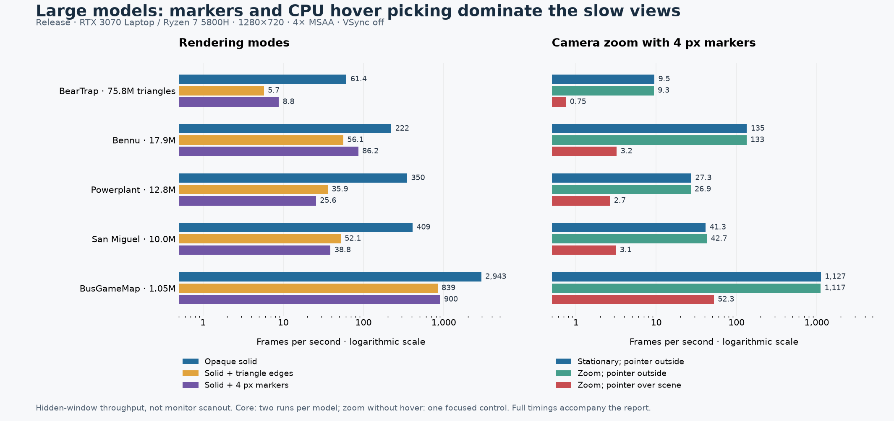
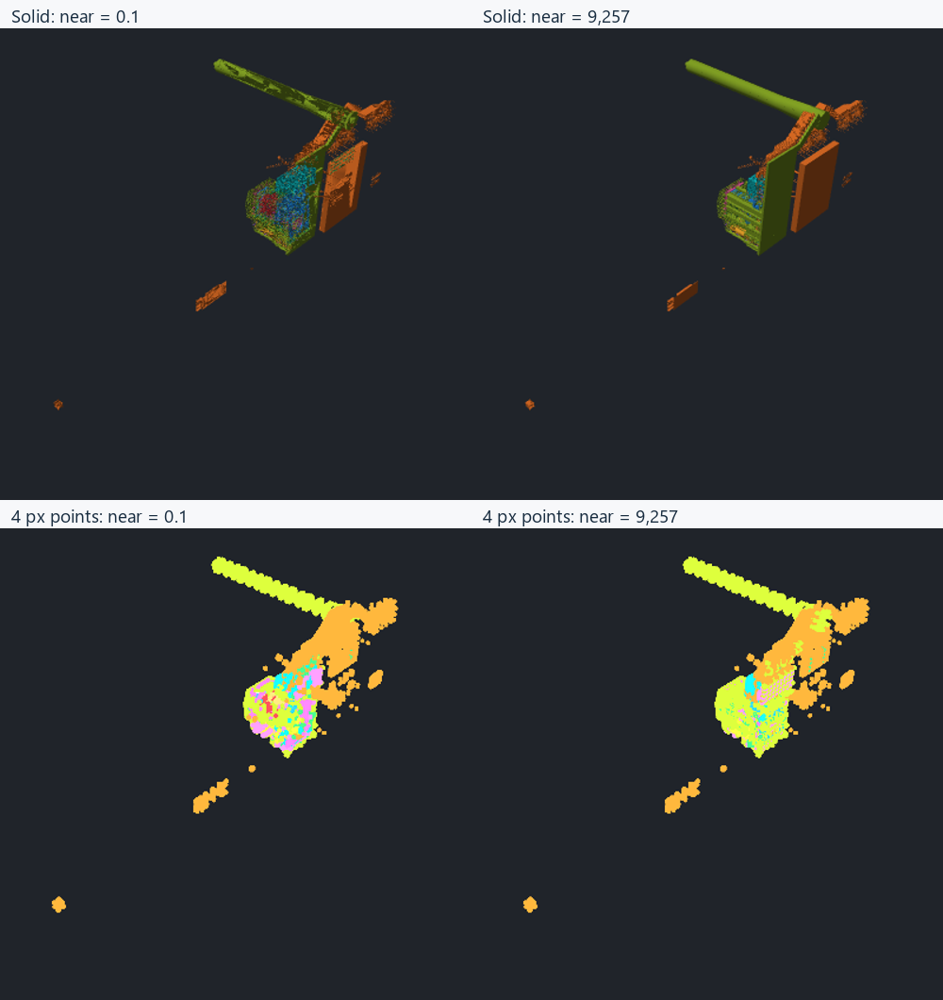

# Rendering large OBJ models

Measured on 27 September 2026 at `51933cf87d59257bc5f822f8e68cb95712b1434f`,
using all five unchanged OBJ files in `D:\temp\obj_tests`.

**The most severe interaction bottleneck is CPU vertex hover picking.** Solid
rendering, vertex-marker drawing, and hover picking are three different workloads.
Camera matrix updates are cheap; the work that a changed view invalidates can be
very expensive. Vertex-marker overlap and the triangle-edge pass are the other
large costs in these models.

## Measured results

FPS below is uncapped Release frame throughput with a 1280×720 window,
4× MSAA, panes/helpers hidden, and a fitted isometric view. Entries are the
median of **two independent process-run rates**. Higher is better.

| Model | Triangles | Groups | Solid FPS | 4 px markers FPS | Triangle edges FPS | Moving pointer, markers on FPS |
|---|---:|---:|---:|---:|---:|---:|
| BearTrap | 75.77 M | 1 | 61.4 | 9.5 | 6.3 | 0.75 |
| Bennu | 17.87 M | 1 | 222 | 135 | 74.4 | 3.2 |
| Powerplant | 12.76 M | 21 | 350 | 27.3 | 39.4 | 2.6 |
| San Miguel | 9.98 M | 2,203 | 409 | 41.3 | 56.0 | 3.0 |
| BusGameMap | 1.05 M | 65 | 2,943 | 1,127 | 1,011 | 52.5 |

Markers and edges in this table are drawn on their own. Combining them with
solid surfaces adds work: BearTrap measures 8.8 FPS for solid plus markers
and 5.7 FPS for solid plus edges. VSync normally limits faster views to
about 120 FPS on this machine; the thousands-of-FPS bus-map values are
rendering headroom in the hidden benchmark window, not displayed monitor FPS.

| Model | Solid FPS run range | Solid GPU ms | Main-thread work ms | Marker-hover work ms | Zoom with markers: P95 frame ms |
|---|---:|---:|---:|---:|---:|
| BearTrap | 61.0–61.8 | 16.18 | 0.14 | 1321.95 | 1385.69 |
| Bennu | 221–224 | 4.48 | 0.11 | 306.90 | 324.53 |
| Powerplant | 347–353 | 2.69 | 0.10 | 376.76 | 381.43 |
| San Miguel | 392–426 | 2.18 | 1.56 | 324.76 | 329.06 |
| BusGameMap | 2,929–2,958 | 0.15 | 0.09 | 18.75 | 19.86 |

The GPU/CPU columns summarize per-run medians; the last column summarizes
per-run P95 frame times. The hover column isolates the hover-picking stage.
BearTrap’s ordinary CPU work is only about 0.14 ms; its approximately
1.3-second interaction stall is in CPU hover picking, not camera matrix
construction or GPU submission. San Miguel has the most draw groups and
substantially more command/state work than the single-group models.

[Complete aggregate and individual run summaries](large-model-rendering-results.json)
and [flat comparison CSV](large-model-rendering-results.csv) include sample
counts, P50/P95/P99 frame times, GPU timings, stage breakdowns and run ranges.

## Zoom and camera movement

| Model | Solid far FPS | Fitted | Near | Markers far FPS | Fitted | Near |
|---|---:|---:|---:|---:|---:|---:|
| BearTrap | 67.1 | 61.4 | 61.7 | 6.7 | 9.5 | 12.2 |
| Bennu | 226 | 222 | 216 | 110 | 135 | 132 |
| Powerplant | 457 | 350 | 340 | 8.6 | 27.3 | 31.1 |
| San Miguel | 456 | 409 | 411 | 27.3 | 41.3 | 53.7 |
| BusGameMap | 2,768 | 2,943 | 2,736 | 721 | 1,127 | 1,134 |

Solid zoom effects are small or moderate in these views. Marker zoom effects
are much larger, especially in Powerplant and BearTrap. In the offscreen
solid test BearTrap still spends about 6.15 ms on the GPU; explicitly hiding
it reduces GPU frame work to about 0.005 ms. Camera movement is not a
substitute for visibility culling.

| Model | Marker orbit drag FPS | Marker pan drag FPS* | Zoom, pointer outside FPS* | Zoom, pointer inside FPS | Keyboard translation, pointer inside FPS |
|---|---:|---:|---:|---:|---:|
| BearTrap | 9.4 | 9.5 | 9.3 | 0.75 | 0.75 |
| Bennu | 135 | 134 | 133 | 3.2 | 3.2 |
| Powerplant | 25.3 | 27.2 | 26.9 | 2.7 | 2.6 |
| San Miguel | 42.7 | 42.5 | 42.7 | 3.1 | 3.2 |
| BusGameMap | 1,091 | 1,094 | 1,117 | 52.3 | 52.2 |

*Focused controls: one additional process run per model. Other entries use
the two core runs. The zoom controls follow the same analytical trajectory;
a stalled renderer samples fewer positions along it. Orbit/pan dragging
suppresses hover, while zoom/keyboard navigation with a viewport pointer
does not. Moving the pointer outside the viewport removes the expensive
scan in the otherwise matching zoom test.

### Depth range is another zoom-sensitive cost

Powerplant’s fitted distance is 925,742 world units and its default near
plane is 0.1. A focused test uses `max(original near, 0.01 × fitted distance)`:
9,257.42 units for this model. The plane remains well before the model’s
bounding sphere in these fitted/far views. Geometry and draw counts are
unchanged; only the depth projection changes.

| Powerplant markers | Default near: FPS / GPU ms | Larger near: FPS / GPU ms |
|---|---:|---:|
| Fitted view | 27.3 / 36.55 | 45.8 / 21.82 |
| Far view | 8.6 / 116.39 | 31.3 / 31.86 |

The uncaptured control reproduces the improvement seen in a separate captured
QA run. Solid GPU time is essentially unchanged (about 2.7 ms), but its
depth visibility also changes. This is **not pixel-identical output**. The
paired crops below use the same screen rectangle and retain the model’s
footprint; several obvious depth artifacts diminish with the larger near
plane. Poor depth precision and equal-depth marker overdraw are a plausible
mechanism, not a hardware-counter measurement of fragment rejection.

A scene-aware clipping policy is worth testing before larger renderer
rewrites. A fixed 1% rule is only an experiment: close-up navigation must
still preserve nearby geometry, and drawing/picking projections must agree.

The near/fitted/far views use camera distances of 0.5×/1×/4× the fitted distance.
They retain the same orientation, target and 60° field of view. These are
isometric, Z-up test views, not claims about every possible viewpoint or a
model-specific ideal orientation.

The solid renderer does not select a coarser mesh when zooming out. Every visible
group submits its full index range. Moving a model entirely outside the viewport
still submits it; GPU clipping reduces downstream work, but application-side
frustum culling does not remove the draw. Hiding an object does skip its drawing.
There is no occlusion culling, level-of-detail system or backface-culling flag in
this scene-rendering path. A single huge group also needs subdivision before
group-level culling could remove small offscreen regions effectively.

Point markers keep their diameter in screen pixels. Zooming out can make many
more markers cover the same pixels; zooming in can reduce that overlap and clip
markers outside the view. The full point list is still submitted. Marker count,
spatial distribution, depth order and screen coverage therefore matter as well
as triangle count. The shader creates four vertices and two triangles per marker
and discards pixels outside the circle.

## Why moving the camera can stall

[`findHoveredGroupVertex`](../src/hover_pick.cpp) loops over every displayed
per-group point ID, transforms it through model/view/projection matrices, and
only then tests whether its projected position can be under the pointer. It
does not first query a spatial index or reject whole point clusters.

The cache signature includes the mouse position and camera. A stationary camera
and pointer reuse the cached result; either moving invalidates it. In the
[`main.cpp` hover gate](../src/main.cpp), orbit, roll and pan drag flags disable
hover picking. Wheel zoom and keyboard navigation do not set those drag flags.
Consequently, the same model can orbit reasonably smoothly but stall on zoom or
keyboard movement while the pointer is over the viewport and vertices are on.
Returning to a stationary pointer after a drag can also cause one expensive
cache refresh; steady stationary measurements exclude that first refresh.

This is separate from click selection. [`scene_pick.cpp`](../src/scene_pick.cpp)
also has potentially expensive triangle/edge/vertex traversal on clicks. The
solid-only picking path can use annotation-cache blocks; displaying edges or
vertices bypasses that block path. Click latency was inspected in code, not
timed in this experiment.

## Other FPS factors

| Model | 4 px markers GPU ms, 4× MSAA → off* | Edges GPU ms, 4× MSAA → off* | 8 px markers GPU ms, opaque → opacity 0.4 | Solid with VSync + pane FPS* |
|---|---:|---:|---:|---:|
| BearTrap | 105.20 → 62.59 | 158.22 → 112.29 | 179.46 → 412.48 | 59.9 |
| Bennu | 7.30 → 7.20 | 13.51 → 10.15 | 9.15 → 26.29 | 120 |
| Powerplant | 36.55 → 20.81 | 25.55 → 17.61 | 88.15 → 109.64 | 120 |
| San Miguel | 24.18 → 14.40 | 17.90 → 12.84 | 37.44 → 89.14 | 120 |
| BusGameMap | 0.78 → 0.66 | 0.93 → 0.73 | 1.70 → 2.30 | 120 |

*One focused control run per model, with unchanged reference modes in that
same process. Opaque 8 px timings come from the two core runs. These are
strong screening results for large changes, not precise estimates of small
improvements. Disabling MSAA for solid rendering did not improve throughput
in this sweep; 1080p also changed large-model solid timing relatively little.
That is consistent with geometry/command costs dominating these solid views.
Exact GPU hardware-unit bottlenecks require a GPU profiler.

Selecting all of San Miguel and showing the inspector plus dimensions
raises main-thread work from about 1.56 ms to about 4.47 ms; uncapped
throughput falls from 409 to about 218 FPS. In the first run, UI building
costs 1.83 ms and selection/helpers 1.21 ms, versus 0.047 and 0.002 ms in
the baseline. This is a combined workload, not an isolated measurement of
each control. Both Release cases still exceed the 120 FPS VSync cap, so this
mostly reduces CPU headroom under normal presentation. Merely opening the
ordinary scene pane has a smaller cost.

Zero opacity is **not equivalent to hiding**: BearTrap’s zero-opacity solid
control still takes about 16.48 GPU ms and delivers 60 FPS, versus roughly
2,650 FPS with the object hidden. The solid submit path does not skip
zero-opacity groups. Use the visibility control to remove rendering work.

**Build configuration matters.** A separate single Debug check on BusGameMap
measured 390.82 ms in moving-pointer hover picking, versus 18.75 ms in the
Release core runs—about 21 times as much CPU time, and 2.5 versus 52.5 FPS.
Solid throughput was 1,088 versus 2,943 FPS, and the combined selection/inspector
workload was 317 versus about 2,600 FPS. The ordinary VSync limit can mask that
headroom difference until CPU work exceeds the frame budget. This small-model
check does not establish Debug timings for the four larger files. Its separate
data is in [`large-model-rendering-debug-check.json`](large-model-rendering-debug-check.json)
and `build/render-fps-debug-check/`; it is excluded from the Release aggregates.

- **Geometry and draw calls.** Each enabled solid, edge and point mode submits
  another pass per visible group. Main-thread command construction, bgfx's render
  thread and the GPU overlap; their timings must not be added. San Miguel's many
  groups exercise a different cost from the single-group terrain and asteroid.
- **Edges.** [`buildLineIndices`](../src/scene_renderer.cpp) produces six indices
  per triangle, including repeated shared edges. The edge pass uses
  `DEPTH_TEST_ALWAYS`, writes no depth, and draws through surfaces. Its work is
  substantial even when an opaque surface would hide most lines.
- **Transparency.** Opacity below 0.999 enables blending and disables depth
  writes for surfaces and markers. This can increase overdraw; opaque solid
  results do not predict dense transparent-marker performance. The scene uses
  sequential group submission, not a dedicated sorted transparency pipeline.
- **Shaders and textures.** The present solid shader uses uniform color and
  simple normal-based lighting. It does not sample material textures, cast
  shadows or perform ambient occlusion. OBJ disk size and texture detail are not
  direct measures of this renderer's steady shader cost.
- **Memory and first-enable stalls.** Mesh buffers are uploaded once, rather
  than rebuilt on camera movement. Edge and point buffers are created on demand
  and retained after disabling the mode. First-enable construction/uploads can
  stall, but are excluded from the warmed timings. The exact base payload is
  `32V + 12T` bytes, edges add `24T`, and marker IDs add `4P`, where `P` counts
  unique render vertices per group. BearTrap's base payload is about 1.99 GiB;
  edges add 1.69 GiB and marker IDs about 147 MiB. These are buffer payloads,
  not measured VRAM residency or complete process memory. The CPU mesh, source
  data, picking IDs, upload staging and driver allocations also occupy memory.
- **Annotations and diagnostics.** Annotations rebuild projected stroke geometry
  from their segments for drawing; camera changes affect that projection.
  Comparison displays add geometry/passes, and background detector work competes
  for CPU and memory bandwidth. These OBJ-only scenes contain no annotations or
  comparisons, so this report does not assign measured FPS costs to them.
- **Loading, clicks and exports.** File loading, initial GPU upload, first mode
  enable, screenshots/readbacks and diagnostic-result uploads are separate
  transient costs. They should be profiled as latency events, not mixed into
  the steady-state FPS numbers here.

## Optimization priorities

1. **Accelerate hover picking.** Add a spatial broad phase before per-point
   projection, reuse an index across camera changes, and query only candidates
   within the cursor cone. Treat zoom/keyboard navigation consistently with
   drag navigation while interacting; that avoids repeated stalls but should
   accompany acceleration so the first idle refresh is also responsive. Smaller
   unmeasured candidates are composing the projection matrix once per group and
   deferring world-coordinate conversion until after the cursor-distance test;
   currently that conversion also runs for visible points far from the cursor.
2. **Improve scene-aware depth range.** The Powerplant control demonstrates a
   large marker benefit and visible depth changes. Validate adaptive near/far
   planes, close geometry and matching picking before adopting it.
3. **Bound marker work.** Add screen-space density control or a point budget
   during navigation, and cull spatial chunks. Keep the complete model available
   for geometry analysis and exact selection. Rendering every marker at a fixed
   pixel diameter makes dense distant views particularly expensive.
4. **Reduce edge work.** Evaluate undirected shared-edge deduplication and a
   depth-tested edge option while retaining the intentional through-surface
   inspection mode. Verify appearance at seams and with transparency.
5. **Add mesh chunks and measured LOD/culling.** Bounds tests alone can eliminate
   whole offscreen objects; massive single-group meshes require chunks to gain
   much from partial visibility. Investigate GPU-only vertex/index-cache
   optimization and compact vertex formats with visual and indexing checks.
6. **Expose measured quality controls.** MSAA, marker size/density and VSync
   deserve explicit controls if the product should trade quality or power for
   speed. Backface culling could be optional, but forcing it would hide surfaces
   relevant to winding and mesh-defect inspection.

Practical settings today: navigate large scenes in opaque solid mode; enable
vertices and triangle edges only for the region being inspected; keep markers
small; hide irrelevant objects; and turn vertices off before zoom/keyboard
navigation when hover scanning becomes slow. Lowering resolution will help
pixel-bound views more than geometry-bound or CPU-picking-bound views.

## Method, limitations and validation

- **335 scenario measurements**: 26 core scenarios × 5 models × 2 runs, plus
  15 focused controls × 5 models × 1 run. Separate captured QA is excluded.
  The aggregates contain 512,149 measured frame intervals.
- Ryzen 7 5800H; NVIDIA RTX 3070 Laptop GPU, 8 GiB VRAM; 64 GiB system RAM;
  NVIDIA driver 546.30; Windows; Direct3D 11, explicitly requesting NVIDIA.
- Visual Studio 2026 `vs2026-vcpkg` preset. Headline measurements use Release.
  Baseline: 1280×720 window, 4× MSAA, VSync off, 4 px markers when enabled.
  The scene excludes the menu bar; pane/inspector scenarios change viewport size.
- At least 1.5 seconds and 20 frames of warmup per scenario; then at least
  3 seconds and 30 measured frames. Slow cases consequently run much longer.
- No second viewer, compilation or test suite runs during timing.
- Raw frames/configuration/logs: `build/render-fps-results/` and
  `build/render-fps-extra/`. Separate images: `build/render-fps-pilot2/` and
  `build/render-fps-depth-qa/`. The original timed core probe is snapshotted
  in `build/render-fps-results/measured-probe.h` and `measured-main.cpp`.

The adapter invokes production UI operations and the normal renderer. It
replays camera/pointer state without native mouse/keyboard event delivery.
Ordinary rendering and ImGui execute in a hidden window; this measures frame
throughput, not physical monitor scanout, input-to-photon latency or a visible
window's compositor behavior. A separate captured pilot verified the camera
views and drawing. The VSync runs expose the approximately 120 Hz presentation
cap in this environment.

CPU work excludes `bgfx_frame`, which contains synchronization/presentation
waits. GPU timing uses unique asynchronous bgfx GPU frame IDs with boundary
margins. The application retains samples in memory and writes them only after
measurement; there is no performance-query polling or screenshot capture in
the reported sweep. CPU and GPU medians need not refer to the exact same frame.
GPU clocks can change during CPU-bound intervals; GPU times from those intervals
should not be substituted for saturated-rendering throughput.

The second round changes scenario order and reverses model order. Optional
buffers remain allocated after first use, matching normal viewer behavior, so
resource history can differ across scenarios. CPU/GPU frequencies, thermals and
OS scheduling are not locked. Small changes within the run ranges are not
established speedups. No claims here cover other GPUs, drivers, render backends,
simultaneously loaded models or arbitrary cameras.

The production checkout's Debug build and all 636 CTest tests passed. Both
instrumented Debug and Release builds completed without compiler warnings.
The benchmark analysis has four passing unit tests for interval-based FPS, CPU/wait
separation, GPU deduplication/boundaries, independent-run aggregation and rejected
incomplete/inconsistent results. No production implementation was changed.

Reproduction code and full measurement definitions are in
[`tests/render_fps`](../tests/render_fps/README.md). The instrumented worktree is
`D:/.worktree/woby-render-fps`. Existing first-display research files were left
unchanged.
