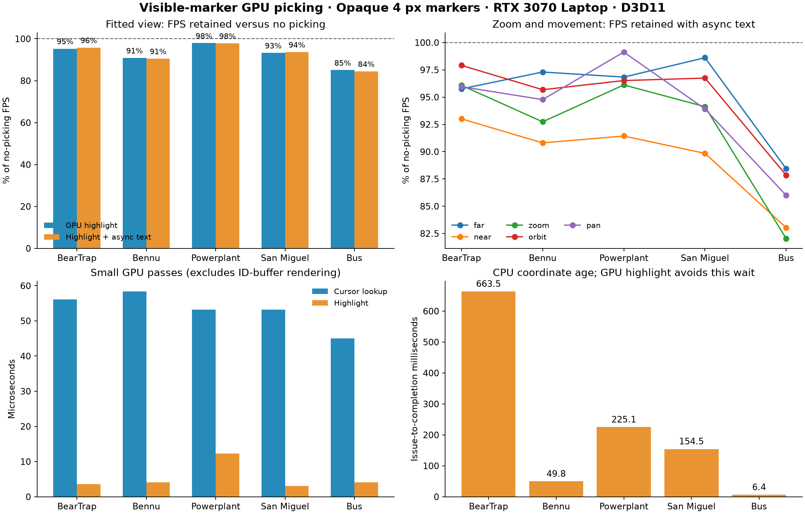
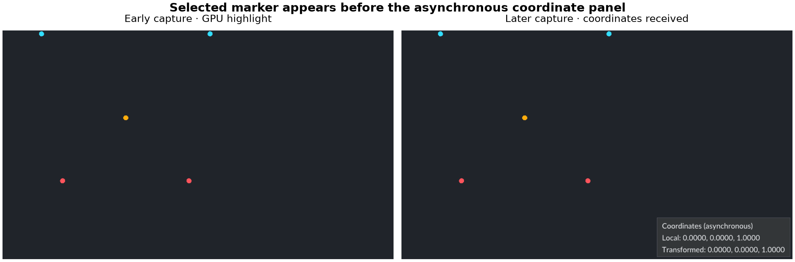

# Visible-marker GPU hover experiment

Recorded 2026-09-27. RTX 3070 Laptop (8 GiB), NVIDIA 546.30, Ryzen 7 5800H, 64 GiB RAM. NVIDIA D3D11; pinned bgfx 1.129.8940-496 port 1.

The prototype writes marker identities in the existing marker draw, looks up the visible samples around the cursor, and draws the highlight in the same GPU frame. Coordinate text updates asynchronously from completed readbacks. It builds no additional spatial index.

## Fitted-view throughput

Opaque 4 px markers, 1280×720 window, 4× MSAA. Medians of two independently ordered Release runs. GPU highlight includes the offscreen color route, ID attachment, cursor lookup, and highlight. Async adds completed coordinate text and delayed readback.

| Model | No picking FPS | GPU highlight FPS | Highlight + async text FPS | FPS retained with async text |
|---|---:|---:|---:|---:|
| BearTrap | 9.4 | 9.0 | 9.0 | 95.8% |
| Bennu | 132.6 | 120.6 | 120.1 | 90.5% |
| Powerplant | 27.3 | 26.7 | 26.7 | 97.9% |
| San Miguel | 41.0 | 38.2 | 38.4 | 93.7% |
| Bus | 1097.4 | 933.5 | 927.2 | 84.5% |

## Cost breakdown

These are medians of each run's per-view GPU medians. Scene-only numbers cover view 1. The routed control adds offscreen rendering and color resolve/composite; the ID-buffer control also writes IDs, without lookup or highlight. GPU times overlap with CPU work and should not be added to CPU times.

| Model | Direct scene ms | Routed scene ms | Scene with IDs ms | Cursor lookup µs | Composite µs | Highlight µs |
|---|---:|---:|---:|---:|---:|---:|
| BearTrap | 106.005 | 106.827 | 111.373 | 56.1 | 9.2 | 3.6 |
| Bennu | 7.400 | 7.704 | 8.096 | 58.4 | 10.8 | 4.1 |
| Powerplant | 36.557 | 36.008 | 37.154 | 53.2 | 9.2 | 12.3 |
| San Miguel | 24.339 | 24.592 | 26.113 | 53.2 | 9.2 | 3.1 |
| Bus | 0.787 | 0.797 | 0.903 | 45.1 | 10.2 | 4.1 |

## Coordinate age

Highlighting consumes the GPU result directly and does not incur this CPU round trip. Coordinate age is request issue to CPU observation, not physical mouse-to-display latency. The coordinate panel is drawn on a subsequent application frame. The delayed variant postpones the readTexture request by three application-frame advances; the pinned D3D11 backend's Map can still block internally. Immediate readback is a control, not a guarantee of a nonblocking path.

| Model | Async coordinate age ms | Async age frames | Immediate age ms | Immediate FPS |
|---|---:|---:|---:|---:|
| BearTrap | 663.5 | 6.0 | 334.7 | 9.0 |
| Bennu | 49.8 | 6.0 | 26.3 | 113.5 |
| Powerplant | 225.1 | 6.0 | 113.7 | 26.3 |
| San Miguel | 154.5 | 6.0 | 77.2 | 37.9 |
| Bus | 6.4 | 6.0 | 4.1 | 693.5 |

## Zoom and camera movement

Each entry is no-picking FPS → marker-ID picking with async text. Queries run every frame, including camera movement. Far uses 4× fitted distance; near uses 0.5×. Motion repeats over two seconds. Fixed-center far/near queries complement the fitted-view pointer sweep.

| Model | Far | Near | Zoom | Orbit | Pan |
|---|---:|---:|---:|---:|---:|
| BearTrap | 6.6 → 6.3 | 12.2 → 11.3 | 9.2 → 8.9 | 9.3 → 9.1 | 9.4 → 9.0 |
| Bennu | 106.2 → 103.3 | 130.8 → 118.8 | 128.8 → 119.5 | 128.2 → 122.7 | 128.2 → 121.5 |
| Powerplant | 8.5 → 8.3 | 30.9 → 28.3 | 26.7 → 25.6 | 25.0 → 24.1 | 26.8 → 26.6 |
| San Miguel | 27.0 → 26.6 | 53.3 → 47.9 | 42.5 → 40.0 | 41.8 → 40.4 | 42.0 → 39.4 |
| Bus | 700.2 → 619.2 | 1122.1 → 931.8 | 1122.0 → 920.4 | 1037.6 → 911.5 | 1069.9 → 920.1 |

## Additional controls

One run each, so these are exploratory. Each entry is no picking → ID picking with async text. All models also exercise hidden and zero-opacity cases in correctness validation.

| Model | Solid + markers | Alpha 0.4 | MSAA off | 16 px markers | 1920×1080 | Scene pane |
|---|---:|---:|---:|---:|---:|---:|
| BearTrap | 8.7 → 8.5 | 5.4 → 3.1 | 15.8 → 14.1 | 4.9 → 4.7 | 10.5 → 10.1 | 9.5 → 8.8 |
| Bennu | 85.4 → 81.5 | 86.8 → 48.5 | 135.8 → 132.7 | 66.6 → 58.8 | 130.2 → 121.4 | 133.1 → 124.5 |
| Powerplant | 25.8 → 25.3 | 20.5 → 12.1 | 48.2 → 44.0 | 7.2 → 6.3 | 29.0 → 27.8 | 26.9 → 25.2 |
| San Miguel | 38.9 → 36.8 | 25.7 → 14.8 | 69.1 → 61.6 | 21.5 → 20.9 | 43.9 → 41.6 | 42.6 → 38.6 |
| Bus | 895.1 → 778.4 | 924.9 → 520.1 | 1327.8 → 1136.4 | 252.7 → 201.6 | 1149.9 → 913.1 | 1096.3 → 912.8 |

**Transparency is the major exception:** at marker opacity 0.4, the ID path loses 41–44% of FPS against its matching transparent no-picking control. This happens on all five models. The compact attachment substantially improves opaque rendering over the wide-format pilot, but it does not make blended marker rendering cheap. These controls measure the combined route/ID/highlight/readback cost; they do not isolate the cause of the transparency penalty.

Turning MSAA off and changing marker size can have larger effects than picking itself. Higher resolution is not uniformly slower here: markers have a fixed pixel size, so changing resolution also changes their overlap. Likewise, zooming out packs more markers into the same pixels. The zoom and resolution observations are consistent with a coverage/overdraw bottleneck; they are not a bandwidth-counter measurement.

## Earlier clustered-compute reference

One additional fitted-view run per model with the same Release executable. This reference searches projected vertex centers, can select occluded vertices, and returns an ID asynchronously. It does not draw the new GPU highlight or coordinate panel. Its FPS is context, not an equal-feature comparison. GPU query time below excludes scene rendering; the marker-ID lookup time above excludes producing its ID attachment.

| Model | Points (millions) | Clustered-compute FPS | GPU query ms | Spatial-index construction s | Extra GPU buffers MiB |
|---|---:|---:|---:|---:|---:|
| BearTrap | 38.41 | 9.5 | 1.488 | 22.47 | 162.6 |
| Bennu | 8.93 | 130.4 | 0.426 | 9.30 | 38.1 |
| Powerplant | 10.95 | 27.4 | 0.429 | 4.60 | 45.4 |
| San Miguel | 9.02 | 40.4 | 0.412 | 1.80 | 37.8 |
| Bus | 0.55 | 1026.6 | 0.048 | 0.19 | 2.3 |

The marker-ID path eliminates this spatial-index construction and makes lookup independent of total point count once the scene has produced the ID image. It moves work into raster output instead; total FPS does not improve over the old reference. On BearTrap the old path also retains about 180 MiB of CPU spatial-index data, which this marker-ID path does not construct.

## Construction and storage

No spatial index, reordered point list, or cluster bounds are constructed. The renderer's existing mesh and point-ID buffers remain necessary. Per-request CPU snapshots contain only the submitted draw transforms/ranges, not point coordinates. The current experiment accepts one imported model; production model replacement/lifetime handling needs integration.

The compact RGBA8 ID target uses four bytes per sample. At the measured 1280×687 scene viewport and four samples, ID payload is 13.4 MiB. Offscreen color, resolved color, depth, and IDs total 43.6 MiB in texture payload, excluding driver alignment/compression and existing swapchain/mesh resources. At 1920×1047 it grows with pixel count. Eight decoded-result slots copy only 16 bytes each. The audit buffers are used only for validation.

An initial RGBA32F attachment stored ID, depth, and draw ordinal in 16 bytes per sample. In its BearTrap pilot, no picking gave 9.5 FPS, offscreen routing 9.4 FPS, and the ID attachment alone 5.4 FPS. This exposed ID attachment output as a major cost and motivated the compact format. The wide pilot is retained separately and excluded from the compact timing tables.

## Selection policy

Select the nearest covered pixel center within three pixels of the cursor, then break ties by point ID. Inspect every MSAA sample; IDs are never averaged. Normal scene depth testing determines visible coverage. Surface fragments clear the ID wherever they pass that depth test, including translucent surfaces drawn over earlier markers. At partial opacity, the last depth-passing fragment owns the ID; this is a defined draw-order policy for blended pixels, not a unique perceptual ownership rule. Fully transparent markers do not produce IDs. Repeated instances sharing the same point IDs need an additional instance identifier before production integration.

This deliberately changes the old geometric hover policy: fully hidden vertices cannot be selected, and distance is to visible raster coverage rather than the projected vertex center. Exact agreement with CPU BVH/geometric compute is neither expected nor a correctness criterion.

## Validation and method

15 Release timing processes, 270 measured scenarios, 177,496 measured frame intervals, excluding priming. Hidden full viewer, VSync off, 4× MSAA except the explicit off control. Each scenario warms at least 1.5 seconds and 20 frames, then measures at least 3 seconds and 30 frames. Two core rounds reverse model order and shuffle scenario order; extra controls have one round. No concurrent viewer, build, or test workload ran during timing. Clocks/thermals were not locked.

642/642 Debug CTest tests passed, including four added marker-logic tests and four graphics tests. Debug and Release builds have no compiler warnings. Four marker-analysis tests pass. The Release GPU fixture passes 240 requests over 24 cases, including model translation during in-flight readback and translucent surfaces drawn over markers. Early/late captures verify GPU highlighting before CPU coordinates arrive. Ten image comparisons confirm color routing/ID output preserves the scene within one 8-bit channel level. Full-model audits pass 700 requests over 70 cases, including real IDs above 16 million, with no skipped requests.

Per-view timestamps use the individual view's GPU source-frame number, deduplicate repeated samples, and discard eight-frame boundaries. Coordinate summaries discard the last eight issued frames to avoid timing contamination from the following scenario. Resource creation is outside measurement; resources remain resident in controls. The coordinate panel is present only in modes that return coordinates, and instrumentation overhead is part of all runs. Native input and physical display latency are not measured. Vulkan and DX12 were not benchmarked.

## Recommendation

This is a workable design for visible opaque markers: keep the selected identity and highlight on the GPU, and let coordinate text arrive later. The GPU can render the highlight without waiting for a CPU readback, using the existing D3D11 backend. That removes the readback delay from highlighting; it does not remove frame rendering, command queue, or display latency. BearTrap still renders at about 9 FPS, so this alone cannot make its interaction feel fast.

Before production integration, investigate the transparency penalty and agree on ownership of blended pixels. A useful next experiment is a cursor-local ID pass compared with this full-viewport attachment, measuring the extra geometry cost as well as saved attachment traffic. Another is reuse of rendered color/IDs while camera and scene are unchanged, so hover updates need not redraw a huge static model. Neither optimization is implemented or measured here. Production work also needs model lifetime/cancellation and repeated-instance identity handling.

## Artifacts

- [Numerical results](marker-picking-results.json) and [CSV](marker-picking-results.csv)
- [Source/binary provenance](marker-picking-provenance.json)
- [Validation summary](marker-picking-validation.json)
- [Clustered-compute reference](marker-cluster-reference.json); raw runs: `build/marker-cluster-control`.
- [Reproduction harness](../tests/marker_experiment/README.md)
- Raw compact timing runs: `build/marker-core` and `build/marker-extra`; model audits: `build/marker-qa-compact`.
- Initial wide-format pilot: `build/marker-wide-pilot`; source snapshot: `build/marker-wide-source`.
- Build/test logs and instrumentation diff: `build/marker-verification`.
- Worktree: `D:/.worktree/woby-marker-picking`; production source in the main checkout is unchanged.
