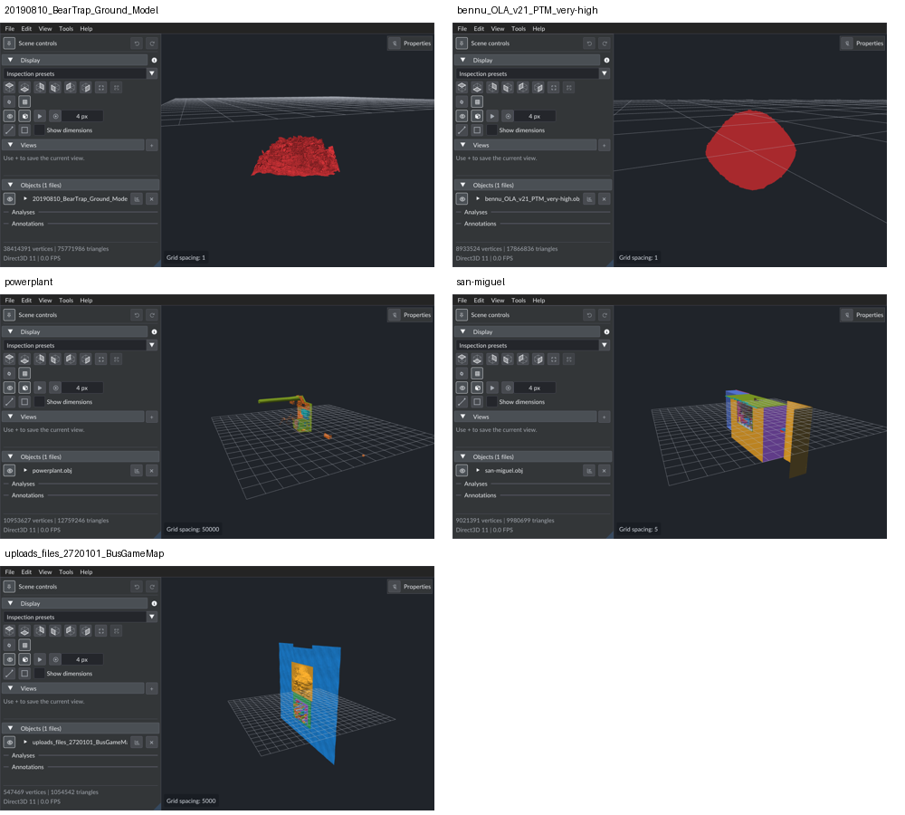

# OBJ loading to first geometry: 28 September 2026

Fresh measurements at `b3f6580`, using all five OBJ files in
`D:\temp\obj_tests`. Production code was not changed. The existing
[first-display probe](../tests/first_display/build.py) was rebuilt from current
sources. This report supplements the [earlier investigation](obj-first-display-performance.md).

The largest opportunities are in serial CPU work after parsing. RapidOBJ
already parallelizes large-file parsing; Woby then performs several full mesh
passes before submitting geometry. A background loading thread keeps the UI
responsive, but does not parallelize these individual passes.

## Results

All times are seconds; each value is the median of three selected runs.

| Model | File GB | CPU import | Load to first completed frame | Observed range | Startup to completed frame |
|---|---:|---:|---:|---:|---:|
| BearTrap | 7.109 | 17.747 | **27.438** | 24.830–27.458 | 27.940 |
| Bennu | 0.816 | 2.539 | **5.757** | 5.733–5.844 | 6.239 |
| Powerplant | 0.818 | 3.344 | **4.860** | 4.820–4.908 | 5.381 |
| San Miguel | 1.143 | 2.820 | **4.114** | 4.114–4.135 | 4.618 |
| BusGameMap | 0.076 | 0.158 | **0.314** | 0.303–0.318 | 0.776 |

CPU import ends before annotation/group and GPU preparation. Startup starts
after logging initialization; it excludes process creation and early argument
parsing. End-to-end totals are measured directly, not summed stage medians.

| Stage | BearTrap | Bennu | Powerplant | San Miguel | BusGameMap |
|---|---:|---:|---:|---:|---:|
| Read + parse + merge | 4.430 | 0.641 | 0.592 | 0.755 | 0.065 |
| Triangulate / inspect faces | 0.259 | 0.063 | 0.048 | 0.049 | 0.008 |
| Validate + copy source positions | 0.591 | 0.135 | 0.100 | 0.089 | 0.008 |
| Allocate mapping/output arrays | 0.049 | 0.010 | 0.007 | 0.007 | 0.001 |
| Map corners + construct vertices/indices | 9.439 | 1.037 | 2.370 | 1.710 | 0.063 |
| Check supplied normals | <0.001 | <0.001 | 0.038 | 0.027 | 0.002 |
| Generate missing normals | 1.928 | 0.509 | <0.001 | <0.001 | <0.001 |
| Whole-mesh bounds | 0.479 | 0.113 | 0.139 | 0.113 | 0.008 |
| Release parser/lookup temporaries | 0.296 | 0.048 | 0.043 | 0.064 | 0.005 |
| Annotation cache + fingerprints | 3.565 | 1.190 | 0.525 | 0.422 | 0.044 |
| Group bounds + centers | 3.160 | 1.225 | 0.466 | 0.368 | 0.040 |
| Validate GPU indices | 0.269 | 0.057 | 0.040 | 0.032 | 0.003 |
| Allocate picking-list scratch | 0.056 | 0.013 | 0.015 | 0.013 | 0.001 |
| Build CPU picking lists | 1.080 | 0.346 | 0.082 | 0.148 | 0.007 |
| Copy vertex staging memory | 0.266 | 0.058 | 0.071 | 0.059 | 0.004 |
| Copy index staging memory | 0.197 | 0.043 | 0.031 | 0.024 | 0.003 |
| Remaining setup to frame loop | 0.011 | 0.005 | 0.006 | 0.008 | 0.005 |
| First-frame CPU work | 0.015 | 0.004 | 0.004 | 0.006 | 0.004 |
| First-frame execution + GPU completion wait | 0.729 | 0.272 | 0.272 | 0.221 | 0.036 |

Normal generation is needed for BearTrap and Bennu; the other models supply
complete normals. Small additional boundary work includes metadata, resource
enqueueing and GPU scratch destruction. Independent medians and rounding do
not add exactly to the median total. GPU CPU-preparation totals (which already
contain validation, picking and staging) are 1.912, 0.526, 0.243, 0.278, 0.017 s.

| Model | Source positions | Render vertices | Triangles | Groups | Secondary seam vertices | GPU vertex + index MiB |
|---|---:|---:|---:|---:|---:|---:|
| BearTrap | 37,890,645 | 38,414,391 | 75,771,986 | 1 | 523,746 | 2,039.46 |
| Bennu | 8,933,524 | 8,933,524 | 17,866,836 | 1 | 0 | 477.10 |
| Powerplant | 5,984,083 | 10,953,627 | 12,759,246 | 21 | 4,969,544 | 480.30 |
| San Miguel | 5,933,233 | 9,021,391 | 9,980,699 | 2,203 | 3,088,160 | 389.53 |
| BusGameMap | 535,893 | 547,469 | 1,054,542 | 65 | 11,604 | 28.78 |

Bennu has no normal/UV arrays and uses direct lookup. BearTrap uses the primary
table plus UV seams; Powerplant adds normal seams; San Miguel and BusGameMap
have normal/UV seams. Secondary vertices are 1.36%, 0%, 45.37%, 34.23% and
2.12% of render vertices respectively. These are vertex counts, not hash-lookup
frequencies. Mapping including allocation accounts for approximately 35%, 18%,
49%, 42% and 20% of total time (ratios of medians).

BearTrap spends 6.73 s in annotation/group preparation alone. Bennu spends
2.42 s there, versus 1.05 s mapping without hashing. This makes repeated
preparation passes a significant optimization target independently of hashing.

GPU payload is allocated data, not total GPU residency or peak process RAM.
CPU memory also retains 12-byte source positions, a 4-byte source index per
corner, render vertices/indices and picking lists. Parser arrays, lookup
storage and output arrays coexist during conversion; staging copies add
temporary memory later. No fresh peak-memory measurement was collected.



## What each step does, and which techniques it uses

“No explicit SIMD” below means no hand-written packed SSE/AVX kernel in the
audited path. MSVC Release can still vectorize suitable operations, and runtime
memory routines may use vector instructions. Generated assembly and hardware
performance counters were not collected, so this is not a claim that the CPU
executes no vector instructions.

| Step | Work | Threads, SIMD, and existing optimizations |
|---|---|---|
| Read, parse, merge | Read text; decode positions, normals, UVs and face indices; resolve indices and merge parser chunks. Optional material-library handling is included. | RapidOBJ splits large files across hardware threads (16 logical processors here), overlaps Windows reads with parsing, then parallelizes merge tasks. Uses `FILE_FLAG_OVERLAPPED` and `FILE_FLAG_NO_BUFFERING`. Its bundled fast_float uses packed 64-bit arithmetic to recognize/convert eight digits at a time: SWAR (SIMD within a register), without explicit SSE/AVX parsing kernels. `memchr` scans lines. Woby switches files <=1 MiB to buffered `ParseStream`; all five subjects exceed that threshold. |
| Triangulate / inspect faces | Count face sizes, retain existing triangles, split polygons where needed. | Serial face inspection/task creation; conversion tasks can run across multiple threads. Already-triangular shapes skip conversion. Quads have a specialized path; larger polygons use ear clipping. No explicit SIMD. |
| Validate/copy source positions | Check finite XYZ values and preserve the original position array for connectivity and diagnostics. | Serial, reserved contiguous float XYZ array (12 bytes per source position). No explicit SIMD. |
| Allocate mapping/output storage | Count corners; reserve vertices, two index streams, shape records and lookup arrays. | Serial allocation. Preallocation avoids most output growth, although seams can exceed the vertex estimate. |
| Map corners/build render mesh | Convert separate OBJ position/normal/UV indices into one GPU vertex index; gather attributes, flip UV V, append render and source indices. | Serial. Direct position lookup when there are no normals/UVs. Otherwise a primary array handles each position's first attribute tuple, and only seam tuples need a secondary hash table. Linear probing, power-of-two capacity, 75% maximum load factor. Global first-use IDs share vertices across groups. No explicit SIMD, final value-based compaction, or triangle reorder. |
| Check/generate normals | Check supplied normals; if any are missing/invalid, clear and regenerate all normals by accumulating normalized face normals, then normalize vertices. | Serial. Early exit on the first invalid normal; generation skipped when supplied normals are complete. No explicit SIMD. Shared-vertex accumulation makes naive parallel writes unsafe. |
| Whole-mesh bounds | Scan render vertices for min/max, then scan again for radius about the center. | Serial reductions, two passes. No explicit SIMD kernel. |
| Annotation preparation | Build per-group geometry fingerprints and bounds for blocks of 256 triangles, when there are at least 50,000 triangles. | Serial, eagerly built and cached for later annotation work. Hash combines depend on the previous hash value; geometry is gathered through corner indices. No explicit SIMD. All five subjects exceed the threshold. |
| Group bounds/centers | Compute each group's bounds and center for transforms and scene controls. | Serial and cached. `nodeBounds` already calculates the bounding-box center; `nodeCenter` traverses the corners again for that center. No explicit SIMD. |
| GPU index validation | Check every render index before creating GPU resources. | Serial, contiguous index scan. No explicit SIMD kernel. |
| CPU point-ID lists | Deduplicate render vertex IDs within each group. These supply the GPU marker buffer, resolve GPU-picked IDs to coordinates, support fallback CPU hover and provide group vertex counts. | Serial. A temporary stamp array avoids a hash set and avoids clearing the whole array between groups. Output storage is reserved. These CPU lists are built even with markers off. No explicit SIMD. |
| GPU staging/submission | Copy vertices and triangle indices into bgfx-owned memory; enqueue buffer creation. | Serial CPU calls and full staging copies, followed by renderer/driver work. Memory copies may be optimized inside the library. Optional GPU edge and point-ID buffers are already lazy; default solid mode does not create them. |
| Scene/camera/UI setup | Assign scene IDs, use cached bounds for framing, initialize history and viewer resources, submit draw calls. | Primarily main-thread CPU work. Uses prepared bounds rather than rescanning all geometry for scene framing. This is small relative to import/preparation for these subjects. |
| Execute first frame | Create GPU buffers, transfer data, execute shaders and indexed drawing, present and synchronize. | GPU hardware parallelism. Normal production bgfx also has a render thread; the measurement probe deliberately runs rendering on the calling thread and waits on a D3D11 event query to obtain a definite completion endpoint. |

The parser interval includes I/O, parsing and merging because those operations
overlap internally. It cannot be interpreted as disk time alone. Likewise,
mapping includes lookup, validation, attribute gathering, allocation growth,
and output writes; it is not a measurement of hashing alone.

## Scheduling in the normal viewer

Startup with `--file` follows `loadModelFile` -> `loadModel` -> `loadObjMesh`
-> `createUiFileState` -> `createGpuMesh` -> scene/camera setup -> first frame.
The caller waits for each of these stages before geometry is submitted; there
is no progressive display of partially imported chunks.

Opening a file in an existing viewer uses a background worker for CPU loading
and UI-file preparation. GPU preparation and scene commit happen on the main
thread. This improves responsiveness, not the CPU parallelism of mapping,
normals, caches or bounds. Batches of large files are loaded sequentially and
committed after preparation. There is bounded look-ahead for up to four small
OBJ/STL inputs (<=1 MiB, batches of at least eight); it does not apply to these
five large models.

## Where to investigate improvements

1. **Reuse group bounds for group centers.** This removes a demonstrably
   repeated traversal. The measured group interval covers both traversals;
   removing one is not guaranteed to halve the interval.
2. **Defer annotation preparation until needed, or prepare it asynchronously.**
   It currently delays first geometry even when no annotation is requested.
   This shifts work to a later point; it needs safe cache publication and a
   defined first-use behavior.
3. **Profile mapping's gathers, lookup misses and allocation growth.** The
   primary/direct shortcut is already present. Parallelizing must preserve
   normal/UV seams and deterministic first-use IDs. SIMD alone is unlikely to
   solve irregular gathers and branch-dependent insertion; hardware counters
   would help distinguish memory stalls from computation.
4. **Evaluate deferring construction of CPU point-ID lists until markers are
   enabled.** These are shared marker data, not evidence that normal hover
   selection still scans vertices on the CPU. The GPU marker buffer is populated
   from these lists; after GPU readback, `resolveMarkerCoordinates` also uses
   them to map the selected marker ID to a mesh position. CPU hover uses them
   as a fallback, and group tooltips use the resulting counts. Deferral must
   preserve all these consumers, including exact counts before marker activation.
   It would move preparation to first marker use. BearTrap's list allocation and
   construction take approximately 1.14 s; GPU index validation remains necessary
   for solid rendering and is not part of that proposed saving. Making the GPU
   marker buffer lazy offers no new benefit because it is already lazy.
5. **Parallelize independent reductions where worthwhile.** Bounds and source
   validation are simpler candidates than mapping or normal accumulation.
   Normal generation needs controlled accumulation/reduction and numerical
   reproducibility checks. Measure end-to-end savings rather than assuming
   eight cores produce an eightfold speedup.

These are proposals, not implemented or benchmarked speedups. Memory bandwidth
and cache behavior are plausible constraints given repeated large-array passes,
but this investigation does not establish them with hardware counters. No
stage-specific thread-count or SIMD on/off experiment was run.

## Measurement boundaries and reproduction

Three selected fresh-process runs per model, executed serially, Release /O2,
MSVC / VS 2026, `vs2026-vcpkg`, D3D11, solid rendering, 4x MSAA and vsync,
1280x720. No builds/tests or other Woby instances ran during timing. No cache
eviction or clock locking was performed. RapidOBJ's large-file Windows path
uses unbuffered I/O, so these should not be labeled conventional warm-page-cache
or cold-disk measurements. Three samples describe observed variability, not
statistical confidence intervals.

Machine: AMD Ryzen 7 5800H (8 cores / 16 logical processors), 64 GiB installed
RAM, NVIDIA RTX 3070 Laptop GPU, driver 546.30. The models on D: reside on a
SKHynix HFS001TDE9X084N NVMe SSD.

Timing starts at entry to `loadModelFile` and ends after the first frame's
D3D11 completion event. This measures a completed geometry frame under a
controlled renderer configuration. It does not measure dialog interaction,
OS scheduling before process startup, physical monitor scan-out, or normal
render-thread overlap. The final execution/wait interval combines GPU resource
creation, upload, draw, driver work, presentation and synchronization. It does
not isolate GPU upload or shader execution time. Screenshots are requested on
the following frame, outside the timed interval.

Instrumentation generates copies of production source files. Its build script
temporarily substitutes those sources in the VS target, restores `CMakeLists.txt`
byte-for-byte, and reconfigures the normal targets. Parser/map temporary release
is made explicit at the end of import to attribute that cost. Original
production sources and input models remain untouched.

```powershell
uv run tests/first_display/build.py
uv run tests/first_display/contract_test.py build/vs2026-vcpkg/bin/Release/woby-first-display.exe
uv run tests/first_display/run.py --bin build/vs2026-vcpkg/bin/Release/woby-first-display.exe --models D:/temp/obj_tests --output build/first-display-20260928 --rounds 3
```

The first BearTrap run was resized to 1263x1469 while loading; it is retained
locally but excluded from every reported timing table. A replacement run
provides the third 1280x720 sample. Selected raw records and their summary are
in [obj-first-display-2026-09-28-results.json](obj-first-display-2026-09-28-results.json).
Full logs/screenshots are under `build/first-display-20260928`.

Source references: [OBJ conversion](../src/obj_mesh.cpp),
[normals/bounds](../src/model_mesh.cpp), [group/UI state](../src/ui_state.cpp),
[annotation cache](../src/surface_annotation.cpp),
[GPU preparation](../src/scene_renderer.cpp),
[background scheduling](../src/background_load.cpp),
[RapidOBJ implementation](../third_party/rapidobj/include/rapidobj/rapidobj.hpp).

## Validation

- The instrumented Release viewer and the complete normal Debug build succeeded
  without warnings, using the `vs2026-vcpkg` preset.
- The existing first-display contract passed: primary/secondary seam mapping,
  geometry counts, buffer sizes, stage presence, completion ordering and screenshot
  creation. Its synthetic files use a unique temporary root with automatic cleanup.
- All **650/650** repository tests passed, including slow and graphics tests,
  in **234.70 s**. Log: `build/first-display-20260928-tests.log`.
- All 15 selected runs completed with stable geometry/mapping counts and matching
  resolution. A screenshot for each model from selected runs was visually inspected;
  each contains rendered geometry.
- Only this report, its raw results and preview image were added. No production
  code changes or document-content tests were made. The pre-existing `imgui.ini`
  modification was left in place.
