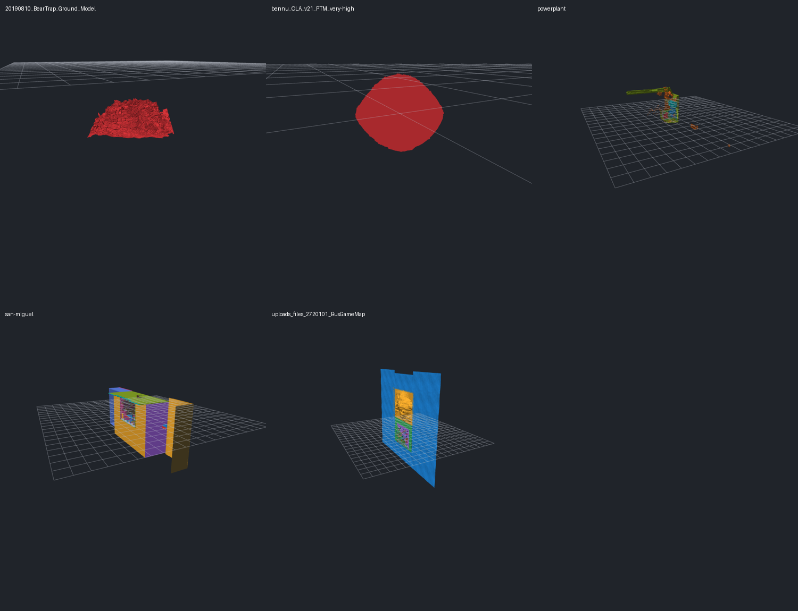

# OBJ loading through the first completed geometry frame

Measured on 27 September 2026 at `51933cf87d59257bc5f822f8e68cb95712b1434f`.
This investigation measures the current production mapping and float source
coordinates, with no meshoptimizer compaction. Older OBJ-loading reports in
this directory describe earlier implementations.

**The wait is dominated by serial CPU work, but vertex mapping is only part
of it.** Mapping/construction accounts for 36% of BearTrap's first-display
time, 49% of Powerplant's and 43% of San Miguel's. Bennu already uses direct
position lookup with no hashing: annotation and group preparation together
cost 2.69 s, versus 1.07 s for mapping.

## Results

Seconds below are medians of **two comparable fresh-process Release runs per
model**, all at 1280×720. The endpoint is completion of the first geometry
frame under the controlled renderer configuration described below. The input
models are unchanged. [Raw runs and complete ranges](obj-first-display-results.json)
retain every stage measurement.

| Model | File GB | CPU mesh import | Load → first completed frame | Observed range | Startup → first completed frame |
|---|---:|---:|---:|---:|---:|
| BearTrap | 7.109 | 19.402 | **29.711** | 29.445–29.978 | 30.232 |
| Bennu | 0.816 | 2.646 | **6.195** | 5.982–6.408 | 6.712 |
| Powerplant | 0.818 | 3.426 | **4.956** | 4.894–5.018 | 5.447 |
| San Miguel | 1.143 | 2.945 | **4.273** | 4.196–4.349 | 4.808 |
| BusGameMap | 0.076 | 0.162 | **0.314** | 0.306–0.321 | 0.852 |

The detailed breakdown uses the same runs, not measurements spliced from
different executables. Near-zero normal-generation entries mean that supplied
normals were complete; near-zero checks on BearTrap/Bennu exit at the first
missing normal. File sizes use decimal GB; payload sizes below use MiB.

| Stage, seconds | BearTrap | Bennu | Powerplant | San Miguel | BusGameMap |
|---|---:|---:|---:|---:|---:|
| Read + parse OBJ | 4.812 | 0.637 | 0.647 | 0.783 | 0.068 |
| Triangulate / inspect faces | 0.285 | 0.069 | 0.050 | 0.046 | 0.008 |
| Validate + copy source positions | 0.601 | 0.136 | 0.089 | 0.095 | 0.008 |
| Allocate lookup/output arrays | 0.058 | 0.012 | 0.007 | 0.007 | 0.001 |
| Map corners + construct vertices/indices | **10.498** | **1.053** | **2.408** | **1.812** | **0.063** |
| Check supplied normals | <0.001 | <0.001 | 0.042 | 0.027 | 0.002 |
| Generate missing normals | 2.313 | 0.576 | <0.001 | <0.001 | <0.001 |
| Mesh bounds | 0.478 | 0.109 | 0.140 | 0.112 | 0.007 |
| Release parser/lookup temporaries | 0.356 | 0.053 | 0.043 | 0.062 | 0.005 |
| Annotation cache + fingerprints | **3.972** | **1.340** | **0.538** | **0.473** | **0.050** |
| Group bounds + centers | **3.277** | **1.345** | **0.469** | **0.365** | **0.039** |
| Validate GPU indices | 0.243 | 0.044 | 0.022 | 0.016 | 0.002 |
| Allocate CPU picking-list scratch | 0.063 | 0.013 | 0.015 | 0.014 | 0.001 |
| Build per-group CPU picking lists | 1.348 | 0.372 | 0.087 | 0.157 | 0.007 |
| Copy vertices into GPU staging memory | 0.321 | 0.060 | 0.070 | 0.058 | 0.004 |
| Copy indices into GPU staging memory | 0.242 | 0.046 | 0.031 | 0.024 | 0.003 |
| Remaining setup after model preparation | 0.011 | 0.006 | 0.005 | 0.007 | 0.005 |
| First-frame CPU work before `bgfx::frame` | 0.019 | 0.010 | 0.004 | 0.007 | 0.004 |
| First-frame execution + GPU completion wait | 0.796 | 0.308 | 0.285 | 0.203 | 0.037 |

There is additional small boundary work, including GPU scratch destruction,
buffer enqueueing and metadata. Timed totals are authoritative; rounded rows
need not sum exactly. Complete GPU CPU-preparation totals are 2.235, 0.539,
0.229, 0.273 and 0.016 s respectively. Those totals **already contain** index
validation, picking-list construction and staging copies; do not add them to
the detailed rows again. The final execution/wait row combines resource creation,
upload and drawing rather than isolating their GPU durations. Read and parsing
are also measured together because RapidOBJ overlaps them.

## Which mapping path the models use

| Model | Source positions | Render vertices | Secondary seam vertices | Mapping path | Triangles | Vertex + triangle GPU payload, MiB |
|---|---:|---:|---:|---|---:|---:|
| BearTrap | 37,890,645 | 38,414,391 | 523,746 (1.36%) | Primary + UV seams | 75,771,986 | 2,039.46 |
| Bennu | 8,933,524 | 8,933,524 | 0 | Direct position array | 17,866,836 | 477.10 |
| Powerplant | 5,984,083 | 10,953,627 | 4,969,544 (45.37%) | Primary + normal seams | 12,759,246 | 480.30 |
| San Miguel | 5,933,233 | 9,021,391 | 3,088,160 (34.23%) | Primary + normal/UV seams | 9,980,699 | 389.53 |
| BusGameMap | 535,893 | 547,469 | 11,604 (2.12%) | Primary + normal/UV seams | 1,054,542 | 28.78 |

Percentages count secondary **vertices**, not the fraction of corner lookups
that hash. Lookup-hit frequencies were not instrumented. Groups share global
render IDs, but CPU point lists deduplicate separately per group: San Miguel
has 9,021,669 point-list entries for 9,021,391 render vertices.

## Optimization priorities

1. **Remove the repeated group-center traversal.** `nodeBounds` already computes
   the same bounding-box center subsequently calculated by `nodeCenter` for
   these finite meshes. Reusing it is a smaller, more contained change than
   replacing the parser or mapping architecture. The entire group stage is
   measured above; the exact saving from removing one pass has not been measured.
2. **Consider lazy annotation-cache construction.** It costs 3.97 s on BearTrap
   and 1.34 s on Bennu before any annotation is used. Deferring it can shorten
   first display, but moves work to first annotation use and needs an appropriate
   background/preparation policy.
3. **Profile and improve remaining mapping/construction work.** It remains
   the largest stage on the seam-heavy models, and a 10.56 s stage including
   allocation on BearTrap. The current primary-position shortcut is already
   present; optimizing only hash computation misses primary-table access,
   attribute gathering, output growth and writing two index streams. Further
   improvements require measuring those costs, preserving seams and deterministic
   first-use IDs.
4. **Evaluate when CPU point lists are needed.** They cost 1.65 s including
   validation/allocation on BearTrap even with markers off. Any deferred design
   must preserve picking and tooltip behavior. The optional GPU marker buffers
   are already lazy, so making those lazy again offers no benefit.

These are follow-up opportunities, not implemented speedups. Parser work still
matters (4.81 s on BearTrap), but it is about 16% of that first-display total.
The current bottlenecks give stronger reasons to investigate the serial CPU
passes than to start with shader or raw GPU-upload optimization.

## What happens before geometry appears


For a file supplied at startup, the path is `loadModelFile` → `loadModel` →
`loadObjMesh` → `createUiFileState` → `createGpuMesh` → scene/camera setup →
`submitSceneFiles` → `bgfx::frame`.

Opening a file in an existing viewer runs CPU loading and UI-file preparation
on a background worker. GPU preparation and scene commit occur on the main
thread. That changes scheduling and responsiveness, but uses the same mesh
conversion and preparation functions. The measurements below use one file per
fresh viewer process; they do not measure dialog interaction or multi-file
batch scheduling. Large files in a batch load sequentially, and a batch is
committed after its CPU/GPU preparation, so loading the entire test folder is
not equivalent to these individual-file timings.

## How vertex mapping works

OBJ has separate arrays of positions, normals and UVs. A triangle corner can
refer to a different index in each array. The GPU instead needs one index
selecting a complete vertex: position + normal + UV, eight floats / 32 bytes.

The loader visits triangulated corners in file/shape order and assigns global
render IDs in first-use order. Its lookup key is the exact tuple
`(positionIndex, normalIndex, uvIndex)`:

1. Every source position has one uint32 primary entry, initially empty.
2. If there are no normal or UV arrays, that primary array directly maps
   positions to render IDs. No tuple keys or hash buckets are allocated.
3. Otherwise, the first tuple for a position becomes its primary entry. A
   repeated matching tuple returns that ID immediately.
4. Only a different normal/UV tuple at that position uses the secondary hash
   table. It uses linear probing, power-of-two bucket counts and a 75% maximum
   load factor; growing it reinserts the secondary entries.
5. A new tuple creates a render vertex by gathering its attributes. UV V is
   flipped as `1 - V`. Every corner appends both a render index and its source
   position index.

For example, `(7, 2, 4)` repeated across triangles or groups reuses one render
vertex. `(7, 3, 4)` creates a second vertex to preserve a normal seam. Distinct
source indices remain distinct even if their attribute values are identical.
There is no final value-based deduplication or triangle reordering.

All source positions, including unused positions, are retained as float XYZ
(12 bytes/position), plus a uint32 source index per triangulated corner. These
preserve position-based connectivity for diagnostics even when seams split the
render mesh. Each corner also has a separate uint32 render index. Parsed OBJ
arrays, lookup arrays and growing output arrays coexist during conversion.
Output vertices reserve the source-position count initially and may grow when
seams require more vertices; spare CPU capacity is not uploaded to the GPU.

The measured mapping stage includes allocation, source-index validation,
lookup, vertex construction, both index streams and group-range creation.
It is **not a measurement of hashing alone**. Direct-array accesses and
tuple comparisons can still be expensive for a large, irregular working set.
This investigation does not collect cache-miss or instruction-level counters.

## Work after mapping

- If any render vertex has a missing/invalid normal, all normals are
  regenerated. The algorithm sums normalized face normals, then normalizes each
  vertex; it is not area-weighted. Complete supplied normals avoid this pass.
- Mesh bounds scan vertices twice: min/max, then radius from the center.
- At 50,000 triangles or more, annotation preparation walks triangle corners,
  hashes indices and coordinates, and stores bounds in blocks of 256 triangles.
- Group setup walks each group's corners to calculate bounds, then walks them
  again for its center. Scene setup subsequently uses the cached bounds.
- GPU preparation validates all render indices and builds unique render-vertex
  lists per group for picking/tooltips. These CPU lists are built even with
  vertex markers off. A temporary size_t stamp array tracks group membership.
- `bgfx::copy` allocates and copies CPU staging buffers for the vertex and
  triangle-index payloads. GPU buffer creation is enqueued. Default solid mode
  creates neither edge buffers nor the optional GPU point-ID buffer.
- Scene IDs, bounds, camera framing, history metadata, shaders, fonts and UI
  setup precede the first submitted viewer frame. The renderer then processes
  buffer creation and drawing.

RapidOBJ parallelizes large-file parsing (16 logical processors here) and can
parallelize triangulation. Woby's mapping, normals, bounds, annotation and
point-list passes are serial. Moving these to a background worker keeps the
viewer responsive without making the individual passes parallel.

## Measurement boundaries and reproduction

The research probe uses generated copies of five production source files.
The original source files are untouched. Its build script temporarily
substitutes those copies into the normal VS target, writes a separate
`woby-first-display.exe`, then restores `CMakeLists.txt` byte-for-byte and
reconfigures the normal targets. Do not run another configure/build concurrently.
The OBJ instrumentation reuses the existing mapping benchmark, including
explicit release of parser/map temporaries just before returning the mesh.

The full windowed viewer runs in Release with Direct3D 11, the normal solid
view, 4× MSAA and vsync. Calling `bgfx::renderFrame` before initialization keeps
the API and renderer on one thread. After the first `bgfx::frame`, a D3D11 event
query is flushed and awaited. This measures a **completed first geometry frame**,
not merely the API submission return. A screenshot is requested on the next
frame, outside the measured interval.

This controlled single-thread configuration removes normal renderer-thread
overlap. It is not a literal dialog-click-to-monitor-scan-out measurement.
The combined first-frame execution/wait includes GPU buffer creation,
driver/shader work, rendering, presentation/synchronization and completion
waiting; it must not be described as pure upload time or pure GPU draw time.
`load_to_first_complete_ms` starts on entry to `loadModelFile`.
`startup_to_first_complete_ms` additionally includes startup after logging
initialization, but excludes process creation and early argument parsing.

The existing production `parse_ms` log covers the whole `loadModel` call,
including mapping, normals and bounds. Its `gpu_ms` covers CPU preparation and
enqueueing, not completion of GPU upload.

Hardware: Ryzen 7 5800H (8 cores / 16 threads), 64 GiB installed RAM, NVIDIA
GeForce RTX 3070 Laptop GPU, driver 546.30. Build: MSVC, VS 2026,
`vs2026-vcpkg`, Release. The reported runs are two serial fresh processes per
model at 1280×720, with no builds/tests running during measurements. No cache eviction is done.
Large-file RapidOBJ uses its production overlapped, unbuffered Windows reader.
Timing variation can include disk, allocation, clocks and OS/driver scheduling;
two runs do not establish statistical confidence intervals. A first round at
1267×996 and a replacement round affected by another desktop window-size change
are excluded. Only the ten identical-resolution runs are used for every table.
With two samples, the median is the midpoint of the two observations.

Raw selected JSON/logs/screenshots are in `build/first-display-final`;
`build/first-display-runs` and `build/first-display-replacement` retain the
exploratory runs. The committed JSON contains all selected records, so the
timing results do not depend on retaining ignored build output.

## Validation

- The Release probe and complete normal Debug project built without warnings.
- The synthetic seam contract passed, checking primary/secondary mapping,
  counts, stages, buffer byte sizes and screenshot production, using a unique
  temporary directory with cleanup.
- All **636/636** repository tests passed, including slow and graphics tests,
  in **241.62 s** (`build/first-display-ctest.log`).
- All ten selected runs completed successfully with stable geometry/mapping
  counts. Every screenshot contains colored model geometry; a representative
  view of each model was visually inspected. Pixel hashes are recorded locally
  but are not asserted equal: small rendering differences occur in two models.
- Production source and CMake files are unchanged. No document-content tests
  were added.



The reproduction commands below request two runs and reject mixed rendering
resolutions during summarization. Keep the viewer's window dimensions fixed;
the image checker expects the measured 1280×720 layout.

```powershell
uv run tests/first_display/build.py
uv run tests/first_display/contract_test.py build/vs2026-vcpkg/bin/Release/woby-first-display.exe
cmake --build --preset vs2026-vcpkg
ctest --test-dir build/vs2026-vcpkg -C Debug --output-on-failure
uv run tests/first_display/run.py --bin build/vs2026-vcpkg/bin/Release/woby-first-display.exe --models D:/temp/obj_tests --output build/first-display-new --rounds 2
uv run tests/first_display/summarize.py build/first-display-new/runs.jsonl doc/obj-first-display-results.json
uv run tests/first_display/check_images.py build/first-display-new doc/obj-first-display-previews.png
```

Implementation: [OBJ conversion](../src/obj_mesh.cpp),
[mesh finalization](../src/model_mesh.cpp),
[UI file/group preparation](../src/ui_state.cpp),
[annotation cache](../src/surface_annotation.cpp),
[GPU preparation](../src/scene_renderer.cpp),
[viewer lifecycle](../src/main.cpp),
[background loading](../src/background_load.cpp).
