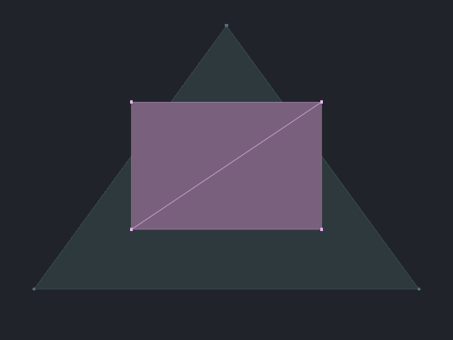
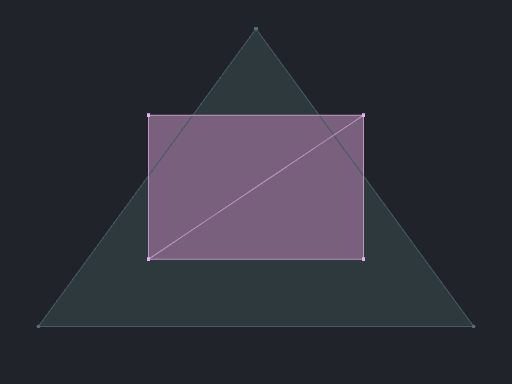

# Overlay prototype results — issue 106

The first prototypes support replacing triangle line draws with edges shaded
inside the surface pass. Merely sorting the existing draws into passes fixes
occlusion policy but leaves most of the edge cost. Vertex circles remain a
separate bottleneck.

The experiment is opt-in under `WOBY_BUILD_OVERLAY_PROTOTYPE`. These measurements
precede the production integration; they use the original control draw order
and retain its edge buffer for all methods.
[Production integration](shader-edge-integration.md) records the resulting
viewer behavior, storage changes, and validation.
[Source and reproduction instructions](../experiments/mesh-overlays/README.md).
[CSV measurements](benchmarks/overlay-prototype-20261004/results.csv) and
[JSON evidence](benchmarks/overlay-prototype-20261004/results.json) contain 200
aggregates, 180 image comparisons, camera matrices, geometry counts, resource
guards, and hashes. Per-frame samples and all captures remain in the ten run
directories recorded in the JSON, under
`D:/.worktree/woby-overlay-build/measurements`.

## Implemented comparisons

| Method | Behavior |
| --- | --- |
| Legacy | Production shaders and group-interleaved solid / unconditional triangle lines / circle markers. |
| Ordered | All surfaces, then visible lines, then circles. Opaque lines test and write depth. |
| Native barycentric | Shade edges within indexed triangles; fuse solid + edges into one draw per group. |
| Pulled barycentric | Read the existing triangle indices in the vertex shader and generate per-corner coordinates. Uses the same edge shader without the native barycentric feature, at the cost of indexed vertex reuse. |

The new methods use visible surfaces by default. Edge-only mode uses a depth
prepass for hidden-line rendering. Explicit X-ray retains unconditional hardware
lines. Circle markers retain their existing depth-tested rendering and IDs.

The same fixture with the new visible-surface path and explicit X-ray:

| Visible surfaces | X-ray edges |
| --- | --- |
|  |  |

## Measurement conditions

Measured on 4 October 2026 with an RTX 3070 Laptop GPU (8 GiB), NVIDIA 616.92,
Ryzen 7 5800H, Windows, and a Visual Studio 2026 Release build using
`vs2026-vcpkg`. Source base: `3e4d19f3dba00dfcb1e517d73a09dfd3bada5ce9` plus
these prototype changes; manifests retain source, executable, and input hashes.
The shaders were compiled with Slang 2026.18.3. All ten runs used the same
executable hash.

The target is actually 1280 × 720 with four samples. Every method in a run uses
the same mesh, fitted camera, colors, buffers, and target. GPU timestamps measure
scene drawing and color resolve; CPU submission is recorded separately and
excludes waiting for the GPU. Capture and marker-ID readback are outside the
measurement interval. Frames complete synchronously in this harness, so these
numbers are **GPU milliseconds, not viewer FPS or interaction latency**.

The initial sweep uses one round, at least 12 warm-up frames / 0.25 seconds and
20 measured frames / 0.5 seconds per case. Focused repeats use three rounds,
0.5-second warm-up and 1-second measurement windows, with the same minimum frame
counts. Method order rotates between rounds. No clocks or thermal state were
locked; small differences should not be interpreted as regressions.

Runs are serial, without overlapping Woby workloads, builds, or test suites.
The first attempt was stopped by the overlap guard and is excluded. Memory
guards stop above 38 GiB private bytes or below 6 GiB available system memory,
sampled every 200 ms. Models are hashed before launch, warming the file cache;
recorded import times are not cold-cache results.
Peak process private memory across accepted runs was 12.17 GiB; minimum
available system memory was 37.12 GiB. No accepted run triggered a resource guard.

## Initial five-model sweep

Solid + edges, GPU milliseconds; one-round screening, IDs disabled:

| Mesh | Legacy | Ordered | Native barycentric | Pulled barycentric |
| --- | ---: | ---: | ---: | ---: |
| BearTrap | 134.41 | 124.99 | 15.41 | 19.72 |
| Bennu | 15.47 | 14.43 | 5.44 | 7.09 |
| Powerplant | 24.29 | 21.71 | 2.55 | 3.37 |
| San Miguel | 14.70 | 13.59 | 1.96 | 2.55 |
| BusGameMap | 0.96 | 0.97 | 0.17 | 0.48 |

Ordered versus barycentric compares the requested visible-surface behavior.
Legacy also draws hidden edges, so its comparison includes the intended behavior
change. Shader edge coverage differs from hardware line coverage in both cases.

For BearTrap, the ordered edge pass alone took 110.37 ms after a 14.60 ms surface
pass. Native barycentrics took 15.40 ms for the fused surface/edge pass. This
supports removing the separate triangle-line workload rather than expecting
depth testing alone to make it inexpensive.

## Focused repeats

Median of three per-round medians, GPU milliseconds:

| Workload | Legacy | Ordered | Native barycentric | Pulled barycentric |
| --- | ---: | ---: | ---: | ---: |
| BearTrap, solid + edges | 135.69 | 125.95 | 15.66 | 20.07 |
| BearTrap, solid + edges + 4 px vertices | 227.79 | 217.19 | 103.15 | 108.41 |
| BearTrap, solid + edges, half camera distance | 119.56 | 108.66 | 15.43 | 22.72 |
| BearTrap, combined, marker-ID attachment enabled | 222.80 | 211.49 | 102.12 | 107.52 |
| San Miguel, combined | 32.46 | 28.45 | 16.33 | 16.86 |

For solid + edges, native barycentric round medians ranged from 15.53 to 15.66 ms;
the ordered control ranged from 125.94 to 126.29 ms. Native was 8.0× faster than
ordered and 8.7× faster than legacy in this workload. The portable pulled version
also removed most of the edge cost, but was slower than native barycentrics.

The combined case improved 2.2× versus legacy. Its legacy rounds ranged from
219.73 to 227.93 ms, while native ranged from 103.05 to 103.30 ms. This variation
is why the report retains ranges and does not make small-difference claims.

The closer-camera and ID-enabled runs retain the large edge improvement. The
ID and non-ID cases are separate process runs; their small difference does not
establish that writing IDs is free. San Miguel has 2,203 groups, and also benefits
on the CPU: median submission fell from 7.99 ms for legacy to 3.44 ms for native
barycentrics. This is submission time, not the full UI-frame cost.

## Remaining vertex cost

BearTrap has 38,414,391 vertices/markers and 75,771,986 triangles. Its baseline
vertex-only GPU times were 44.96, 98.08, and 219.04 ms at 1, 4, and 8 pixels.
These prototypes intentionally leave that representation unchanged.

In the initial combined run, native barycentrics reduced total GPU time from
220.09 to 100.34 ms. The marker/resolve interval still took 85.56 ms, following a
14.78 ms fused surface pass. An edge optimization therefore cannot by itself
make this case interactive at ordinary frame rates.

## Correctness and scope

Debug builds of the viewer and experiment, and Release builds of the experiment,
completed without compiler warnings. All 909 existing tests passed. The three
prototype CTest entries pass in Debug and Release after the transformed-marker
test caught and corrected a matrix-layout mistake in the new harness.

GPU readback tests cover opaque occlusion under group reordering, hidden-line versus
X-ray, marker IDs, complete circles at 1/4/8/40 pixels, occluded markers,
transformed near-plane clipping, and native/fallback comparison at one and four
samples. Capture-analysis tests reject mismatched dimensions and detect changed
pixels. Metal shader source translation was checked; Metal runtime behavior was
not tested.

Across the real-model captures, all 60 unchanged-mode comparisons (solid-only
and vertex-only at 1/4/8 pixels) are pixel-identical to legacy. Native and pulled
barycentric RGB images are also pixel-identical in all 40 comparisons of edge,
combined, transparent, and X-ray scenarios, including focused repeats. Those
checks establish equivalence between the two shader-edge implementations on
these inputs; they do not establish equivalence to hardware lines.

Limitations that affect interpretation:

- Shader edges lie inside triangles. Silhouette thickness and antialiasing differ
  from centered hardware lines; dense subpixel triangles can fill the surface
  with edge color. Appearance needs product review at several zoom levels.
- Transparent fused surface/edge output blends once, while separate passes may
  blend twice. The opacity-0.4 cases are diagnostic and do not establish visual
  equivalence. Mixed opaque/transparent groups and arbitrary saved scenes are
  outside this prototype.
- Every method retains the same control edge buffer to isolate drawing costs.
  BearTrap's 1.69 GiB of triangle-edge indices is a possible payload saving, not
  a measured VRAM reduction. X-ray still uses that buffer here.
- The ID-enabled experiment includes the production-style packed-ID attachment,
  but not the complete hover lookup, highlighting, UI, or presentation pipeline.
- Native capability support was exercised on one NVIDIA device. Unsupported
  devices omit that method explicitly; the pulled fallback remains available.
- No geometry reduction, marker sampling, visibility compaction, or CPU/GPU
  cluster culling is implemented.

## Recommended production work

1. Build an explicit scene draw plan: opaque surfaces, visible overlays, and
   transparent content with a defined ordering policy. Keep planning separate
   from backend submission. Imported lines and detector geometry need their own
   handling rather than being folded into triangle-wire logic.
2. Integrate fused barycentric edges first for opaque solid + triangle edges.
   Expose native barycentric support as a backend capability and retain a tested
   fallback. Keep transparent content on a separately reviewed path.
3. Store the visible/X-ray edge choice in `UiState`, edit it through
   `ui_operations`, and map it through `.woby` save/load. Missing values should
   use the agreed visible-surface default. Retain explicit X-ray behavior.
4. Follow with a vertex prototype that conservatively compacts visible marker
   candidates on the GPU while preserving original IDs. A center-only depth or
   frustum test is insufficient: it can erase visible portions of large circles.
   Compare compacted rasterization against the unchanged circle path before
   considering a more invasive tiled/compute renderer.
