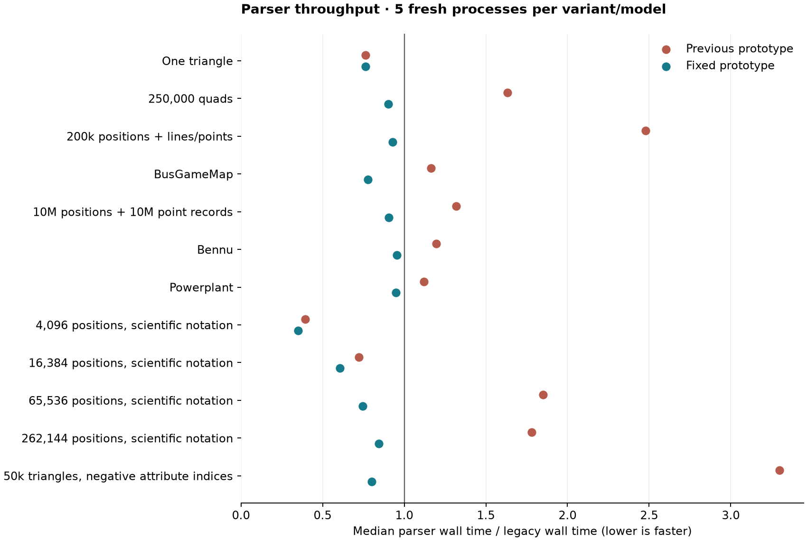

# Parser regression investigation — 2026-10-05

**Follow-up:** [Merge validation, worker scaling, sanitizers and cross-platform CI](merge-validation.md) (2026-10-06).

The fixes meet the **roughly legacy or better** target on all 12 measured
workloads. Every final prototype median is below legacy in the completed
**180-process campaign**: five repeats each for legacy, the saved pre-fix
prototype and the fixed prototype. All ordered geometry fingerprints match;
no model exceeds the 5% / 0.1 ms regression gate. Small differences within
overlapping ranges are parity evidence, not proof of a significant speedup.
This is evidence for the tested model set and machine, not every possible OBJ.

| Workload | Legacy | Previous prototype | Fixed prototype | Fixed / legacy |
| --- | ---: | ---: | ---: | ---: |
| 250,000-quad grid | 24.36 ms | 39.77 ms | 21.99 ms | 0.903× |
| 200k positions, polylines and points | 13.82 ms | 34.25 ms | 12.82 ms | 0.928× |
| 10M positions + 10M point records | 372.53 ms | 490.72 ms | 337.62 ms | 0.906× |
| Bennu, 17.87M triangles | 698.12 ms | 835.92 ms | 666.47 ms | 0.955× |
| Powerplant, 12.76M triangles | 650.34 ms | 728.11 ms | 617.46 ms | 0.949× |
| 50k triangles, negative attribute indices | 20.49 ms | 67.60 ms | 16.38 ms | 0.800× |

These percentages compare measurements within the final campaign. The historical
viewer report's **14.4 → 32.8 ms** line regression was real, but its numbers should
not be mixed with a later standalone campaign. The older workflow report remains
available with its original data.



[All models and run ranges](results.md) · [Raw measurements](measurements.json) ·
[Phase timings](timings.csv) · [Vector chart](comparison.svg)

## Quad grid and lines: too few workers

The previous prototype split input into fixed 4 MiB tasks. The quad grid produced
only **four tasks**, and the line fixture only **two**, versus legacy's 16 workers.
This was a scheduling regression before triangulation, normal generation, mesh
mapping or GPU preparation. The same problem affected medium vertex-only files
and the negative UV/normal-index fixture.

Known-size memory inputs and the general file path now balance blocks across
workers, with a 256 KiB normal minimum, 4 KiB alignment, and the caller's maximum
as an upper limit. Tiny inputs remain sequential. Unknown-size streams retain
bounded block processing. The default native file path uses balanced persistent
ranges, described below; it also uses all 16 workers on the grid and line fixture.

This addresses the dominant cause of the roughly twofold line regression. A
smaller block cap by itself was not sufficient for large inputs: the original
cloud became slower at 256 KiB and 1 MiB caps because it created many more tasks.

## Point cloud: per-record overhead and output construction

The Semantic3D fixture contains **10 million `v` records and 10 million explicit
`p` records**, interleaved. It is not a vertex-only cloud. Both old readers already
used 16 workers, so worker count was not its main problem.

Several costs accumulated over 20 million records:

- The scanner maintained incomplete physical/logical-line state even for complete
  ordinary lines with no continuation.
- Position records traversed general optional-field handling and temporary arrays.
- A one-index point used the general face/line/point decoder.
- Flat decoded coordinates were copied into value-initialized Woby tuple vectors.
- Each 4 MiB task opened its own reader and waited for input before decoding it.

The complete-line loop now decodes directly from the input view when no partial
statement or continuation needs reconstruction. It still detects actual trailing
continuations, CRLF, comments, statement limits and errors. The general scanner
handles the remaining cases, including boundaries inside numbers and freeform
statements. Cancellation is checked at bounded intervals and on the caller.

Positions decode three doubles directly into an owned tuple slot, then validate
all optional weight/color fields. Invalid partial tuples never reach caller
output. One-index points have a short decoder, preserving negative-index offset
flags and final global range validation. Multi-point and unusual syntax use the
existing general decoder.

Decoded position chunks now contain actual `array<double, 3>` objects. One merge
worker bulk-constructs the final vector in order, while other workers reconcile
and copy indices. This removes the explicit vector zero-fill before copying and
overlaps independent work without adding threads. It does not write beyond
`vector::size()`, alias flat doubles as tuple objects, or mutate vector metadata
from multiple workers. UV/normal tuple copies use `memcpy` into existing objects
with a compile-time representation-size check.

## Large files: persistent input and plain faces

The first set of fixes looked sufficient in a 12-model standalone campaign, but
the actual viewer still exposed a cloud regression: **425 ms legacy versus 530 ms
prototype** at the medians. Quieter follow-up runs also exposed a large-triangle
gap previously obscured by slow legacy file reads. Those observations are kept
in [the interim data](ablations), rather than discarded or presented as final parity.

Large default file loads now use one persistent decoder per balanced range and
two aligned 256 KiB input buffers. A worker submits the next positioned read
before decoding the current buffer. Only prefix/suffix text is retained for
ordered boundary reconciliation. This removes repeated task/reader setup and
allows reading to overlap decoding.

Unusually long range-edge statements trigger the existing general bounded
scanner. That fallback keeps long freeform statements and comments legal without
retaining an entire file range. Memory inputs, streams, small files, single-worker
loads and explicit small block caps retain the general block path. The reported
native input-memory peak is a **conservative bound** covering read buffers, edge
strings and reconstruction scratch; it is not a measured allocator high-water
mark. With default settings its bound remains at most 4 MiB per worker, 64 MiB
for 16 workers, independent of file size. Decoded geometry is accounted separately.
The decoded-chunk statistic counts live payload, not spare allocation capacity.

Plain positive-index triangles and quads also have a short decoder. It recognizes
the complete face before mutating the chunk. Attributed faces, negative indices,
larger polygons and malformed input fall back to the existing decoder; global
index validation and material/smoothing handling remain in the merge pipeline.

A later full rerun isolated a smaller remaining gap on the negative UV/normal-index
fixture: 17.14 ms versus legacy's 15.94 ms, or 7.5%. Its merge still carries the
cost of double attribute output, and its UV/normal records were also going through
general keyword dispatch and a temporary-array loop. Direct attribute decoding
now checks the required arity without that general path: one to three components
for UVs, exactly three for normals. It preserves doubles, short-UV defaults,
comments, continuations and malformed-field diagnostics. The focused comparison
showed a modest improvement (16.82 → 16.56 ms); the full final corpus is the
acceptance check, rather than treating that small three-repeat difference as
statistically conclusive.

The retained native reader is **buffered and read-shared**. Experiments with
unbuffered reads, including aligning ranges to whole I/O blocks, substantially
increased read waiting on this machine and were removed. Reproducing a legacy
implementation detail did not automatically reproduce its throughput.

## Where the time goes after the fixes

| Model / wall-time phase | Legacy ms | Previous prototype ms | Fixed prototype ms |
| --- | ---: | ---: | ---: |
| quads / read/scan | 17.66 | 34.29 | 17.77 |
| quads / merge | 2.32 | 3.62 | 2.32 |
| quads / whole parser call | 24.36 | 39.77 | 21.99 |
| lines / read/scan | 10.48 | 30.95 | 9.49 |
| lines / merge | 0.96 | 2.40 | 1.46 |
| lines / whole parser call | 13.82 | 34.25 | 12.82 |
| cloud / read/scan | 312.21 | 394.34 | 260.02 |
| cloud / merge | 25.21 | 72.15 | 58.27 |
| cloud / whole parser call | 372.53 | 490.72 | 337.62 |
| bennu / read/scan | 493.11 | 647.36 | 511.91 |
| bennu / merge | 98.87 | 125.41 | 97.98 |
| bennu / whole parser call | 698.12 | 835.92 | 666.47 |
| powerplant / read/scan | 488.09 | 586.49 | 509.80 |
| powerplant / merge | 57.94 | 92.19 | 71.96 |
| powerplant / whole parser call | 650.34 | 728.11 | 617.46 |
| negative_seams / read/scan | 16.13 | 63.44 | 11.65 |
| negative_seams / merge | 1.70 | 3.05 | 2.10 |
| negative_seams / whole parser call | 20.49 | 67.60 | 16.38 |

Cloud merge still costs more than legacy; faster scanning compensates for it.
Bennu and Powerplant also retain some scan/merge overhead while setup and
cleanup differences contribute to the faster whole-call medians. The claim
is parity of the public parser call, not that every internal phase is faster.

10M positions + 10M point records ranges: legacy 328.53–380.58 ms; fixed 329.86–348.44 ms.

Bennu, 17.87M triangles ranges: legacy 659.86–740.42 ms; fixed 640.85–687.59 ms.

50k triangles, negative attribute indices ranges: legacy 15.75–21.28 ms; fixed 15.20–16.69 ms.

The ranges overlap. The paired-round comparisons below show the observed
wins and exceptions; these measurements do not guarantee every future invocation.

Read/scan includes input, numeric decoding and ordered collection. Merge includes
output construction, task preparation, index validation and copying. Independent
phase medians need not add up to the median whole call. Worker input/decode sums
overlap across workers and are not wall times.

The old `attribute_allocate_ms` field includes vector value-initialization in the
saved prototype. Final position construction now runs inside merge execution;
a near-zero attribute-setup value does not mean positions are free to construct.
Both persistent ranges and legacy use reader submit/wait counters. Older block
experiments also included buffer allocation in their input timer, so those worker
subtotals are not perfectly interchangeable.

Direct Woby ownership still avoids the later flat-positions-to-Woby copy. It does
**not** eliminate every intermediate copy: decoded worker tuples are still bulk
copied into the final contiguous vector. Removing that remaining copy would need
a different ownership/allocation design or a counting pass, with its own costs.

## Check inside the viewer

The rebuilt viewer was checked with **18 runs**: three repeats each for legacy
and prototype on quads, lines and cloud. Geometry counts, retained capacities,
GPU input byte counts and decoded screenshot fingerprints match. No guarded
interference was recorded. Four additional rendered runs checked mixed weighted/
freeform input and trimmed surfaces, one per reader/model; those are functional
cross-checks, not repeated performance evidence.

| Model | Legacy parse ms | Fixed parse ms | Legacy first scene ms | Fixed first scene ms |
| --- | ---: | ---: | ---: | ---: |
| quads | 24.80 | 23.61 | 151.22 | 146.62 |
| lines | 13.41 | 13.06 | 76.39 | 72.45 |
| cloud | 401.08 | 353.32 | 2700.68 | 2529.85 |

[Viewer results, ranges and fingerprints](viewer-results.json) ·
[Extended-grammar viewer checks](viewer-extended-results.json)

For the cloud, later Woby source adoption copies 228.9 MiB with legacy and 0.0 MiB with the prototype. That avoided copy is outside the standalone parser timer. Import peak commit
is 1497.7 MiB versus 1496.5 MiB; the avoided copy must not be equated with the same reduction in whole-application peak memory.

These runs compare the rebuilt application with legacy and prototype readers,
including mesh preparation and visualization. The primary acceptance target here
is parser time. Unchanged downstream work and frame scheduling can make a faster
parse produce only a small first-scene improvement, or overlapping first-scene
ranges. The historical [full workflow report](../load-workflow-performance/index.html)
documents hierarchy preparation, mapping, GPU upload, annotation preparation and
memory costs in detail; its old parser timings are intentionally not rewritten.

## Experiments retained and rejected

The [ablation directory](ablations) includes the original block-cap sweep, each
completed candidate campaign, the worker-count sweep, and the first corpus/viewer
cross-check. Saved executables were compared in rotated fresh processes. These
are diagnostic comparisons, not additive estimates of independent contributions.

| Change | Finding / decision |
| --- | --- |
| Balance medium blocks | Dominant quad/line fix; retained |
| Common position, point and complete-line decoding | Reduced per-record work; retained |
| Bulk tuple copying, then typed position chunks | Removed scalar copy overhead and explicit position zero-fill; retained |
| Early serial scalar construction | Slower merge despite a superficially better total in one campaign; rejected |
| Input-buffer recycling | No repeatable benefit in either attempt; rejected |
| Alternate newline search / outlined ordinary-record helper | No improvement; rejected |
| 8/12/16-worker sweep | No universal advantage from lowering worker count; keep default cap 16 |
| Persistent buffered ranges | Closed the large cloud gap; retained |
| Unbuffered ranges, two alignment policies | Much more I/O waiting; rejected |
| Position construction inside merge pool | Overlapped construction and index work; retained |
| Plain triangle/quad path | Improved quad and plain-face decoding; retained |
| Direct UV/normal arity decoding | Removed general dispatch from attribute records; retained |

The initial successful-looking F corpus is preserved as `corpus-f.json`, and its
failed viewer check as `viewer-f-summary.json`. Later G–Q campaigns show why work
continued. In particular, the buffered range experiment measured cloud medians
of 328 ms versus legacy's 349 ms, whereas the unbuffered experiment measured
453 ms versus legacy's 337 ms. Absolute numbers from different campaigns should
not be subtracted to estimate a single optimization's benefit.

## Method, limits and remaining opportunities

Release builds use `vs2026-vcpkg` on Windows, an 8-core/16-thread machine with about
64 GiB RAM. Every standalone sample is a fresh process, with input warmed before
launch and reader order rotated. Fixture generation, warming and ordered output
hashing are outside the parser timer. The timer ends when the public parser
returns, including synchronous cleanup. Legacy may recycle large decoded buffers
on a detached thread; the prototype joins and cleans up its own work synchronously.

Known build/test/viewer overlap is guarded. The final campaign additionally waits
for two consecutive half-second CPU samples at or below 15%, after warming input.
This cannot exclude every transient load during a sample. Warming also does not
make buffered and unbuffered I/O equivalent or provide a cold-storage benchmark.
The raw data records CPU samples, input/executable/source hashes and excluded runs.
The saved baseline is `de7ac08`; final changes are on top of that worktree revision.

The working regression flag is a per-model median above both **105% of legacy**
and **legacy + 0.1 ms**. Five repetitions are a practical regression check, not a
statistical equivalence proof. No aggregate score is used to hide a slow model.
Large-file ranges and worker I/O timings remain important: the initial F campaign
hid a decode gap behind legacy read waits, which is why it was not accepted alone.

Across the five same-round comparisons:

- quads: fixed was no slower in 5/5 rounds; largest fixed/legacy ratio 0.949×.
- lines: fixed was no slower in 3/5 rounds; largest fixed/legacy ratio 1.155×.
- cloud: fixed was no slower in 4/5 rounds; largest fixed/legacy ratio 1.018×.
- bennu: fixed was no slower in 5/5 rounds; largest fixed/legacy ratio 0.993×.
- negative_seams: fixed was no slower in 4/5 rounds; largest fixed/legacy ratio 1.047×.

These observations remain in the data. The acceptance claim concerns each
model's median, not an assurance that every invocation wins under system noise.

Remaining opportunities are the final contiguous-position construction, decoded
chunk allocation/growth, and downstream mapping/hierarchy work. Further changes
should measure these separately. A counting prepass or different output container
must earn back its extra scan/complexity; unsafe vector-lifetime tricks are not an
acceptable shortcut. The unusual long-boundary fallback is correctness-tested,
but its throughput is not claimed to match a legacy parser that cannot parse the
same extended grammar. Linux/macOS, cold/network storage and other machines were
not performance-tested here.

Windows sampling was attempted, but the OS rejected enabling the profiling policy
(`0xc5585011`). No sampling trace was collected. The investigation uses source and
assembly inspection, coarse phase/worker timers, and measured candidate comparisons.

## Correctness and reproduction

The complete Debug build and Release viewer/comparison targets are warning-free.
**All 966 CTest checks pass**, including **27 parser contract cases**.
Python analysis tests cover invalid/missing samples,
fingerprint mismatches, regression classification and the CPU-idle gate.

New coverage includes medium-file balancing, exact position numbers and optional
fields, one/multiple/relative/forward point indices, invalid token endings and
overflow, native read boundaries through continued freeform bodies, long-boundary
fallback, earliest errors, read sharing, cancellation with reads outstanding,
tuple construction concurrent with index-validation failure, and simple-face
fallback. Final review also caught and fixed a native-range limit error occurring
before the first completed physical line; the regression subcase checks that its
line-1 diagnostic is retained. Each filesystem fixture has its own temporary root and cleans up through
RAII; the tests do not depend on repository and temporary paths sharing a drive.

Ordered benchmark fingerprints compare exact position bits, topology, shape names,
material IDs and smoothing IDs. UV/normal values compare at legacy float precision
because the prototype retains doubles. Material payloads and ignored vertex colors
are not covered by that fingerprint. Parser contract and viewer comparisons provide
additional checks; hashes alone are not a complete correctness proof.

See [the runner instructions](../../experiments/parser-throughput/README.md) for
build commands, corpus selection, worker/block sweeps, timers and report generation.
The complete validation build used:

```powershell
cmake --preset vs2026-vcpkg -DWOBY_RAPIDOBJ_PROTOTYPE=ON -DWOBY_PROFILE_LOAD_WORKFLOW=ON -DWOBY_BUILD_RAPIDOBJ_PROTOTYPE_BENCHMARK=ON
cmake --build --preset vs2026-vcpkg --config Debug
ctest --test-dir build/vs2026-vcpkg -C Debug --output-on-failure -j 8
cmake --build --preset vs2026-vcpkg --config Release --target woby woby_obj_prototype_benchmark woby_parser_benchmark
```

The application prototype switch remains OFF by default in source. Nothing here
merges or enables the prototype automatically.
