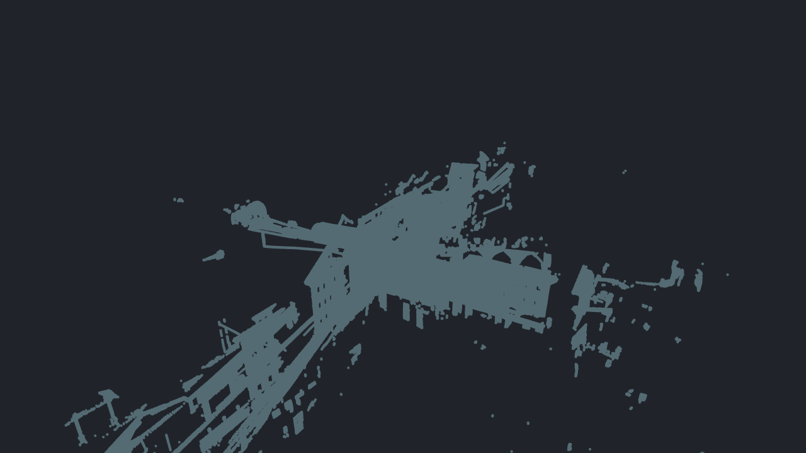
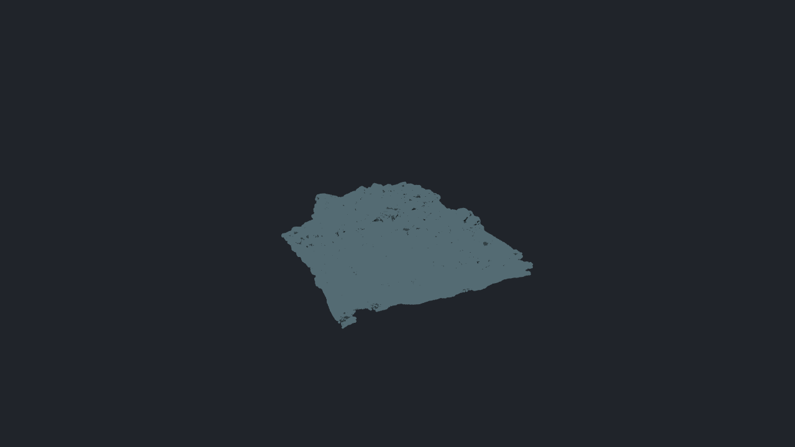

# Opaque point rendering prototype — 2026-10-04

The 100M-point experiment supports **spatial detail selection during navigation,
followed by persistent visibility refinement when still**. Changing the primitive
to compute alone is insufficient: brute-force compute is slower than the quad
control for 4- and 8-pixel points at 4× MSAA. Bounding the submitted work and
reusing completed visibility are the decisive changes.

The measurements in this section describe the original opt-in, headless prototype.
The production integration is described in the final section below.
The source mesh, original point identities, and precise positions are retained.
All points and surfaces in these measurements are opaque.

## 100M-point results

Semantic3D `semantic3d_sg27_station8_100000000_xyz_points.obj`, RTX 3070 Laptop
8 GiB, Ryzen 7 5800H, 64 GiB RAM, NVIDIA driver 616.92, Windows Vulkan.
Fixed **1280×720, 4× MSAA**, with IDs enabled in both implementations.

| Point diameter | Original full-data quads, GPU ms | Full-data compute, GPU ms | Adaptive navigation, GPU ms | Navigation total median / p95 ms | Retained sample coverage |
| --- | ---: | ---: | ---: | ---: | ---: |
| 1 px | 173.17 | 58.46 | 0.52 | 3.49 / 5.26 | 99.24% |
| 4 px | 470.08 | 541.42 | 3.84 | 6.85 / 8.67 | 99.85% |
| 8 px | 1179.13 | 1587.88 | 7.96 | 10.85 / 12.15 | 99.92% |

Navigation total includes CPU hierarchy selection, command submission, and GPU
completion wait. It excludes application UI and presentation, so these numbers
are not measured interactive Woby FPS. The full-data columns use the fixed fitted
camera; navigation uses a 90-frame orbit. Detail differs deliberately, and no
pixel-equivalence speedup ratio is claimed between those workloads.

At **0.25× camera distance**, 4-pixel navigation took **7.31 ms median / 9.16 ms
p95**, retaining **99.26%** of the full reference's covered samples. Maximum
observed navigation frame time was 9.99 ms in that closer view and 12.57 ms in
the fitted 8-pixel case. The fitted cloud occupies a relatively small region of
the viewport; the closer view tests much greater screen coverage.

Coverage is measured against full-data **compute** rendering at the final orbit
camera, taking the lowest coverage across the three rounds. It counts samples
with a visible point, not identical point IDs or depth. There were no additional
covered samples outside the full reference. Missing coverage remains a visual
approximation, and these views do not establish a guarantee for arbitrary thin
features, abrupt camera changes, or every viewpoint.

Close view during navigation:

The same camera after full refinement:

## Refinement and exact source queries

The coarse view remains visible while bounded batches accumulate original points.
All **18 measured refinement sequences** ended with byte-identical RGBA and
identical IDs at every MSAA sample compared with a fresh full-data compute draw.
The cloud sequences each visited all 100,000,000 original points. No visibility
readback or CPU oracle is needed to choose a rendering winner.

| Cloud view | Refinement frames | Total unpaced computation, median | Frame-count time at 60 Hz |
| --- | ---: | ---: | ---: |
| Fit, 1 px | 50 | 74 ms | 0.83 s |
| Fit, 4 px | 81 | 630 ms | 1.35 s |
| Fit, 8 px | 233–238 | 1928 ms | 3.88–3.97 s |
| Close, 4 px | 55 | 374 ms | 0.92 s |

The last column is an estimate from the frame count, not a presentation
measurement. A production scheduler could spend more of an idle frame budget
on refinement. The 8 ms controller is feedback rather than a hard deadline:
the largest observed refinement frame was 15.31 ms. Once fully refined, cached
visibility resolved in about **0.09 ms GPU**, or **0.3–0.4 ms total** headlessly.

Precise queries traverse original hierarchy leaves rather than proxy points.
All **128 covered-sample queries** in the measured cloud runs matched the full
GPU reference ID, including 4× sample locations. At 4 pixels, fitted-view query
timing was **0.63 ms median / 1.44 ms p95**; the close view was **1.34 / 3.68 ms**.
These queries use the original render positions and return IDs mapped back to
the retained mesh's precise positions. Measurement tools and source-data
ownership have not been rewritten as part of this experiment.

## Opaque mesh vertices

BearTrap has 38,414,391 submitted markers and 75,771,986 triangles. With 4-pixel
vertices and opaque surfaces, the original control was about **99.28 ms GPU**.
Full-data compute was also about **98 ms GPU**. The surface pass alone costs
approximately 15 ms, so a universal 8 ms GPU-frame target is inappropriate.

| Navigation policy | GPU median | Total median / p95 | Minimum marker coverage |
| --- | ---: | ---: | ---: |
| 8 ms target | 15.56 ms | 17.22 / 17.88 ms | 73.21% |
| 20 ms target, up to 2M points | 18.44 ms | 23.89 / 27.03 ms | 98.66% |

The first policy leaves only the controller's minimum raster allowance and
visibly undersamples the vertices. The second is substantially more useful, but
still spends about 5 ms on CPU selection/submission. Its stationary view reached
the exact result in 20 refinement frames, about 93 ms of unpaced computation.
This is evidence for a separate mesh-overlay quality policy and cheaper
hierarchy traversal, not a claim that mesh rendering now sustains 60 Hz.

The first BearTrap control round transitioned from approximately 143 to 99 ms
mid-round; its conventional median was 121 ms. The other two round medians were
99.26–99.28 ms. A compute round also ran slower. The cause was not established;
all samples are retained, and the comparison uses the lower, repeatable control
cost rather than treating the slow round as a larger improvement.

## Representation and memory

- Each render point contains an unquantized 12-byte position and a 4-byte original
  marker ID. Morton keys only reorder data; they do not alter positions.
- A spatial binary hierarchy partitions that order into leaves of at most 4096
  points. Nodes contain stratified original-point samples plus actual extrema.
  The cloud has 65,535 nodes and 8,752,756 proxy points.
- Navigation selects a hierarchy frontier using projected bounds and sampling
  error. It starts with a 500k-point budget, adjusts from GPU timing, and submits
  at most 2M points. Metadata traversal replaces per-frame CPU scans of 100M points.
- Compact data is uploaded in independent allocations of at most 1,048,576 points
  (16 MiB), with bounded staging. All allocations are resident in this prototype.
- A 64-bit atomic maximum chooses the reversed depth and original ID together
  for each sample. Equal-depth ties use the original ID, independent of storage
  or submission order. Complete circular footprints compete with opaque surface
  depth; visible circle fringes are retained even when their centers are hidden.
- Shading resolves winning IDs afterward. Stationary refinement preserves this
  buffer. Camera, point size, surface mode, group visibility, transform, and color
  changes reset it. Immutable geometry and fixed viewport are prototype contracts.

For the cloud, retained GPU geometry fell from **3.600 GB to 1.740 GB** including
proxies, a **51.7% reduction**. The visibility buffer adds **29.49 MB** at the tested
resolution and sample count. These are decimal logical buffer sizes, not total
device-memory measurements; texture heaps, upload staging, readback, roots, and
task metadata are additional allocations.

The mesh adapter still retains the original surface vertex/index buffers.
Consequently, BearTrap geometry **increased from 2.292 GB to 2.823 GB** when adding
the compact marker hierarchy. Production integration should share point positions
with the surface representation and preserve instancing rather than retain both
forms. The current point records can also duplicate shared vertices across groups.

The CPU adapter keeps the existing Mesh/source copies and adds about 2.145 GB of
compact cloud data and mappings. Hierarchy construction took **7.9–9.2 seconds**
for the cloud, after existing OBJ loading, and **5.1–5.5 seconds** for BearTrap.
This is offline setup, not an asynchronous loading implementation. Across the six
final campaigns, peak sampled process-private memory was **12.17 GiB** and minimum
available system memory was **35.71 GiB**. No overlap or resource guard fired.

## Implementation boundaries and next work

The shared hierarchy implementation is now in [point_cloud.cpp](../src/point_cloud.cpp),
[point_renderer.cpp](../experiments/mesh-overlays/point_renderer.cpp), and
[point.slang](../experiments/mesh-overlays/point.slang). It builds on the compute
visibility-buffer approach described in
[Software Rasterization of 2 Billion Points in Real Time](https://www.cg.tuwien.ac.at/research/publications/2022/SCHUETZ-2022-PCC/).
That paper's headline implementation concerns one-pixel points; these measured
full circles and MSAA workloads have different costs.

The prototype directly visits footprint samples. It does not yet implement tile
lists, quantized/chunk-relative coordinates, per-point colors, disk paging,
incremental hierarchy construction, asynchronous UI integration, or a Metal/
32-bit-atomic fallback. The old importer/preparation capacity limits still apply,
even though the new point GPU allocations are chunked. It assumes Vulkan standard
1×/4× sample locations, verified by the GPU oracle tests on this device.

The compute circle test runs at each MSAA sample. The original quad shader
discards the circle at pixel frequency, so edge coverage differs. This prototype
is not a pixel-identical replacement for the old MSAA path. Selected diagnostic
markers and production measurement/picking interactions still need integration.

The next production work should keep the hierarchy and original identities
independent of the raster backend:

1. Coordinate point/source ownership and chunked import with issues
   [112](https://github.com/tuncb/woby/issues/112) and
   [113](https://github.com/tuncb/woby/issues/113), removing redundant Mesh copies
   and making loading, residency, cancellation, and uploads bounded.
2. Move or amortize hierarchy selection off the UI thread; add stable selection,
   camera-motion tests, thin-feature quality checks, and explicit marker quality
   floors when surfaces consume the frame budget.
3. Compare tiled compute and hardware rendering for large/sparse footprints.
   The direct atomic implementation is an exact full-footprint reference;
   its brute-force 4× MSAA cost is not the final rasterization target.
4. Integrate precise queries and pinned selected markers with the authoritative
   source data, then validate frame pacing and interaction in the actual viewer.

## Reproduction and evidence

[Build and CLI instructions](../experiments/mesh-overlays/README.md#compact-opaque-point-renderer)
describe the separate `woby_point_prototype` target. Six serial final campaigns
used one executable SHA-256:
`d519dcfe5876f0d5600244026e9e863c9cac9de53b86ae007ddb4b884842b222`.

[Summary](benchmarks/point-cloud-20261004/summary.json) links the original raw
directories. The adjacent JSON files retain every GPU/CPU/wall sample, coverage,
camera settings, point counts, refinement comparisons, guards, and source/input/
SPIR-V hashes. Each final case has three rounds. Full-data cases have three warmup
frames and 12 measured frames; cached cases have 12 measured frames after
refinement, and each orbit has 90 frames.
Point-size order rotates between rounds. Captures, source queries, and the full
reference used for comparisons are outside measured navigation/refinement frames.
Navigation traces follow the full-data workload; cold-start navigation and
resuming from a prolonged idle period were not measured.
The control's upload timer excludes device initialization, whereas compute setup
includes it; those setup fields should not be treated as identical boundaries.

Tables use medians of the three conventional per-round medians recomputed from
raw samples. P95 is the highest round's stored higher-order-statistic percentile.
Coverage is the lowest of the three final-camera measurements. Exploratory 1×
runs and looser sampling pilots are excluded from these tables.

Behavioral tests cover ID/position preservation, hierarchy budgets, tiny budgets,
full-source refinement partitions, source picking, complete circle fringes,
clipping, 1×/4× sample coverage against an independent CPU oracle, chunk boundaries,
group transforms, stable ties, opaque surfaces, order-independent accumulation,
cache invalidation, and the workload guard. The GPU tests also run with Vulkan
synchronization validation; shaders compile with warnings treated as errors and
pass SPIR-V validation.

Validation completed with warning-free full Debug and prototype Release builds,
**all 918 Debug CTest entries passing** (300.56 seconds), the three focused
Release checks passing, and the final Debug GPU checks passing with Vulkan
synchronization validation enabled. `git diff --check` passed.

## Production integration — 2026-10-04

The app now uses the opaque point renderer for prepared meshes with at least
65,536 markers. The View menu's **Adaptive points while navigating** setting is
enabled by default, belongs to `UiState`, and round-trips through scene files,
saved views and undo/redo. The control API exposes `render.set` / `adaptivePoints`
and CLI `render set scene --adaptive-points true`. A viewport label distinguishes
navigation, refinement and full detail.

Hierarchy construction and preparation run on the existing cancellable loading
worker. The original mesh and precise positions remain authoritative. GPU uploads
use bounded staging and 16 MiB compact allocations; standalone clouds no longer
also upload the 32-byte surface vertices or a separate legacy point-ID buffer.
The CPU hierarchy is shared with full-source picking. Cursor queries traverse
original leaves and fill the GPU picking region from original point IDs even
while the rest of the viewport has reduced detail.

Navigation uses spatial-error cuts prepared during loading, including full sparse
leaves. Equal-depth tree cuts were rejected: their density bias retained only
77–89% of covered samples in the 100M fitted test. Each visible group's budget is
independent, and smaller clouds draw all originals when they fit. Prepared cuts
are reused across camera changes. Optional view-specific work uses owned worker
snapshots and is accepted only for the matching camera/geometry epoch.

After 150 ms without a view change, bounded batches refine every original point
into persistent per-sample depth/ID winners. Completed visibility is reused.
Camera, geometry, transforms, point size, colors and ID-layout changes invalidate
it. The resolve pass tests against the current opaque surface depth, so an
occluder can change without leaving stale point visibility. GPU timing uses the
existing frame timeline; it does not add a per-frame completion wait. The 8 ms
raster budget is feedback, not a deadline, and excludes the surface pass and UI.

The original measured Vulkan path requires 64-bit buffer atomics and standard
sample locations. The subsequent Metal implementation adds a portable 32-bit
atomic path: select batch depth, select IDs at that depth after a barrier, then
merge each batch winner into persistent visibility with one invocation per sample.
It preserves the depth/ID tie rule without 64-bit atomics, at the cost of a second
raster pass, barriers, and eight scratch bytes per sample. Runtime capability
checks select 32-bit compute on M1 and permit 64-bit maximum on supported M2+
macOS devices. Metal's default 1x/4x sample positions are verified at device creation.

Adaptive selection also feeds compact hardware quads independently of compute
capabilities. Quads redraw the selected navigation cut and cached full-source
cursor-query ranges every frame; after navigation they draw all source points.
They do not accumulate persistent refinement. Point timing includes the selected
backend's work. The Metal buffer address registry grows dynamically instead of
limiting chunk uploads to 64 allocations.

Freeform geometry and smaller meshes keep full-detail drawing. Mesh vertices and
point clouds are always opaque, independent of group, file and folder opacity.
Surface and edge opacity changes retain the optimized point path, cached point
visibility and the existing markers-last rendering order. Compact quad fallback
preserves source identities and colors. Screenshot exports also use full source
detail with opaque points. In the hardware fallback, ties between overlapping
points at equal depth follow spatial storage order; picked IDs still map to the
original source footprints. General surface transparency ordering,
out-of-core residency and the import
capacity limits are separate work; issues #112 and #113 remain applicable.
Dense surface meshes still retain surface buffers as well as compact markers.

### Actual app measurements

Same hardware as above, Release desktop Vulkan, **1280×720 drawable / 1280×687
scene viewport, 4× MSAA**, visible window, three rounds with rotating point-size
order. Each round records twelve full-source changing views, 96 adaptive camera
commands over the same repeated angular path, refinement, then cached frames.
BearTrap includes surfaces, shader edges and vertices. The other rows contain
standalone points. All cases completed with no workload-overlap or resource-guard
violation, and every refinement submitted the full original point count.

| Dataset | Diameter | Full-source changing view, GPU ms | Adaptive GPU median / worst-round p95 ms | Full-detail cached GPU ms |
| --- | ---: | ---: | ---: | ---: |
| 10M cloud | 1 px | 3.39 | 0.78 / 1.07 | 0.22 |
| 10M cloud | 4 px | 36.68 | 4.44 / 5.19 | 0.17 |
| 10M cloud | 8 px | 118.98 | 6.47 / 15.59 | 0.17 |
| 100M cloud | 1 px | 58.70 | 0.76 / 0.78 | 0.17 |
| 100M cloud | 4 px | 555.64 | 4.04 / 4.80 | 0.17 |
| 100M cloud | 8 px | 1375.72 | 6.75 / 16.65 | 0.17 |
| BearTrap, 38.4M markers | 1 px | 21.44 | 16.03 / 16.17 | 15.58 |
| BearTrap, 38.4M markers | 4 px | 97.96 | 19.39 / 20.02 | 15.46 |
| BearTrap, 38.4M markers | 8 px | 332.52 | 22.14 / 31.22 | 15.58 |

These GPU-frame summaries select completed GPU frames containing point raster
work. They exclude cached frames between camera RPCs; the current CPU submission
count is not used to classify delayed GPU timestamps. Medians are medians of
three round medians. The raw records retain every frame and CPU stage, including
pacing and waits. Navigation changes detail deliberately; the table does not
claim pixel-equivalent moving-view speedups. Cached rows have full detail and a
stationary camera. GPU time is not physical input-to-display latency or presented
FPS. Historical issue FPS lacks comparable recorded drawable dimensions.

At 4 pixels, the main thread's scene-submission median was **0.18 ms** for 100M
points and **0.26 ms** for BearTrap. The 100M cloud took 29.32 s to load, including
9.40 s for preparation, with 0.44 s of GPU-finalization work. Its longest measured
upload step was 2.20 ms. Peak process-private memory was 12.21 GiB; the campaign's
largest was 12.44 GiB on BearTrap. These do not remove existing CPU mesh copies.

The 100M runs refined in 50 / 87–88 / 233–237 submitted batches at 1 / 4 / 8 px;
BearTrap used 20 / 20 / 44–46. Completion counters describe submission, with GPU
completion following on the existing timeline. At 8 pixels the largest observed
navigation GPU frame was 22.72 ms for the 100M cloud and 35.74 ms for BearTrap.
The controller therefore improves typical cost without promising a hard frame
limit.

### Coverage and verification

An independent headless check uses the same prepared cuts at 1280×720, 4× MSAA.
Fitted 100M coverage is **99.06% / 99.85% / 99.92%** at 1 / 4 / 8 px. A 0.25×
distance close-up retains **98.24%** at 4 px, and BearTrap with surfaces retains
**98.31%**. These are covered-sample ratios, not equal IDs or depth. They are
single final-view checks of the fast prepared cuts, not a guarantee for every
viewpoint or thin feature. All five sequences refine to identical RGBA and every
sample ID compared with a fresh full-source compute reference. The exact original
queries also match that reference.

Production GPU tests use an independent CPU oracle for complete circles, original
IDs, depth ties, transformed groups, 1×/4× samples, point sizes 1/4/8/40, offset
viewports, resize, stale visibility, partial refinement and exact picking before
refinement. They cover both color-only and picking targets, current opaque
occluders, transparent fallback and GPU chunk uploads. Other tests cover scene
and view persistence, control validation, undo/redo, cancellation, group budgets,
sparse geometry and full-source CPU picking.

[The integration summary](benchmarks/point-app-20261004/summary.json) records
source/input/executable/shader hashes, per-case summaries and resource guards.
Adjacent `.json.gz` files retain complete app and coverage measurements. PNG
exports from the actual app are full-source reference exports outside timing;
the coverage PNGs come from the headless checker. Earlier hidden-window and
uniform-cut pilots are excluded from the final app table. Reproduce with the
[app runner](../tests/point_render_benchmark.py) and the commands in the experiment
README. Exact logical GPU geometry remains 1.740 GB for the 100M cloud and
2.823 GB for BearTrap; the app's winner buffer adds 28.14 MB.

Final validation: warning-free Debug and Release builds; **all 940 Debug CTest
entries passed** in 306.77 s with Vulkan synchronization validation enabled.
`git diff --check` passed. Compressed build/test logs accompany the measurements.
The recorded base revision predates the integration commit; working-source and
executable hashes identify the measured implementation committed with this report.
