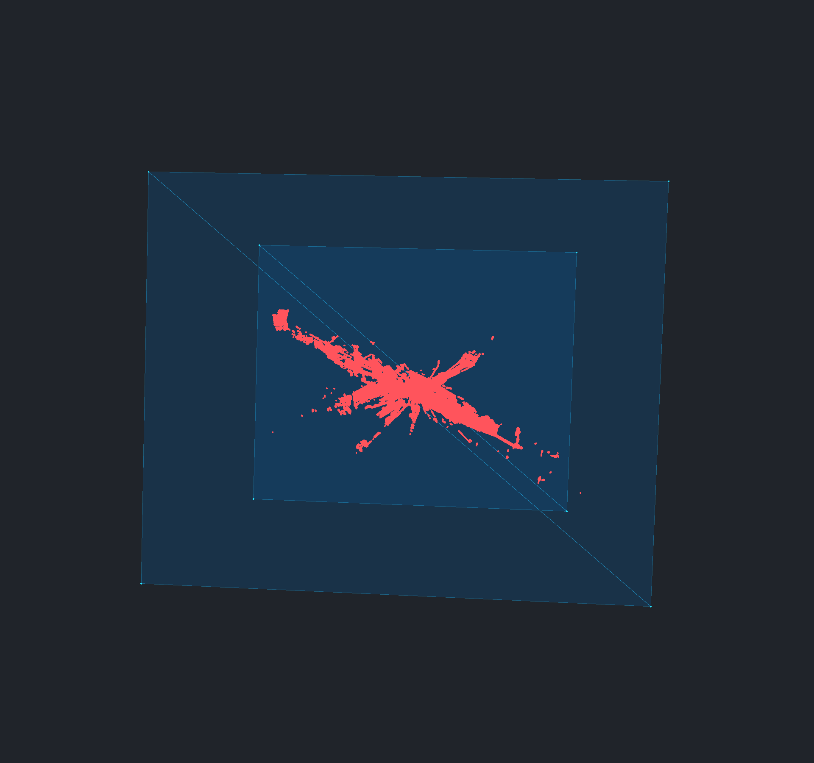

# Opaque points with transparent surfaces — 2026-10-06

The opaque point policy keeps large clouds on the optimized renderer when mixed
with transparent surfaces. In the fitted 100M-point, 4-pixel case, adding two
translucent sheets changed navigation GPU time from **4.50 to 4.64 ms** and cached
full-detail GPU time from **0.269 to 0.279 ms**. All **144 opacity transitions**
retained complete point visibility with **zero new point submissions and zero
point raster frames**.

Large footprints still produce occasional expensive frames: the largest measured
8-pixel navigation GPU frame was **23.69 ms**. The raster budget remains feedback,
without a hard frame-time guarantee.

## Workload and method

Release desktop NoGraphicsAPI Vulkan, NVIDIA RTX 3070 Laptop 8 GiB, driver 616.92,
Ryzen 7 5800H, 64 GiB RAM, Windows. The application source is commit `67e8e26`;
the summary records executable, application-source, runner, input and artifact
hashes. Debug and Release builds completed without warnings.

Both Semantic3D station8 datasets are the existing real OBJ inputs, containing
10,000,000 and 100,000,000 points. All campaigns requested **1280×720 drawable**, used
an actual **1280×687 scene viewport**, and retained **4× MSAA**. The desktop window
was visible, both panes and scene helpers were disabled, and the camera was fitted
to the cloud before adding the surface fixture. Each condition uses the same
camera placement and repeated twelve-view angular path within its dataset.

The mixed fixture contains two blue camera-facing sheets, placed on either side
of the cloud center: **four triangles, eight vertices, opacity 0.35**. Surface
edges and vertices are enabled. The sheets cover a much larger image region than
the fitted cloud; retained exports show the actual geometry. The comparison
toggles this file's visibility without changing the cloud or camera.

Three rounds rotate point-size and condition order, giving **36 measured cases**:
two datasets × three diameters × two conditions × three rounds. Each case uses:

- Four warmup full-source camera commands, then twelve measured changing views
  with adaptive navigation disabled.
- Twelve warmup adaptive camera commands, then 96 measured camera commands over
  the same repeated angular path.
- Stationary refinement until all original points have been submitted, followed
  by a 250 ms drain outside timing and 600 ms of cached-frame recording.
- Recorded cloud opacity changes to 0.35, 0 and 1. Mixed cases also change surface
  opacity to 0.6 and back to 0.35, with 80 ms observation windows per change.

Cloud opacity changes exercise legacy/API values; the UI control is disabled for
point-cloud-only selections. Points remain opaque throughout these measurements.
No build, test suite or other monitored Woby workload overlapped timing, and no
resource guard fired. The 10M and 100M campaigns took 88.3 and 327.4 seconds,
including loading, controls and exports. Peak process-private memory was 1.69 and
12.21 GiB respectively; minimum available system memory was 31.82 GiB.

## Navigation and cached rendering

All timings are milliseconds. GPU navigation values select completed frames
containing point raster work, using `gpuRasterCount`, independently of the current
CPU frame's submission count. This avoids counting cached frames between camera
RPCs as point raster work. Medians are medians of three round medians; p95 is the
largest round p95. Every raw sample is retained, including slower rounds.

| Dataset | Diameter | Cloud navigation GPU median / p95 | Mixed navigation GPU median / p95 | Cloud cached GPU | Mixed cached GPU |
| --- | ---: | ---: | ---: | ---: | ---: |
| 10M | 1 px | 0.69 / 0.75 | 0.63 / 0.69 | 0.409 | 0.322 |
| 10M | 4 px | 4.44 / 5.22 | 4.47 / 5.21 | 0.265 | 0.278 |
| 10M | 8 px | 6.41 / 15.05 | 6.46 / 15.16 | 0.267 | 0.279 |
| 100M | 1 px | 0.59 / 0.62 | 0.58 / 0.63 | 0.287 | 0.310 |
| 100M | 4 px | 4.50 / 5.24 | 4.64 / 5.15 | 0.269 | 0.279 |
| 100M | 8 px | 6.81 / 15.30 | 6.65 / 14.80 | 0.270 | 0.283 |

Small differences between conditions include run variation and the adaptive
controller's selected work; lower mixed-case medians do not establish a speedup.
For example, 10M full-source 1-pixel round medians were 3.56, 5.40 and 6.90 ms.
The cause of that variation was not established.

Full-source changing views remain expensive. For 100M points, cloud-only GPU
medians were **60.2 / 563.8 / 1427.5 ms** at 1 / 4 / 8 pixels; mixed-case values
were **60.5 / 564.7 / 1436.3 ms**. Adaptive navigation deliberately changes detail,
so these workloads do not support a pixel-equivalent moving-view speedup ratio.
Every stationary refinement reached all original source points, and cached rows
represent full detail.

At 4 pixels, main-thread scene submission during frames that submit point work
was **0.105 / 0.110 ms** for 10M cloud-only / mixed and **0.134 / 0.141 ms** for
100M. Total recorded CPU stages excluding `graphics_frame` were **0.371 / 0.384
ms** for the 100M pair. The backend `cpuSubmitMilliseconds` field also includes
waiting, so it is retained in raw data and is not used as CPU processing cost.

The recorder preserves every CPU stage, frame interval, pacing setting and GPU
sample. The visible window's configured pacing target was 240 Hz. RPC-driven
intervals include cached frames between camera commands; they and GPU timings
are not presented FPS or physical input-to-display latency.

## Appearance and cache verification

All 36 cases retained an active optimized point renderer and the expected source
count. Capture validation rejects changed drawable/viewport sizes, missing or
dropped samples, inactive point rendering, incomplete cached visibility and new
point submissions during cached/opacity-edit observations.

Across 72 transitions per dataset, no source points were resubmitted and no point
raster work was recorded. This includes changing surface opacity while its eight
opaque mesh vertices remain enabled.

Four independent 4-pixel export comparisons—both datasets, with and without
surfaces—were byte-identical in RGB at cloud opacity 1 and 0. Adding the sheets
also left all **43,722 / 40,739** fully covered cloud-color pixels unchanged for
10M / 100M. This latter check covers opaque cloud interiors, excluding MSAA
fringes and point IDs. Export PNGs use the application's standard **1920×1800**
full-source export path, outside timing; they are not captures of reduced
navigation detail. Original IDs, circle fringes and selection behavior are covered
by the production GPU tests, rather than newly measured by this campaign.




## Scope and reproduction

These fitted views and two simple sheets establish that the chosen appearance
policy retains optimized rendering and cached visibility. They do not measure
dense transparent meshes, general intersecting-surface ordering, close-up
navigation quality, or other GPU backends. No new approximate-coverage guarantee
is claimed. Historical transparent-point FPS in issue #115 used different
appearance and lacks comparable recorded viewport dimensions.

The next performance work should investigate the 8-pixel frame-time tails and
use representative complex surface scenes before choosing surface-ordering
optimizations. Surface-ordering decisions remain tracked in
[#116](https://github.com/tuncb/woby/issues/116); the measured point policy and
remaining performance scope relate to [#115](https://github.com/tuncb/woby/issues/115).

Build and run serially, using fresh output directories:

```powershell
cmake --preset vs2026-vcpkg -DBUILD_TESTING=ON -DWOBY_BUILD_BENCHMARKS=ON
cmake --build --preset vs2026-vcpkg --config Release --target woby
uv run tests/point_render_benchmark.py D:/woby/build/vs2026-vcpkg/bin/Release/woby.exe D:/temp/obj_tests/pointclouds/semantic3d_sg27_station8_10000000_xyz_points.obj D:/woby/build/point-opacity-new/10m --rounds 3 --sizes 1 4 8 --navigation-frames 96 --full-frames 12 --visible-window --compare-transparent-surfaces --opacity-checks
uv run tests/point_render_benchmark.py D:/woby/build/vs2026-vcpkg/bin/Release/woby.exe D:/temp/obj_tests/pointclouds/semantic3d_sg27_station8_100000000_xyz_points.obj D:/woby/build/point-opacity-new/100m --rounds 3 --sizes 1 4 8 --navigation-frames 96 --full-frames 12 --visible-window --compare-transparent-surfaces --opacity-checks
ctest --preset vs2026-vcpkg -R '^woby_point_benchmark_reporting$' --output-on-failure
```

The three reporting regression tests pass. They distinguish delayed GPU work
from CPU submissions, separate CPU work from waits, and reject incomplete cache
observations and incompatible render dimensions. The application C++ and shader
code is unchanged from the previously validated opaque-point commit.

[Summary and hashes](benchmarks/point-opacity-20261006/summary.json),
[10M raw frames](benchmarks/point-opacity-20261006/10m.json.gz), and
[100M raw frames](benchmarks/point-opacity-20261006/100m.json.gz) retain the evidence.
Adjacent files include the exact sheet fixtures, export comparisons, viewer logs,
build logs, reporting-test results and GPU telemetry. The short pilot is excluded
from all reported campaign values.
