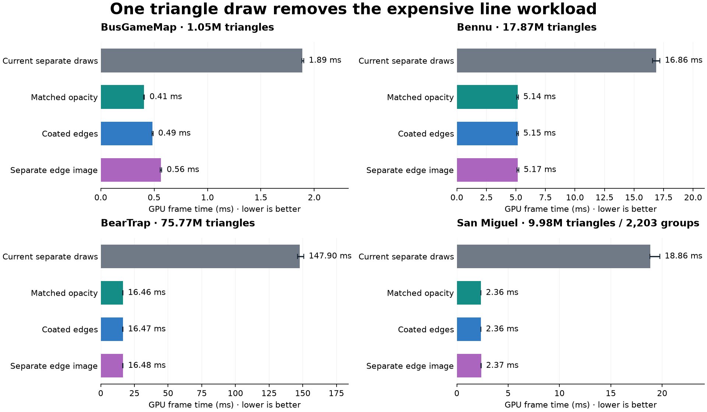
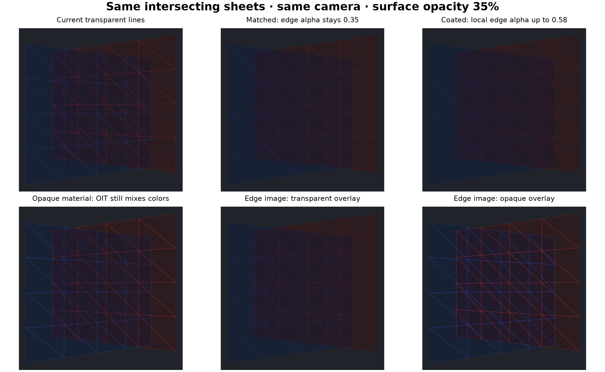

# Transparent edge measurements — issue 118

Combining triangle edges with transparent surfaces in one geometry draw is the
clear winner in these measurements. The native barycentric path is 3.3–9.0 times
faster than the current separate surface and line draws across four real meshes.
The fallback also wins. The opacity policy can be selected mainly for appearance
on the large meshes; all five native combined policies have almost the same cost.

These measurements compare the original renderer with working prototypes for
[issue 118](https://github.com/tuncb/woby/issues/118), kept in
`D:/.worktree/transparent-edge-benchmark/woby`. The main renderer now adopts the
combined path with matched opacity as its sole opacity policy, using native
barycentrics when supported and the vertex-pulling fallback otherwise. The other
policies remain experimental comparisons in the archived prototype.

[CSV results](benchmarks/transparent-edges-20261007/summary.csv),
[JSON evidence](benchmarks/transparent-edges-20261007/summary.json),
[provenance and image checks](benchmarks/transparent-edges-20261007/provenance.json),
and [prototype sources](benchmarks/transparent-edges-20261007/prototype-sources.zip)
retain the full comparison and reproduction details.

## Main comparison

Each entry is GPU frame time in milliseconds, the median of three rotated
per-round medians. All conditions retain the original triangles, buffers,
camera, resolution, and scene settings within each run. Lower is better.

| Mesh | Triangles / groups | Surface only | Current transparent lines | Current lines made opaque | Matched opacity | Coated edges | Opaque edge material | Separate edge image | Opaque edge image |
| --- | ---: | ---: | ---: | ---: | ---: | ---: | ---: | ---: | ---: |
| BusGameMap | 1.05M / 65 | 0.392 | 1.889 | 0.962 | 0.406 | 0.485 | 0.490 | 0.563 | 0.538 |
| Bennu | 17.87M / 1 | 5.168 | 16.861 | 16.117 | 5.142 | 5.152 | 5.154 | 5.169 | 5.159 |
| BearTrap | 75.77M / 1 | 16.476 | 147.901 | 147.880 | 16.464 | 16.470 | 16.465 | 16.477 | 16.476 |
| San Miguel | 9.98M / 2,203 | 2.355 | 18.859 | 17.763 | 2.359 | 2.361 | 2.360 | 2.371 | 2.371 |

Matched opacity reduces GPU frame time by approximately 79%, 70%, 89%, and 87%
respectively. Paired speedups are approximately 4.7x, 3.3x, 9.0x, and 8.0x.
Differences of a few hundredths of a millisecond between the combined policies
on the larger meshes are too small to select an appearance policy from.

The Bus costs show the bandwidth distinction more clearly: its separate edge
image costs about 0.16 ms more than matched edges. It remains 3.4 times faster
than the existing transparent lines. Making the old lines opaque helps this
particular mesh, but leaves BearTrap's bottleneck intact.

## Where the time goes

| Mesh | Existing triangle-line block | Combined triangle-line block | Combined transparency accumulation | Combined transparency resolve |
| --- | ---: | ---: | ---: | ---: |
| BusGameMap | 1.583 ms | 0 | 0.218 ms | 0.042 ms |
| Bennu | 11.475 ms | 0 | 4.972 ms | 0.048 ms |
| BearTrap | 132.045 ms | 0 | 16.303 ms | 0.043 ms |
| San Miguel | 16.397 ms | 0 | 2.194 ms | 0.041 ms |

Accumulation includes pass transitions. The table uses matched opacity for the
combined path. Individual stage medians are not additive measurements of the
whole-frame median. The retained data contains all stage distributions.

The existing path emits six procedural line vertices and three hardware lines
per triangle, including duplicate shared edges. BearTrap generates 454,631,916
line vertices every frame. The combined shader removes that draw and shades
edges from barycentric coordinates on the existing surface triangles. It keeps
the weighted transparency accumulation and fullscreen resolve. Thus “one pass”
means one geometry draw for surfaces and edges; transparency still has a resolve.

## Fallback and CPU submission

| Mesh | Native matched edges | Forced fallback matched edges | Current scene submission CPU | Combined scene submission CPU |
| --- | ---: | ---: | ---: | ---: |
| BusGameMap | 0.406 ms | 0.722 ms | 0.0718 ms | 0.0438 ms |
| Bennu | 5.142 ms | 6.535 ms | 0.0080 ms | 0.0052 ms |
| BearTrap | 16.464 ms | 20.759 ms | 0.0089 ms | 0.0067 ms |
| San Miguel | 2.359 ms | 2.977 ms | 2.3412 ms | 1.3738 ms |

Native barycentrics preserve indexed vertex reuse. The fallback reads the
original triangle indices and emits three corners per triangle; it adds no edge
index buffer. Its measured cost is higher, but it still outperforms the separate
line path on all four meshes.

CPU figures measure scene command creation, not GPU execution or frame pacing.
San Miguel drops one line submission per group, saving about 0.97 ms of CPU work.
Its remaining 1.37 ms suggests a later investigation into caching/coalescing
adjacent draws with identical material, transform, and visibility settings.
That follow-up is not implemented or benchmarked here.

## Appearance choices

Let `a` be surface opacity and `c` analytic edge coverage. All variants use the
existing surface lighting/UV shading and edge color, with RGB scaled by 1.25.

| Policy | Behavior | Main tradeoff |
| --- | --- | --- |
| Matched | Mix edge RGB into surface RGB; keep alpha `a`. | Fastest, minimum memory, coherent translucency; less prominent than repeated overlay lines. |
| Coated | Composite an edge with alpha `c*a` over its local surface, then apply weighted transparency. | Stronger edges without another image. At full coverage and `a=.35`, local alpha is `.5775`. |
| Opaque material | Same local composition with edge alpha `c`. | Full-coverage local alpha reaches 1, but weighted transparency still averages overlapping colors. It does not guarantee nearest opaque edge visibility. |
| Separate edge image | Accumulate ordinary surfaces and premultiplied edge color into a third attachment in the same triangle draw; composite edges after resolved surfaces. | Prominent edges, with added memory/bandwidth and source-order dependence. |
| Opaque edge image | Same attachment, with edge alpha `c`. | Closest option to the current prominent opaque overlay behavior; source-order dependence remains. |

Matched, coated, and opaque-material edges are order independent up to floating
point accumulation error. The image policies intentionally retain conventional
overlay ordering. Reversing differently colored groups changes their overlap
colors, just as it can with the current line overlay.

Barycentric edges are covered inside triangle footprints. They do not exactly
reproduce hardware-line silhouettes, joins, or the opacity from duplicated
shared lines. Coating approximates one edge over one fill; legacy shared lines
can add more repeated coverage. These are appearance alternatives rather than
pixel-identical replacements.

The image grid shows the full rendered sheets resampled for comparison. Original
1920x1800 PNGs are beside the evidence files with `fixture-` prefixes. The sparse
64-triangle fixture is a qualitative comparison, not evidence of a performance
win for tiny scenes; its one-round setup timings are excluded from the speedup
claims. Very small meshes can have too little line work to offset added fragment
shading or image bandwidth.

## MSAA, opacity, and camera checks

These are also medians of three rounds, with all original geometry retained.
The opacity and camera changes use BusGameMap; each condition within a scenario
has the same camera and scene settings.

| Scenario | Current transparent lines | Matched | Coated | Opaque material | Edge image | Opaque edge image | Matched fallback |
| --- | ---: | ---: | ---: | ---: | ---: | ---: | ---: |
| Bus, 1x MSAA | 1.402 | 0.323 | 0.411 | 0.456 | 0.459 | 0.465 | 0.503 |
| BearTrap, 1x MSAA | 125.392 | 16.477 | 16.479 | 16.484 | 16.481 | 16.482 | 18.801 |
| Bus, 10% opacity | 1.921 | 0.319 | 0.466 | 0.485 | 0.559 | 0.535 | 0.721 |
| Bus, 70% opacity | 1.916 | 0.318 | 0.469 | 0.488 | 0.561 | 0.544 | 0.718 |
| Bus, camera distance x0.6 | 2.120 | 0.458 | 0.598 | 0.625 | 0.741 | 0.735 | 0.753 |
| Bus, camera distance x2.5 | 1.626 | 0.342 | 0.497 | 0.518 | 0.528 | 0.525 | 0.612 |

The advantage survives these checks. The closer view increases the edge-image
premium over matched edges to about 0.28 ms, showing why the extra attachment
is not free even though it barely affects the large geometry-bound meshes.
The opacity/zoom sweep covers Bus; it is not an exhaustive multi-GPU or
all-model factorial experiment.

## Memory and scope

Geometry buffer payload stays identical across every policy in each run:
37.9 MiB for Bus, 630.1 MiB for Bennu, 2,692.4 MiB for BearTrap, and 539.6 MiB for
San Miguel. There is no new edge geometry or per-frame geometry derivation.

The material policies need no additional image. The separate edge image adds
one RGBA8 attachment per frame: at 1280x720 and 4x MSAA it is 14.06 MiB per frame,
42.19 MiB across three frames. The measured texture heap rises from 256 to
320 MiB, an extra 64 MiB including allocation granularity and backend storage.
That fixed attachment cost becomes more significant at larger resolutions;
4K at the same samples/frame count requires 379.7 MiB of logical overlay images
before allocator overhead.
At 1x MSAA the added logical images total 10.55 MiB. They fit within the existing
64 MiB texture heap in both measured 1x runs, so committed heap size does not
increase there. A zero heap increment does not mean the extra image is free.

These optimizations cover solid-plus-edge rendering without X-ray. Edge-only
and X-ray modes retain the existing path and cost. Opaque surfaces keep their
existing fused shader. Zero surface opacity hides triangle edges, while points
remain prominent and preserve their original IDs.

## Measurement and validation

Measured on 7 October 2026, Windows, RTX 3070 Laptop GPU (8 GiB), driver 616.92,
Ryzen 7 5800H, 64 GiB RAM, Visual Studio 2026 Release, Slang 2026.18.3, Vulkan.
Base revision is `2723084` with the isolated prototype changes. All measured
runs use the same executable and shader binaries. The drawable is 1280x720;
the timed scene viewport is 1280x680 at `(0,40)`, with 4x MSAA and surface opacity
35% for the main table. Vertices, adaptive points, and helpers are disabled.

Cases rotate over three rounds in one viewer process per scenario. Each case
warms first, then retains at least 24 valid GPU frames after trimming three at
each end. Durations adapt to the observed GPU/frame cadence. GPU timestamps
cover scene, UI, resolve, and presentation composite work; they are not displayed
FPS or physical presentation latency. Screenshots are exported after the timed
rounds at 1920x1800 and are not used as interactive timing samples.
The ten performance scenarios contain 306 accepted captures and 116,419 retained
GPU frame samples. The colored fixture adds nine qualitative captures. All
accepted runs have zero guard violations; the lowest sampled available system
memory is 38.5 GiB and peak viewer private memory is 12.2 GiB.

The active viewer keeps the GPU in working power states. Two hidden-window
pilots were excluded: one was undersampled, and one demonstrated P8 downclocking
with inflated timings. A successful active-window setup pilot is also excluded
from the final aggregates. GPU clocks remain workload dependent rather than
locked; per-case telemetry and round ranges are retained. Small differences
between policies should not be interpreted as fixed shader throughput ratios.
Earlier issue measurements used a different viewport/pacing environment and
are not the denominator for these speedups.

The runner rejects overlapping viewer/build/test workloads, changed cameras,
changed viewport/MSAA, changed scenes during capture, point submissions, dropped
capture frames, validation errors, excessive memory, and timeouts. Per-frame
samples, model/source/shader/executable hashes, camera settings, environment,
images, and guard records are retained in the worktree's
`build/transparent-edges` folders.
The CSV/JSON aggregates include round ranges, frame p95 values, pass timing,
CPU timing, and memory. Raw-file SHA-256 values are in the provenance file.
Original runner versions are archived with the prototype, including the later
storage optimization that deduplicates identical scene snapshots outside the
timed intervals.

Debug and Release builds completed without warnings. All 1,006 selected Debug
CTest checks passed. Focused GPU/unit checks passed 332 assertions, including
1x/4x MSAA, native/fallback agreement, UVs, opaque occlusion, zero opacity,
prominent point colors/IDs, group reorder, and unchanged X-ray behavior. All six
new fragment entries compile to Metal source without warnings; Metal runtime
performance remains unmeasured.

## Adopted implementation

Transparent solids with ordinary triangle edges now use one combined geometry
draw and the existing weighted transparency resolve. Edge coverage changes RGB
while retaining the surface opacity. Native and vertex-pulling shaders share
the same material and transparency functions. Edge-only and X-ray modes retain
their existing coverage behavior.

Matched opacity is the default and only production opacity policy. No policy
selector, additional geometry buffer, render target, or scene property is added.

The production Debug build completed without warnings using `vs2026-vcpkg`.
All 1,012 checks selected by the standard CTest preset passed, including native
and forced fallback rendering, opacity from 2% to 98%, 1x/4x MSAA, intersecting
triangle/group reorder, large index offsets, UV shading, opaque occlusion,
point IDs, and full-detail PNG exports. Both new fragment entries compile to
Metal source with warnings treated as errors; Mac runtime validation remains
unavailable. The timing tables above describe the measured prototypes, rather
than a new timing run of the final production build.
