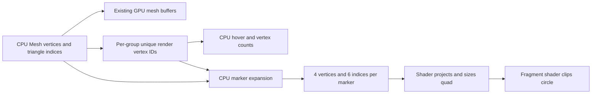

# Vertex marker data and shader generation

Historical research: the shader approach is now the only production vertex-marker
path. Unsupported renderers fail during startup. The benchmark source and old
expanded-geometry path have been removed; the measurements below describe
commit `0cb4419` and its baseline.

Source audit at `b9fc2dc`, 27 September 2026. This concerns the circular markers
enabled by **Show vertices**. It does not replace import, the solid mesh, or
diagnostic point/cross rendering. Application rendering code is unchanged.

Follow-up: an isolated D3D11 implementation has now been measured on five real
models. See [performance results](vertex-drawing-performance.md) for enable
latency, memory, GPU timings, and pixel comparisons. The compiler-only validation
described below is the original audit; runtime validation now exists for D3D11,
while the other backends still need it.

The marker expansion can move entirely into the vertex shader. The preferred
design reuses the existing mesh vertex buffer, uploads the existing compact
per-group vertex-ID list, and generates four quad corners per instance. Extra
marker GPU payload becomes **4 bytes per marker instead of 104**, a 96.15%
reduction. No expanded marker vertex or triangle-index array is needed.
This still uploads the compact ID list once: it currently exists only on the
CPU. Eliminating that upload too requires a different membership/deduplication
strategy, rather than just moving corner generation into a shader.

The current data flow is:



The proposed flow replaces the expansion and its buffers with reads of `B`
and an uploaded copy of `C`. Projection, pixel sizing, and circle clipping
already run in shaders.

The data inventory below distinguishes storage that can disappear from data
with other consumers. Let `V` be the render vertex count, `I` the triangle-index
count, and `P` the sum of unique render vertex counts **within each group**.
Sizes are logical payload, excluding capacity, allocation, and driver overhead.

| Data | Current storage and purpose | Other uses / consequence |
|---|---|---|
| `Mesh::vertices` | CPU `Vertex`: XYZ, normal XYZ, UV; 32 bytes each. Marker generation reads only XYZ. | Solid rendering/upload; normal generation and bounds; hover; object picking; dimensions and selection outlines; surface annotations and fingerprints; comparison input and quality analysis. Keep it. |
| `Mesh::indices`, `Mesh::nodes` | CPU uint32 triangle indices and per-group triangle ranges. Used to determine marker membership. | Solid/edge rendering, picking, annotations, bounds/dimensions, comparisons, and group identity. Keep them. |
| `GpuMesh::vertexBuffer` | Existing GPU copy of `Vertex`, `32V` bytes. | Shared by solid and wireframe draws. Reuse it as shader-readable storage for markers. |
| `triangleIndexBuffer`, `lineIndexBuffer` | GPU solid indices, `4I` bytes; optional edge indices, `8I` bytes. | Needed by their existing rendering modes. The preferred marker path does not need to read them. |
| `pointVertexIndices` | Retained CPU uint32 render IDs, `4P` bytes. Despite the enclosing `GpuMesh` name, this is not a GPU buffer. | Directly traversed by vertex hover and included in its cache signature; used to build markers. Retain it and upload a compact GPU copy. |
| `pointIndexOffset`, `pointIndexCount` | Per-group slices into that CPU list. | Hover, cache invalidation, and group vertex-count tooltips. Reuse as marker instance ranges. |
| Temporary `vertexGroups` | One `size_t` stamp per render vertex, `8V` bytes on this x64 build. | Used only while constructing the compact list. Discarded after `createGpuMesh`; moving quad expansion does not eliminate this computation. |
| `PointSpriteVertex` and generated vectors | Four `(XYZ, cornerXY)` records and six uint32 indices per marker; `80P + 24P` bytes. | Upload staging only. No picking, annotation, or analysis consumer. Eliminate them. |
| `pointSpriteVertexBuffer`, `pointSpriteIndexBuffer`, sprite index ranges | Persistent GPU copies of the expanded geometry; ranges are compact-list ranges multiplied by six. | Only marker submission and resource lifetime handling use them. Replace/remove them. |
| `SourceMeshData` | Separate original float XYZ records and source triangle IDs, with provenance. | Duplicate, degenerate, topology, and intersection analyses. It is not the marker vertex list and must remain available. |
| Logical controls | Visibility, modes, group color/opacity/transforms, file scale, group scale, and master point size in `UiState` and owned structs. | Other rendering, picking, history, saved views, and `.woby` persistence. Shader generation does not change these controls or their ownership. |

Primary definitions and construction are in
[`model_mesh.h`](../src/model_mesh.h),
[`scene_renderer.h`](../src/scene_renderer.h), and
[`scene_renderer.cpp`](../src/scene_renderer.cpp) (`appendPointIndicesForRange`,
`buildPointSprites`, `createGpuMesh`, `prepareGpuMeshFeatures`).
The direct compact-list consumers are
[`hover_pick.cpp`](../src/hover_pick.cpp) and the group tooltip in
[`main.cpp`](../src/main.cpp).

The broader CPU geometry consumers are independently implemented:
[`scene_pick.cpp`](../src/scene_pick.cpp) performs object picking from triangles,
including marker hit tests; [`scene_dimensions.cpp`](../src/scene_dimensions.cpp)
and [`ui_state.cpp`](../src/ui_state.cpp) compute bounds/dimensions;
[`surface_annotation.cpp`](../src/surface_annotation.cpp) clips, fingerprints,
and attaches annotations to triangles;
[`comparison_scene.cpp`](../src/comparison_scene.cpp) gathers transformed inputs;
[`mesh_comparison.cpp`](../src/mesh_comparison.cpp) and
[`surface_mesh_quality.cpp`](../src/surface_mesh_quality.cpp) process them.
Source records reach diagnostic algorithms through `DuplicateInput` and derived
topology. Those uses do not depend on the expanded marker buffers. Diagnostic
crosses and focus geometry in [`comparison_view.cpp`](../src/comparison_view.cpp)
use a separate drawing path.

Marker identity is significant. `appendPointIndicesForRange` walks each group's
triangle indices in order and keeps the first occurrence of each **render
vertex ID**. It does not merge equal positions. OBJ normal/UV seams can create
different IDs at the same position, and STL imports create separate triangle
corners. An ID shared by two groups appears in both groups' lists so each can
have its own transform, color, opacity, and visibility. Thus `P` can exceed `V`.
Unused source positions are absent from ordinary vertex display, even though
diagnostics can inspect them. Switching to source positions or global
position deduplication would change current behavior.

The current computations and their timing are:

1. **Load/runtime creation:** validate indices and triangular group ranges;
   construct compact point lists using stamps; upload the main vertex and
   triangle-index buffers. Point lists exist even with vertex display disabled.
   Complexity is `O(V + sum of group index counts)`; ranges can overlap.
2. **First marker demand:** gather each listed XYZ four times, attach corners
   `(-.5,-.5), (.5,-.5), (.5,.5), (-.5,.5)`, and append triangle indices
   `0,1,2, 0,2,3` relative to each quad. Upload both arrays through `ownedBuffer`
   / `bgfx::makeRef`. CPU staging survives until bgfx's release callback.
   GPU buffers remain allocated after markers are hidden and are reused.
3. **Each group draw:** compose the scene hierarchy/file/group model transform;
   calculate diameter as
   `round(clamp(masterSize * fileScale * groupScale, 1, 40))`;
   brighten group RGB by 1.5 and clamp it; multiply group opacity by inherited
   opacity. Send model transform, color, diameter, and viewport width/height.
   These changes do not rebuild marker geometry.
4. **Vertex shader:** project the center, then offset its clip-space XY:

   ```text
   center = modelViewProjection * vec4(localPosition, 1)
   center.xy += corner * diameter * vec2(2/width, 2/height) * center.w
   ```

   Multiplication by `center.w` preserves the requested diameter in viewport
   pixels after perspective division. All corners keep the center's depth.
5. **Fragment shader:** discard fragments where `length(corner) > 0.5` and output
   the group color. The pass uses `LEQUAL` depth testing; opaque markers write
   depth, transparent markers alpha-blend without depth writes. It requests
   MSAA and does not enable face culling.

See [`point_sprite.vert.sc`](../shaders/point_sprite.vert.sc),
[`point_sprite.frag.sc`](../shaders/point_sprite.frag.sc), and
`submitGroupRange` / `submitPointSpriteRange` in the renderer.
[`scene_screenshot.cpp`](../src/scene_screenshot.cpp) calls the same scene
submission with export viewport dimensions. Hover uses the same rounded size
but a minimum hit radius; object picking has its own equivalent size calculation
and DPI-dependent minimum tolerance. Both should continue to match the drawing.

For the proposed path, create the existing vertex buffer with shader-read
capability from the outset (`BGFX_BUFFER_COMPUTE_READ`). Lazily upload
`pointVertexIndices` as a uint32 index buffer with
`BGFX_BUFFER_INDEX32 | BGFX_BUFFER_COMPUTE_READ`. These buffers are bound for
reads with `setBuffer`; a compute dispatch is not required. The bgfx
[terrain vertex shader](https://github.com/bkaradzic/bgfx/blob/master/examples/41-tess/vs_terrain_render.sc)
demonstrates this kind of vertex-shader buffer access.

For each group, issue four generated vertices as a triangle strip and
`pointIndexCount` instances. In the vertex shader:

```text
renderId = pointIds[groupPointOffset + instanceId]
position = meshData[2 * renderId].xyz
corner = proceduralCorner(vertexId)   // four strip corners
```

`meshData` is an array of `vec4`: each current 32-byte `Vertex` occupies two
elements. Its first element is `(x, y, z, normal.x)`, so `.xyz` reads the center
without gathering/repacking positions or changing solid mesh inputs. This
layout relationship must be checked against the actual C++ and bgfx strides.
Reuse the existing projection/offset calculation and circle fragment shader.
Do not encode a potentially large point offset directly as a numeric float:
values above `2^24` lose integer precision. The probe uses two exactly
representable 16-bit halves in a uniform and reconstructs the uint offset.

The bgfx [generated vertex/instance APIs](https://bkaradzic.github.io/bgfx/bgfx.html)
provide `setVertexCount` and `setInstanceCount`, gated by `BGFX_CAPS_VERTEX_ID`.
Runtime selection must also account for instancing, usable vertex-stage buffer
reads, and binding limits; `VERTEX_ID` alone does not establish the entire path.
The installed D3D11 backend creates a shader-resource view when the read flag
is supplied, keeps vertex-input binding, and supports read buffers in graphics
submission. Its default vertex-buffer read view is float4, compatible with the
two-element interpretation above. Merely binding today's buffer, created
without that flag, is insufficient.

The alternatives have different costs:

| Approach | Extra marker GPU payload | Implications |
|---|---:|---|
| Current expanded quads | `104P` bytes | Existing behavior and backend coverage. |
| Generated corners, compact IDs, existing mesh reads | `4P` bytes | Preferred; no repeated XYZ or per-marker quad indices. Preserves per-group identity/order. Needs storage reads and generated vertices/instances. |
| Shared tiny quad plus persistent float4 center instances | `16P` bytes plus constant quad | Simpler fallback where instancing works but storage reads do not. Saves 84.62%, but gathers/uploads positions again. Avoid transient instance uploads every frame. |
| Generate markers for existing triangle-index occurrences | No new membership upload | Repeats markers for incident triangles, adds overdraw, and changes transparency. For example, three identical alpha-0.5 draws contribute 0.875 instead of 0.5. Not equivalent to the current unique-ID list. |
| Reuse the main vertex buffer directly as instance data | No new center upload | Useful for a verified contiguous group range. General groups have sparse/shared IDs, so one range cannot express their membership; splitting into runs can greatly increase draws. |
| GPU deduplication/compaction | No CPU upload of the compact list | Still requires GPU output/scratch, synchronization and possibly indirect draws. CPU hover still needs membership; preserving first-occurrence order adds work. A separate, larger project. |

Native point primitives do not preserve the application's 1–40 pixel circles
across backends. In particular, D3D11 defines rasterized points as one-pixel
squares ([Microsoft specification, section 3.4.6](https://microsoft.github.io/DirectX-Specs/d3d/archive/D3D11_3_FunctionalSpec.htm)).
A fragment-only effect inside the solid triangles also cannot draw complete
markers beyond silhouettes or when solid display is disabled. Generating the
same expanded buffers in a compute pass would remove CPU expansion/upload but
retain most of their GPU storage; direct procedural drawing avoids that storage.

For one million markers, current extra GPU payload is **99.18 MiB** and the
compact-ID proposal is **3.81 MiB**, saving **95.37 MiB**. The existing main mesh
buffers and CPU geometry are additional in both cases. During first enable,
the current path also holds about `104P` bytes of CPU upload staging; the new
path would only need the compact upload's lifetime-safe storage. These are
calculated payload differences, not measured process-memory or frame-time gains.
The expected benefits are first-enable latency, upload volume, and memory.
CPU hover traversal, source loading, triangle analysis, marker count, and
fragment coverage are not reduced. Shader fetch/instancing performance is
workload-dependent; the follow-up measurements include dense large markers.

A standalone compiler probe in `build/vertex-drawing-audit/point_pull.vert.sc`
uses the two buffer reads, generated vertex/instance IDs, split offset uniform,
and current sizing formula. Using this workspace's shaderc and varying file,
all five requested targets compiled without warnings:

| Requested target | Compiler result / limit |
|---|---|
| Windows `s_5_0` | Compiled D3D shader bytecode. |
| Linux `spirv` | Compiled SPIR-V. |
| macOS `metal` | Generated Metal shader output; not a macOS runtime test. |
| GLSL `120` | Succeeded, but generated **`#version 430`**. |
| ESSL `100_es` | Succeeded, but generated **`#version 310 es`**. |

This promotion is implemented in the installed shaderc when it finds storage
buffer declarations. The existing low GL profiles in
[`BgfxShaders.cmake`](../cmake/BgfxShaders.cmake) therefore do **not** establish
compatibility with this shader. Keep a separate compatible fallback, or make
an explicit renderer-support change. A single unconditional replacement could
fail at runtime even though every shader build succeeds. The probe did not
exercise program linking, buffer binding, rendered output, or performance on
any backend; these remain implementation validation tasks.

Implementation would primarily touch `GpuMesh`, its creation/preparation/
destruction functions, marker submission, shader assets and shader selection.
Keep CPU point ranges, existing `UiState` controls, operation validation,
save/load, and viewport/export semantics. Preserve upload ownership because
bgfx can consume data asynchronously. Existing
[`scene_renderer_tests.cpp`](../tests/scene_renderer_tests.cpp) already checks
first-occurrence order, empty/shared/overlapping groups, lazy preparation,
resource reuse, and invalid indices/ranges. Extend behavioral coverage for
the new resources and retain hover/picking tests. Render comparisons should
cover perspective/orthographic views, nested transforms, seams and coincident
IDs, opacity, depth occlusion, screen/near-plane clipping, 1/40-pixel sizes,
resize, DPI and screenshots. Validate large offsets above `2^24` and backend
fallback selection. Benchmark first enable and steady drawing separately.

The baseline Debug build used `cmake --build --preset vs2026-vcpkg` and completed
without warnings. The full suite, including slow and graphics tests, passed
**632/632** in 221.99 seconds using
`ctest --test-dir build/vs2026-vcpkg -C Debug --output-on-failure`.
Results are recorded in `build/vertex-drawing-audit-tests.log`;
shader-probe outputs and logs are under
`build/vertex-drawing-audit/`. No production code or tests were changed for this
research, and no document-content tests were added.
