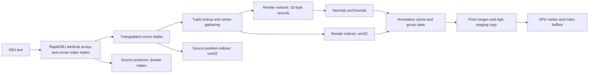

# OBJ vertex mapping and CPU-to-GPU layout

**Implementation status:** the adaptive lookup described here has now been
adopted by the production OBJ loader. Every source position has a primary entry,
including positions unused by faces; there is no sparse-position fallback. Source
coordinates are now stored as floats and promoted when analysis processes them.
The measurements and data layouts below preserve the original experiment,
before those production changes. See the
[implementation and validation results](vertex-mapping-implementation.md).

Investigation dated 2026-09-27, production base `1b5862a`, using all five OBJ
files in `D:/temp/obj_tests`. Only optional benchmark and documentation files
were added; the application loader and renderer are unchanged.

**The main opportunity is the CPU tuple lookup, not a CPU/GPU packing fix.**
Across 45 fresh-process Release runs, an experimental primary-position lookup
plus a position-only fast path reduced median CPU load time by **22–54%**.
Every saved output fingerprint, count, bound, and radius agreed across all
variants and rounds. The [raw runs and summary](vertex-mapping-results.json)
preserve stage timings, memory, capacities, counts, and validation hashes.

## Measured time by step

Current production algorithm, median milliseconds across three runs per model:

| Stage | BearTrap | Bennu | Powerplant | San Miguel | BusGameMap |
|---|---:|---:|---:|---:|---:|
| File I/O + parse | 5344.5 | 701.0 | 609.7 | 839.1 | 105.1 |
| Triangulate | 296.5 | 60.0 | 53.3 | 35.2 | 9.3 |
| Validate/copy source positions to doubles | 692.9 | 165.6 | 108.7 | 104.3 | 9.8 |
| Allocate mapping/output arrays | 76.9 | 19.4 | 18.7 | 18.6 | 1.3 |
| Map corners + gather vertices + write indices | **20528.6** | **4385.5** | **3263.8** | **2681.6** | **181.3** |
| Check supplied normals | <0.1 | <0.1 | 36.4 | 26.9 | 2.2 |
| Generate missing normals | 1939.1 | 507.2 | <0.1 | <0.1 | <0.1 |
| Calculate mesh bounds | 489.0 | 112.8 | 138.5 | 113.5 | 7.4 |
| Release parser and mapping temporaries | 304.4 | 54.1 | 44.4 | 64.3 | 6.1 |
| **Complete CPU load** | **29638.0** | **6020.4** | **4333.4** | **3864.8** | **327.3** |
| Build annotation cache after load | 3157.2 | 1169.8 | 550.0 | 413.3 | 44.2 |
| Build group bounds/centers after load | 2815.7 | 1233.7 | 473.5 | 365.4 | 41.3 |
| Validate GPU triangle indices | 125.1 | 29.1 | 20.9 | 16.3 | 2.1 |
| Allocate CPU point-range arrays | 54.1 | 12.7 | 15.5 | 12.9 | 0.9 |
| Build per-group point ranges | 1034.6 | 348.9 | 85.2 | 149.0 | 6.8 |

Individual stage medians do not sum exactly to the median total. Below 0.1 ms
for generated normals means that regeneration was skipped; the near-zero
normal check on BearTrap/Bennu exits immediately on a missing normal.
Mapping accounts for about **56–76%** of CPU load. All stage timers are wall
time, not aggregate CPU thread time. Three samples do not establish confidence
intervals; file I/O and small-model totals vary noticeably.

## Measured lookup alternatives

`Adaptive` uses a direct position-to-first-use-ID array when both normal and UV
arrays are empty (Bennu), and the hybrid lookup otherwise. `Hybrid` stores each
position's first tuple directly and hashes only additional combinations. Both
preserve the current render vertex order and all attributes.

| Model | Mapping current → adaptive (s) | CPU load current (s) | CPU load hybrid (s) | CPU load adaptive (s) | CPU load speedup |
|---|---:|---:|---:|---:|---:|
| BearTrap | 20.606 → 8.763 | 29.638 | 18.070 | 17.774 | 1.67× |
| Bennu | 4.404 → 1.055 | 6.020 | 3.005 | 2.778 | 2.17× |
| Powerplant | 3.282 → 2.415 | 4.333 | 3.358 | 3.399 | 1.28× |
| San Miguel | 2.700 → 1.735 | 3.865 | 3.055 | 2.896 | 1.33× |
| BusGameMap | 0.183 → 0.062 | 0.327 | 0.184 | 0.199 | 1.65× |

Mapping includes allocation plus the loop, taking the median of each run's
sum. Hybrid/adaptive use the same lookup policy on the four UV/normal-bearing
models; their small timing differences are not evidence of distinct algorithmic
benefits on those models. On BearTrap only **523,746** entries require a
secondary tuple, versus **38,414,391** total render vertices. Powerplant has
many more splits, explaining why bypassing the primary hash is less effective.
No hardware cache-miss counters were collected; the experiment measures the
combined benefit of changed lookup work and allocation behavior.

Adding the measured annotation, group, validation, and point-range stages gives
CPU readiness before staging/upload:

| Model | Current → adaptive CPU preparation (s) | Load peak resident memory current → adaptive (MiB) |
|---|---:|---:|
| BearTrap | 36.807 → 25.102 | 9997.3 → 9890.4 |
| Bennu | 8.810 → 5.547 | 1926.4 → 1794.2 |
| Powerplant | 5.483 → 4.513 | 1722.6 → 1714.6 |
| San Miguel | 4.822 → 3.852 | 1680.5 → 1655.2 |
| BusGameMap | 0.422 → 0.291 | 140.8 → 138.9 |

CPU readiness is a per-run sum before taking its median. It excludes graphics
initialization, driver upload, drawing, importer selection, and other UI work;
it is not measured time to a visible viewer window. Peak memory is sampled
after load and before annotation/group construction. The speed improvement is
much larger than the peak-memory improvement because parsed data, source
topology, and render arrays still coexist while mapping.

## Sizes on the real models

| Model | Source positions | Render vertices | Triangles | Groups | Solid GPU payload (MiB) | UV portion (MiB) |
|---|---:|---:|---:|---:|---:|---:|
| BearTrap | 37,890,645 | 38,414,391 | 75,771,986 | 1 | 2039.5 | 293.1 |
| Bennu | 8,933,524 | 8,933,524 | 17,866,836 | 1 | 477.1 | 68.2 |
| Powerplant | 5,984,083 | 10,953,627 | 12,759,246 | 21 | 480.3 | 83.6 |
| San Miguel | 5,933,233 | 9,021,391 | 9,980,699 | 2203 | 389.5 | 68.8 |
| BusGameMap | 535,893 | 547,469 | 1,054,542 | 65 | 28.8 | 4.2 |

All variants upload the same payload if used by the renderer. Powerplant's
render vertices outnumber positions by about **83%**, and San Miguel's by
**52%**: independent attribute indices genuinely require splitting in the
current representation. Count differences alone are not proof of bad
deduplication. Per-group point lists can also exceed the global render count;
San Miguel has 9,021,669 point entries for 9,021,391 render vertices.

BearTrap additionally retains **867.2 MiB** of source double coordinates and
**867.1 MiB** of source indices on the CPU. Vertex display would add about
**3.72 GiB** of GPU sprite data and wireframe about **1.69 GiB** of GPU indices,
on top of its **1.99 GiB** solid payload. These optional costs are calculated
from production layouts and measured counts, not fresh GPU allocation probes.

## What mapping does

1. RapidOBJ reads and parses the text. Positions, normals, UVs, and optional
   colors are separate packed float arrays. Every polygon corner has three
   signed 32-bit indices: position, UV, normal; missing attributes use `-1`.
   Shapes also carry face sizes, materials, and smoothing groups.
2. `rapidobj::Triangulate` turns polygons into triangles, preserving corner
   attribute references. Original polygon identity is not retained in woby's
   source triangle IDs.
3. Woby copies **all** source positions, including unused ones, into double
   triples for diagnostic tools. Widening parsed floats does not recover OBJ
   decimal precision. A separate source index buffer preserves position-based
   connectivity even where render vertices split.
4. For each triangle corner, the loader looks up the exact
   `(positionIndex, normalIndex, uvIndex)` tuple. First use creates a vertex;
   later uses reuse its ID. IDs follow first use across all shapes. The key is
   index identity, not equality of attribute values. Distinct OBJ indices with
   identical values remain distinct. The previous value-compaction pass was
   removed.
5. Each new render vertex gathers position, normal, and UV into eight floats.
   Missing attributes start at zero and UV V becomes `1 - V`. Shape ranges keep
   triangle order and group membership.
6. Finalization checks normals, regenerates all of them if any is invalid,
   and computes bounds. Normal generation sums normalized face normals into
   render vertices, then normalizes each vertex; it is not area-weighted.
7. UI-state construction builds an annotation cache plus per-group bounds and
   centers. GPU preparation validates indices, constructs per-group unique
   render-vertex lists for picking, and copies vertices and triangle indices
   into bgfx staging allocations. bgfx consumes these asynchronously and creates
   the GPU buffers. CPU mesh/source data remain for picking and diagnostics.
8. Wireframe and point-sprite buffers are built on request and retained.



## Data shapes and mismatches

| Representation | Layout | Lifetime / purpose |
|---|---|---|
| RapidOBJ attributes | Separate float arrays: XYZ, XYZ normals, UV | Temporary parser result |
| RapidOBJ corners | 12 bytes: three signed 32-bit indices | Temporary, one record per triangle corner after triangulation |
| Tuple map | Dense 12-byte keys + power-of-two array of 4-byte bucket IDs | Temporary; linear probing; grows at 75% occupancy |
| `SourceMeshData::points` | 24-byte double XYZ | Retained CPU source topology |
| Source triangle indices | 4 bytes/corner | Retained CPU original position connectivity |
| `Mesh::vertices` | 32 bytes: position at 0, normal at 12, UV at 24 | Retained CPU render geometry |
| Render triangle indices | 4 bytes/corner | Retained CPU and uploaded GPU topology |
| Main GPU vertices | Same 32-byte record and offsets | Direct byte copy; no layout conversion |
| CPU point ranges | uint32 render IDs per group; temporary size_t stamp per render vertex | Picking and optional point rendering |
| GPU point sprites | Four 20-byte vertices + six uint32 indices per point entry | 104 bytes/entry, plus the main mesh buffers |
| GPU wireframe | Six uint32 indices per triangle | Two times the triangle-index payload; shared edges repeated |

**There is no CPU/GPU packing mismatch in the main mesh path.** The benchmark
checks `sizeof(Vertex) == 32` and offsets `[0, 12, 24]`; `meshVertexLayout()`
declares the matching float formats. Indices are uint32 on both sides and bgfx
receives `BGFX_BUFFER_INDEX32`. The gathering conversion is necessary because
OBJ has independent attribute indices while this render path uses a common
vertex index.

There are nevertheless representation and semantic costs:

- **Unused UV bandwidth in the ordinary mesh shader.** `mesh.vert.sc` declares
  UV input but only uses position and normal. Eight of 32 bytes per vertex are
  unused by that shading path. A separate 24-byte ordinary GPU vertex would
  save 25% of vertex bytes, not 25% of all GPU memory or frame time. Comparison
  and mesh-quality shading deliberately encode scalar data in `texcoord`, so
  globally removing this member would break those paths. Repacking also costs
  CPU time and temporary memory; it has not been benchmarked here.
- **Float-to-double duplication.** Source points take twice the parser's
  coordinate storage without recovering precision. This supports existing
  diagnostic algorithms and should not be changed without checking their
  numeric behavior and importer contracts.
- **CPU passes and GPU draws want different subsets.** Bounds and many geometry
  queries read positions from 32-byte interleaved render records, pulling cache
  lines that also contain normals and UVs. Separate render-position storage
  could improve those CPU scans, but would change many mesh consumers and the
  upload strategy. This is a layout tradeoff, not a proven speedup here.
- **Source and render IDs are different namespaces.** Normal/UV seams split
  vertices; original position topology must remain separate. Merging render
  vertices by position would alter hard normals and potentially diagnostics.
- **Incomplete OBJ semantics.** Material IDs, smoothing-group IDs, vertex
  colors, line primitives, and point primitives are not transferred into this
  render mesh. Missing-normal generation uses the already split render
  vertices, so UV seams can split generated smoothing. A single invalid normal
  triggers replacement of supplied normals too. These are existing behaviors,
  not effects introduced by the benchmark alternatives.
- **Retained capacity is not uploaded.** Vertex-vector growth can reserve more
  memory than is used; bgfx copies `size()`, not `capacity()`. Trimming capacity
  should be evaluated separately from deduplicating vertices.
- **GPU byte limits are tighter than importer element limits.** The loader
  checks uint32 element counts; each bgfx buffer also has a uint32 byte-size
  limit. A 32-byte vertex buffer therefore hits the limit much earlier.

## GPU-side evidence from the earlier experiment

The earlier [compaction investigation](obj-compaction-performance.md) measured
the same ordinary solid upload path on this machine. Its **compaction-off**
results are relevant to the current loader, which no longer has that pass.
These are historical medians of three runs, not fresh GPU measurements from
the vertex-map sweep. In particular, none of the new lookup speedups should be
read as a GPU-frame-time improvement: the uploaded geometry is identical.

| Model | CPU staging allocation + copy (ms) | Preparation + enqueue (ms) | D3D11 execution + completion wait (ms) | Upload total (ms) | GPU frame (ms) |
|---|---:|---:|---:|---:|---:|
| BearTrap | 430.3 | 1693.3 | 558.4 | 2245 | 15.640 |
| Bennu | 101.8 | 501.8 | 178.1 | 679 | 5.198 |
| Powerplant | 100.7 | 230.2 | 243.5 | 477 | 4.610 |
| San Miguel | 83.7 | 269.9 | 140.4 | 419 | 1.942 |
| BusGameMap | 6.2 | 16.1 | 29.1 | 45 | 0.205 |

Staging copy is included in preparation, which is included in total; these
columns must not all be added. Separate medians need not add exactly. GPU
timestamp results depend on camera, shader workload, clock state, and driver
scheduling and do not predict interactive FPS. Execution/wait includes driver
work and synchronization, not just transfer over the GPU bus. The benchmark
excluded UI-state construction, so its load-plus-upload totals omit the
annotation/group preparation now measured separately in this investigation.

## Improvement priorities

1. **Use direct/primary-position lookup before general tuple hashing.** This
   investigation implements and measures it only in optional benchmark targets.
   Keep first-use IDs, global cross-shape reuse, normal/UV seams, triangle
   order, and source topology. Before production adoption, account for sparse
   OBJ files with huge unused position arrays: a primary table indexed by all
   positions can cost more than the existing reservation bounded by corner
   count. The secondary table should also be sized carefully for seam-heavy
   models; it currently starts small and grows.
2. **Remove repeated group scans.** `createUiGroupStates` calls `nodeBounds`,
   then `nodeCenter`; the former already calculates the same bounding-box
   center. Reuse `localBounds.center`. Consider accumulating group bounds while
   constructing annotation blocks, but preserve cache fingerprints and block
   boundaries. This is a source-based opportunity, not a measured patch.
3. **Reduce upload duplication or specialize the solid GPU layout.** An upload
   reference to immutable, lifetime-owned CPU geometry could remove the bgfx
   staging copy. It must retain ownership until bgfx's release callback; simply
   replacing `copy` with a borrowed `makeRef` is unsafe if a scene is removed.
   Alternatively, a 24-byte position/normal GPU stream would remove unused UV
   bytes for ordinary shading. Measure repacking cost versus transfer/storage
   savings, and preserve the UV/scalar layout for comparison tools.
4. **Reduce optional point-rendering expansion.** Instanced quads could avoid
   storing the position four times and six indices per point. This matters much
   more when vertex display is enabled than optimizing an already shared main
   vertex buffer. CPU point-range stamps could also use uint32 rather than
   64-bit size_t after an explicit group-count bound. These are unmeasured
   proposals requiring renderer and picking tests.
5. **Treat memory lifetime, capacity, and precision separately.** Releasing
   parsed attributes and the mapping table before normal/bounds work would
   reduce their live duration, but cannot remove a peak already reached inside
   mapping. Normal/bounds work itself allocates no large replacement arrays.
   Trimming spare vertex capacity
   saves commitment but can require a large copy and need not save resident
   memory. A float-backed source representation would halve source coordinate
   storage, but requires a wider diagnostic API/numerics review. None is a
   reason to restore the previously unhelpful value-compaction pass.

Parallel mapping and GPU vertex pulling are larger architectural experiments.
Mapping shared source positions independently by shape would change vertex
sharing and generated normals; a parallel implementation needs deterministic
merging. Vertex pulling could retain separate attribute buffers and corner
triples on the GPU, but adds shader gathers and complicates generated normals,
picking, and buffer support. The measured CPU lookup alternatives offer a
smaller change with identical output.

## Experiment and reproduction

The research targets generate instrumented copies of current production code.
No timers are inserted per triangle corner. Mapping allocation and the whole
mapping loop are measured separately; the loop includes lookup, attribute
gathering, vertex growth, and source/render index writes. Its suboperations are
not independently timed. The variant comparison changes only the lookup data
structure.

- `baseline`: current global tuple hash table.
- `hybrid`: a uint32 primary entry for each source position. Its first tuple
  bypasses hashing; alternate normal/UV combinations use a secondary hash table.
  The dense key array still stores complete tuples in first-use order.
- `adaptive`: hybrid, with a direct position-to-first-use-ID array when both
  normal and UV arrays are empty. This conservative condition is sufficient
  for Bennu; it does not detect unused normal/UV arrays.

CPU annotation construction, group-state construction, index validation, and
point-range construction are extracted from production functions as well.
Graphics submission is excluded from the new CPU benchmark. Fresh GPU timings
are not claimed; the GPU section cites the existing same-machine experiment.
Model file reads are conditioned before each three-variant group without cache
eviction; native RapidOBJ retains unbuffered Windows I/O. Results are repeated
load measurements, not controlled cold-drive or application-launch timings.
The machine has a Ryzen 7 5800H (8 cores / 16 logical threads), 64 GiB RAM,
and Windows; binaries use MSVC VS 2026 Release `/O2 /Ob2 /DNDEBUG` through the
`vs2026-vcpkg` preset. No benchmark ran concurrently with the build or tests.
The referenced adjacent MTL files are absent, so material/texture loading is
not represented.

Full ordered byte fingerprints of render vertices, both index buffers, source
points, node names/ranges, and per-group point IDs are compared after timing.
Bounds, radius, and counts must also agree. This tests data equivalence more
strongly than counts alone, although hashes are not a formal collision-free
proof. Small contract fixtures cover concave/reversed polygons, negative
indices, UV/normal seams, duplicate values at distinct indices, mixed missing
normals, multiple groups, unused positions, Unicode paths, and secondary-table
growth. Fixture files live under unique temporary roots and are cleaned on
failure.

```powershell
cmake --preset vs2026-vcpkg -DWOBY_BUILD_OBJ_BENCHMARKS=ON
cmake --build --preset vs2026-vcpkg --config Release --target woby_mapping_baseline woby_mapping_hybrid woby_mapping_adaptive
uv run tests/vertex_mapping/contract_test.py build/vs2026-vcpkg/bin/Release
uv run tests/vertex_mapping/run.py --bin build/vs2026-vcpkg/bin/Release --models D:/temp/obj_tests --output build/vertex-mapping-results.jsonl --rounds 3
```

Use a new output filename for each sweep. The runner refuses to overwrite an
existing file and stops if output validation differs.

## Validation

- Debug application and all enabled benchmark targets built successfully via
  `cmake --build --preset vs2026-vcpkg`, without compiler warnings.
- Release research targets built without compiler warnings. Their contract
  tests passed, including Unicode paths and direct-path/secondary-growth checks.
- Full Debug suite, including slow and graphics tests:
  `ctest --test-dir build/vs2026-vcpkg -C Debug --output-on-failure` —
  **628/628 passed**, 223.15 seconds.
- All 45 large-model runs completed; cross-variant and cross-round fingerprints,
  geometry counts, point-entry counts, bounds, and radii agree for each model.
- No production loading/rendering behavior was changed. No document-content
  tests were added. Local logs are `build/mapping-debug.log`,
  `build/mapping-release.log`, `build/mapping-release-final.log`, and
  `build/mapping-ctest.log`.
